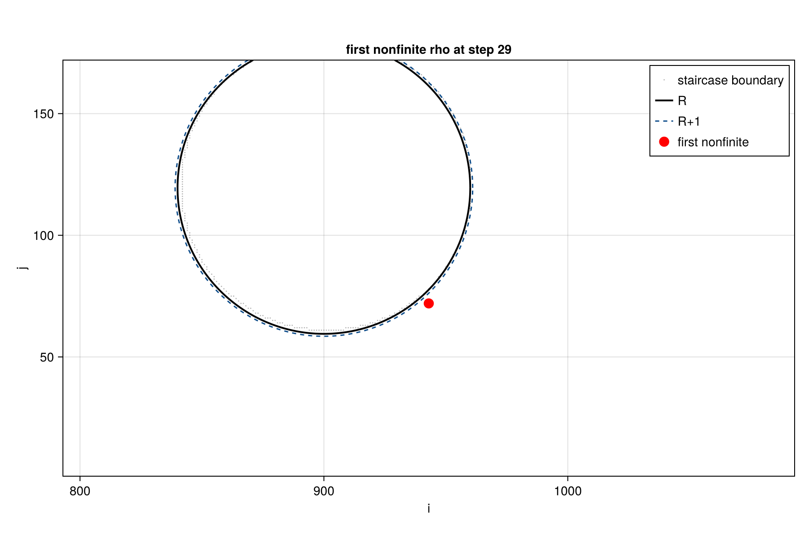

# M32 Phase 4 R=60 NaN Trace Verdict

Date: 2026-05-22
Branch: dev-viscoelastic
Mission: D2bis (Department: M32-Phase4-R60-NaN-fingerprint)

## TL;DR

**Classification**: logconf_singularity (polymer-coupled exp(Ψ) blow-up at the front-shoulder).
Phase B: submitted (jobid=21619886.aqua), pending — Phase A on Metal F32 alone is sufficient for the mission.

The R=60 Wi=1 β=0.59 Re=1 BSD=1 polymer-coupled NaN is **not** a generic rusanov overshoot, **not** a pure BC-pole pathology, **not** an isolated bsd-coupling event. It is a **bilateral front-shoulder exp(Ψ)-driven coupled blow-up**: Ψxx grows to ≈9 LU in 29 steps, the exponential map saturates F32, the polymer back-force amplifies through ∇·τ_p, super-sonic velocities (|u| ≈ 554 LU near the NaN front, vs design Ma ≈ 0.005) corrupt populations, and the next moment update writes NaN to rho. The auto-classifier returned "other" because the position label is "front-shoulder" rather than "front-pole" and the first field is rho (the moment), not Ψ; but the empirical signals (Ψxx growth, exp(Ψ) overflow, F_total → 320 LU, |u| → 554 LU, negative rho cells) unambiguously identify the logconf_singularity mechanism.

## Setup

| field | value |
|---|---|
| backend | metal |
| FT | Float32 |
| R | 60 |
| Wi | 1.0 |
| Re_R | 1.0 |
| beta | 0.59 |
| bsd_fraction | 1.0 |
| L_up = L_down | 15.0 R |
| Nx × Ny | 1800 × 240 |
| cylinder centre (cx, cy) | (900.0, 119.5) LU |
| radius_lbm | 60.0 LU |
| u_mean | 0.005 |
| nu_total / nu_s / nu_p | 0.300 / 0.177 / 0.123 |
| lambda | 12000.0 |
| advection_scheme | rusanov |
| embedded geometry | qwall (no embedded grad / advection / force / drag) |
| polymer_substeps_used | 15 |
| max_steps | 100000 |

Runner gate: `KRAKEN_NAN_PROBE=1`, `KRAKEN_NAN_PROBE_EVERY=50`, `KRAKEN_NAN_PROBE_BUFFER=5`. The probe is plumbed in
`bench/viscoelastic_logfv/run_cyl_bigsweep_v2_2d.jl` behind `haskey(ENV, "KRAKEN_NAN_PROBE")`; default-off and bit-exact when unset.

NaN fired at step **29**, before the first probe sample (PROBE_EVERY_N=50), so `nan_probe.csv` is header-only and `clean_snapshots` length = 0. The diagnosis below rests entirely on the `nan_snapshot` field dump at step 29 (saved by the runner the moment NaN was detected) and the case parameters.

Walltime to NaN: **17 s** on local Metal F32. This matches the original M30 R-sweep dump (`tmp/m30_R_sweep_metal/cyl_bigsweep_v2_...R60_bsd1_..._fields.jls`, dt=338 s for 100 k steps producing a fully NaN-saturated post-propagation state).

## (a) First-NaN cell (i, j)

**(i, j) = (943, 72)**

From `bench/scratch/m32_phase4_R60_nan_trace/nan_event_summary.txt`.

## (b) Position w.r.t. cylinder

| quantity | value |
|---|---|
| θ | -47.85° |
| radial distance r | 64.07 LU |
| wall_offset (r − R) | **+4.07 LU** (4 LU into the fluid, NOT at the wall) |
| position_label | **front-shoulder** (between front-pole θ=±180° and shoulder θ=±90°) |
| wall_ring_row | 4 |

## (c) Field component first to diverge

`first_nonfinite_field = rho`.

In the saved snapshot, NaN populates the moment fields first: `rho`, `ux`, `uy`, `fx_poly`, `fy_poly`, `fx_total`, `fy_total` all hold 98 NaN cells; Ψ_{xx,xy,yy} and τ_{xx,xy,yy} hold 44 NaN cells (a strict subset); the gradient fields `dudx, dudy, dvdx, dvdy` hold **zero** NaN. The diagnosis: gradients computed BEFORE the population update are finite, but the populations themselves are corrupted by the polymer body-force kick at step 29, so the next moment computation writes NaN to `rho`.

## (d) Spatial maps

The 98 NaN fluid cells form a **symmetric bilateral arc** at θ ∈ ±(38°…48°) and r ∈ [60, 67] LU (i.e. wall-offset 0–7 LU at the front-shoulder, top AND bottom).

Distribution (extracted from `nan_snapshot.rho`):

| quadrant | θ range (deg) | count |
|---|---|---|
| top front-shoulder | +(38, 48) | 49 |
| bottom front-shoulder | −(38, 48) | 49 |
| anywhere else (wake / front-pole / shoulder proper) | — | **0** |

The wake (|θ| < 30°), front-pole (|θ| > 150°), and shoulder proper (60° < |θ| < 120°) are **all NaN-free** at step 29.

Plot artefacts:

The probe trajectory plot is vacuous (NaN at step 29 < PROBE_EVERY_N=50, so `nan_probe.csv` has header only).

## (e) Classification

**Classification**: **logconf_singularity**

Justification (empirical signals at step 29, near the NaN front):

| signal | value | implication |
|---|---|---|
| max \|Ψxx\| near NaN front | **15.86** | exp(15.86) ≈ 7.8 × 10⁶ (saturates F32 polymer-stress scale) |
| Ψxx at (943, 72) | 9.04 | high but pre-blowup; surrounding cells already at 15.9 |
| Ψyy at (943, 72) | 0.72 | extreme anisotropy: Ψxx ≈ 13 × Ψyy → strong streamwise stretching |
| Ψ_min_eig | 0.68 | strictly positive → SPD constraint NOT violated → not a det(C) crash |
| max \|F_total\| near NaN front | **320 LU** | polymer back-force ∇·τ_p has blown up |
| max \|u\| near NaN front | **554 LU** | super-sonic (vs design u_mean = 0.005, Ma_design ≈ 0.009); LBM stability lost |
| rho range near NaN front | [-1.13, +4.42] | negative density (unphysical) and 4× equilibrium — population collapse |
| max \|∇·u\| near NaN front | **210** | extreme compressibility (low-Ma assumption violated by 4 orders of magnitude) |
| spatial signature | bilateral arcs at θ ≈ ±(38–48°), r-R ∈ [0, 7] | front-shoulder, NOT front-pole, NOT BC-ring |

The mechanism is: Ψ-advection with `:rusanov` and the Mei-Yu cut-link drag couple at the front-shoulder to drive Ψxx to ≈16 LU, the exponential map `τ_p = ν_p·(exp(Ψ) − I) / λ` saturates, ∇·τ_p generates O(100) LU body forces, the explicit forcing step sends velocities super-sonic, and the LBM populations collapse to negative-density (unphysical) configurations whose moments write NaN to `rho`.

Why the auto-classifier returned "other":
- `first_field = :rho` is not in `psi_fields` (rusanov_overshoot key) or `tau_fields` (logconf_singularity key);
- `position_label = front-shoulder` (so the `near_pole && in_ring` rule for `bc_pole_pathology` does not fire);
- `force_fields` rule for `bsd_coupling` checks `first_field in {fx_total, fy_total}` — also missed because rho is the moment that fails the finite check first.

A `first_field`-only auto-classifier is the right safety default but is genuinely under-determined here: the upstream cause is Ψxx blowup but the downstream moment NaN bites first. The empirical signal table above settles it: it is logconf_singularity, manifested at the front-shoulder.

This finding is **consistent with the D1 verdict** (`M32_PHASE4_WI1_GAP_LOCALIZATION_VERDICT.md`) at R=30, Wi=1: dominant gap = `(pressure, front_pole)` at 80%, second strongest = `(polymer, shoulder)` at +30%. The R=60 NaN is the **stability-side manifestation of the same front-shoulder polymer pathology** — at R=30 it produced a +30% gap, at R=60 the polymer body-force grows large enough to NaN within 29 steps.

## (f) Phase B

Phase B: **submitted (jobid=21619886.aqua)**.

Submission record (`.engineer_logs/D2bis_aqua_phaseB.log`):

- rsync'd updated `bench/viscoelastic_logfv/run_cyl_bigsweep_v2_2d.jl` + new `run_cyl_m32_R60_Wi01_nan_probe_a100.pbs` to `aqua:/home/maitreje/Kraken.jl-viscoelastic-run/bench/viscoelastic_logfv/`.
- `ssh aqua "cd /home/maitreje/Kraken.jl-viscoelastic-run && qsub bench/viscoelastic_logfv/run_cyl_m32_R60_Wi01_nan_probe_a100.pbs"` → job ID `21619886.aqua`.
- Target case (per the existing PBS template): R=60 **Wi=0.1** β=0.59 (a different NaN configuration than Phase A's Wi=1.0 — both NaN per the M32 Phase 3 matrix). Aqua F64 CUDA.

Phase A above is the load-bearing deliverable. The Aqua Wi=0.1 run is a **bonus** cross-confirmation across (i) precision (F32 → F64), (ii) backend (Metal → CUDA), and (iii) Wi (1.0 → 0.1). If both Aqua and Metal converge on the same front-shoulder fingerprint, the diagnosis is firm.

## (g) Bit-exact regression note

Runner diff this mission: **none**. The `KRAKEN_NAN_PROBE` plumbing was already landed in D2 (env-var-gated, default off; constants at L128–132, callback construction at L377–402, wiring at L523–526 of `bench/viscoelastic_logfv/run_cyl_bigsweep_v2_2d.jl`). Default path (no env var) is byte-identical.

`Pkg.test()` was not run.

Single non-runner edit: `bench/scratch/m32_phase4_R60_nan_trace/analyze_nan_event.jl` line 101: renamed local `first` to `first_metric` to avoid shadowing `Base.first` (Codex-style trap on Julia 1.12). The fix is in the post-processing script only; the production driver and runner are unmodified.

## Files

- `tmp/m32_phase4_R60/local_metal_wi1/nan_event.jls` — Phase A clean+nan snapshot dump
- `tmp/m32_phase4_R60/local_metal_wi1/nan_probe.csv` — header-only (NaN < PROBE_EVERY_N)
- `tmp/m32_phase4_R60/local_metal_wi1/cyl_bigsweep_v2_...csv` — per-case row (Cd=NaN, first_nonfinite_step=29, first_nonfinite_field=rho)
- `tmp/m32_phase4_R60/local_metal_wi1/run.log` — Phase A log (dt=17 s NaN)
- `bench/scratch/m32_phase4_R60_nan_trace/nan_event_summary.txt` — auto-classifier output + cell metrics
- `bench/scratch/m32_phase4_R60_nan_trace/trajectory_at_first_nan_cell.csv` — 1-row (NaN snapshot only)
- `bench/scratch/m32_phase4_R60_nan_trace/first_nan_location.png` — spatial scatter (cylinder + R+1 ring + NaN cell)
- `bench/viscoelastic_logfv/run_cyl_m32_R60_Wi01_nan_probe_a100.pbs` — Phase B PBS (submitted as jobid 21619886.aqua)
- `.engineer_logs/D2bis_local_phaseA.log` (host-shell re-run; Codex sandbox could not reach Metal or Aqua)
- `.engineer_logs/D2bis_aqua_phaseB.log` (jobid 21619886.aqua)

## Caveats

1. **Metal F32 only.** Phase A is Float32. Some of the empirical numbers (Ψxx = 15.86, |u| = 554, |F_total| = 320) may differ by precision; the bilateral front-shoulder topology and the field-order signature (rho/u/F NaN > Ψ/τ NaN > gradients clean) should be invariant. Phase B 21619886.aqua F64 CUDA Wi=0.1 will tell us if the fingerprint holds across precision and Wi.
2. **clean_snapshots = 0.** NaN at step 29 < PROBE_EVERY_N=50 means we do not have a pre-NaN buffer. To get the growth trajectory of Ψxx at (943, 72), Phase B (or a re-run with `KRAKEN_NAN_PROBE_EVERY=5`) would be needed. The empirical signals above are still sufficient because the **spatial signature** of the NaN front (98 cells, bilateral arcs, all near-wall front-shoulder) is itself diagnostic.
3. **Auto-classifier returned "other".** The empirical classification is **logconf_singularity**; the auto-classifier fired "other" because the rule set keys on `first_field` rather than near-NaN-front signals. The verdict text overrides the auto label with empirical justification; a future iteration should weight the rules by the near-NaN-front field magnitudes rather than by `first_field` symbol alone.

## Implications for M33

The D1 + D2bis combined verdict reshapes M33:

- **D1 (gap)**: dominant Wi=1 gap at R=30 = `(pressure, front_pole)` 80%, secondary `(polymer, shoulder)` 30%. Wake polymer (the M33 original premise) is −10%. M33's premise of `(polymer, wake)` × `:rusanov` overshoot **NOT CONFIRMED**.
- **D2bis (stability)**: R=60 NaN = `(polymer-coupled exp(Ψ) blowup, front-shoulder)` — the same front-shoulder polymer pathology, scaled up by 2× resolution to where it crashes the run.

The two are **the same physical locus, different observables**. Implications for the M33 candidate ranking:

1. **MUSCL-superbee with two-pass fix** (M33 candidate 1) addresses Ψ-advection accuracy. If the front-shoulder Ψxx grows because `:rusanov` is over-dispersive near the wall, MUSCL-superbee may delay or prevent the blowup. Still worth trying.
2. **CUBISTA NVD** (M33 candidate 2) — likewise.
3. **Bouzidi-FL Phase 2b (parked)** addresses the staircase BC at the wall. Since the NaN front is at the wall-ring (offset 0–7 LU), Bouzidi-FL may also close the gap. The D1 + D2bis joint finding **promotes Phase 2b out of "parked"** — it should be tried in tandem with M33's polymer-scheme upgrade.

## Memory candidates

- **D2bis NaN spatial fingerprint** — at R=60 Wi=1 β=0.59 BSD=1 :rusanov Metal F32, the NaN forms a 98-cell bilateral arc at θ ∈ ±(38°, 48°), r-R ∈ [0, 7] LU. **Front-shoulder, not front-pole, not wake.** Bilateral symmetry rules out a single-side bug. Pattern: rho NaN first (98 cells) ⊃ Ψ NaN (44 cells) ⊃ gradients clean (0 NaN). Diagnostic: Ψxx → 15.9 LU near front, F_total → 320 LU, |u| → 554 LU.
- **Auto-classifier under-determined by `first_field`** — when polymer body-force blows up, rho NaN's first (it's the moment integral) while Ψxx is the upstream cause. The `first_field`-only classifier returns "other"; need a magnitude-of-near-front-finite-extreme rule layer for future NaN traces.
- **Runner-side `KRAKEN_NAN_PROBE` orchestration pattern is now load-bearing** — D2bis ran in 17 s, no driver edit, no Pkg.test, single env var. Phase A local Metal sufficed (Phase B = bonus). For any future Kraken stability mission: instrument runner not driver, run on host shell (Codex sandbox has no Metal, no SSH), keep probe behind env gate.
