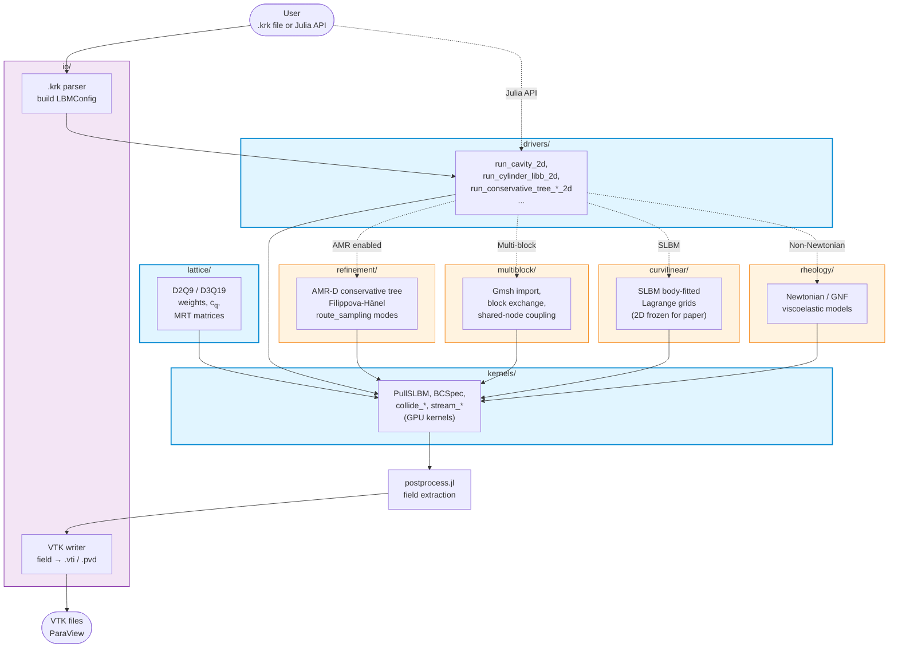

# Architecture

This page explains how Kraken.jl modules are organized and how data flows
through the package at runtime. It is the architectural layer between the
[API reference](api/config.md) (function-by-function) and the
[tutorials](examples/01_poiseuille_2d.md) (end-to-end use cases).

For a per-module deep dive, follow the links in the [Module map](#module-map)
below — each `src/<module>/` carries its own `README.md` with entry points,
critical invariants, and cross-module dependencies.

## Container diagram

The diagram below shows the eight top-level modules in `src/` and the
production data path from a `.krk` configuration file to a VTK output
suitable for ParaView.

**Legend**:
- Blue (core): always exercised — every simulation goes through `drivers`,
  `kernels`, `lattice`.
- Orange (optional): only exercised when the simulation requests AMR,
  multi-block coupling, body-fitted (SLBM), or non-Newtonian rheology.
- Purple (I/O): boundary with the outside world — parses `.krk`, writes VTK.

## Module map

| Module | Purpose (1 line) | README |
|---|---|---|
| `src/lattice/` | D2Q9 / D3Q19 weights, lattice velocity vectors, MRT collision matrices. | [src/lattice/README.md](https://github.com/lauguimel/Kraken.jl/blob/main/src/lattice/README.md) |
| `src/kernels/` | GPU-portable LBM kernels (collide, stream, BC) + DSL bricks (PullSLBM, BCSpec). | [src/kernels/README.md](https://github.com/lauguimel/Kraken.jl/blob/main/src/kernels/README.md) |
| `src/drivers/` | High-level entry points (`run_*` functions) — what most users actually call. | [src/drivers/README.md](https://github.com/lauguimel/Kraken.jl/blob/main/src/drivers/README.md) |
| `src/io/` | `.krk` DSL parser + VTK writer (the package boundary). | [src/io/README.md](https://github.com/lauguimel/Kraken.jl/blob/main/src/io/README.md) |
| `src/refinement/` | Adaptive Mesh Refinement (AMR-D voie) via patch-based conservative tree, Filippova-Hänel ω rescaling. | [src/refinement/README.md](https://github.com/lauguimel/Kraken.jl/blob/main/src/refinement/README.md) |
| `src/multiblock/` | Multi-block geometry (Gmsh import), shared-node block exchange, mesh extension. | [src/multiblock/README.md](https://github.com/lauguimel/Kraken.jl/blob/main/src/multiblock/README.md) |
| `src/curvilinear/` | SLBM (Semi-Lagrangian LBM) on body-fitted curvilinear / Lagrange grids. | [src/curvilinear/README.md](https://github.com/lauguimel/Kraken.jl/blob/main/src/curvilinear/README.md) |
| `src/rheology/` | Constitutive models — Newtonian (default), Generalised Newtonian, viscoelastic. | [src/rheology/README.md](https://github.com/lauguimel/Kraken.jl/blob/main/src/rheology/README.md) |

`src/simulation_runner.jl` and `src/postprocess.jl` are top-level glue files
(no submodule). The former dispatches to module entry points; the latter
extracts macroscopic fields (ρ, u, T) from population arrays for output.

## Production data flow (textual narrative)

For a user running `run_simulation("examples/cavity.krk")`:

1. **Parse**. `src/io/kraken_parser.jl` reads the `.krk` file, returns a
   typed `LBMConfig` (or the equivalent setup struct). The `.krk` DSL is
   the canonical configuration surface — see [Concepts](concepts_index.md)
   for syntax.
2. **Dispatch**. `simulation_runner.jl` or a `run_*` function in
   `src/drivers/` selects the right kernel chain based on the config
   (cavity? cylinder? thermal? AMR? multi-block? Newtonian or not?).
3. **Initialise**. `src/lattice/` provides the weights / velocity vectors;
   `src/kernels/` builds the boundary specs (`BCSpec`) and collision /
   streaming kernels (typically via `PullSLBM` DSL bricks).
4. **Time step**. Inside the time loop:
   - **Collide**: kernel in `src/kernels/` (BGK / MRT depending on config);
     calls into `src/rheology/` for the constitutive law if non-Newtonian.
   - **Stream**: kernel in `src/kernels/`; for AMR-D the streamer is in
     `src/refinement/conservative_tree_streaming_*.jl`; for multi-block,
     `src/multiblock/exchange.jl` handles inter-block coupling; for SLBM,
     `src/curvilinear/slbm_*.jl` handles the body-fitted advection.
   - **BC**: applied in `src/kernels/` via the `BCSpec` brick set at init.
5. **Output**. `src/postprocess.jl` extracts macroscopic fields; `src/io/`
   writes VTK to disk for ParaView consumption.

## Cross-cutting concerns

- **GPU backend** — every kernel in `src/kernels/`, `src/refinement/`,
  `src/multiblock/`, `src/curvilinear/` is `KernelAbstractions`-portable.
  The runtime picks CPU / CUDA / Metal via the `backend` kwarg
  (default depends on platform; Apple Silicon → Metal). See
  [Installation](installation.md).
- **The `.krk` DSL** is the user-facing contract. Parser at
  `src/io/kraken_parser.jl` is the source of truth for accepted syntax;
  the [Concepts page](concepts_index.md) documents the surface.
- **AMR-D mode discrimination** — `refinement/` has three
  `route_sampling` modes (`:leaf_equivalent` production,
  `:level_native` debug, `:subcycled_hybrid` experimental) and two
  c2f prolongation modes (`:flat`, `:limited_linear`). Convention:
  filenames `<flow>_*_debug.krk` opt into debug mode. Choosing the wrong
  mode while debugging is a common trap — see the
  `kraken-codebase-map` skill (loaded by automated agents) for the
  full discriminator.
- **Backend asymmetry trap** — the same logical kernel may live in
  different files for CPU vs Metal (notably `refinement/conservative_tree_gpu_pack_2d.jl`
  is exercised in Metal mode even though "gpu" is in the name). When
  instrumenting, always confirm the backend in use and check the actual
  kernel that fires — `kraken-trace` skill encodes the recipe.

## How to navigate this codebase

| If you're trying to … | Start here |
|---|---|
| Run an existing example | [Tutorials](examples/01_poiseuille_2d.md) |
| Write a new `.krk` file | [Concepts](concepts_index.md) |
| Add a new boundary condition | `src/kernels/README.md` + `BCSpec` |
| Add a new collision model / rheology | `src/rheology/README.md` |
| Understand AMR-D | `src/refinement/README.md` + theory chapter 18 |
| Understand SLBM (body-fitted) | `src/curvilinear/README.md` |
| Connect to Gmsh / multi-block | `src/multiblock/README.md` |
| Debug "edited code but nothing changed" | invoke `kraken-trace` (instrumentation discipline) |
| Find which kernel actually fires | invoke `kraken-codebase-map` (static answer) + `kraken-trace` (runtime answer) |

## Maintenance

This page is maintained on `main`. When a new top-level module is added
under `src/<module>/`, the contributor adds (a) a `README.md` for the new
module, (b) a row in the [module map](#module-map), and (c) a node + edge
in the [container diagram](#container-diagram).

Automated checks (planned, see `scripts/extract_callgraph.jl`): the
generated call graph for hot AMR-D / multi-block paths is committed under
`docs/src/callgraph.md` per branch — when it drifts from this container
diagram, the offending PR must reconcile both. The auto-call-graph is the
fact; this page is the narrative.
