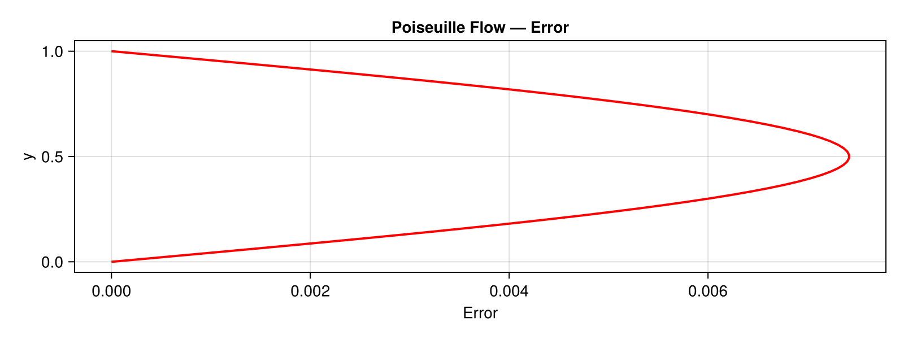
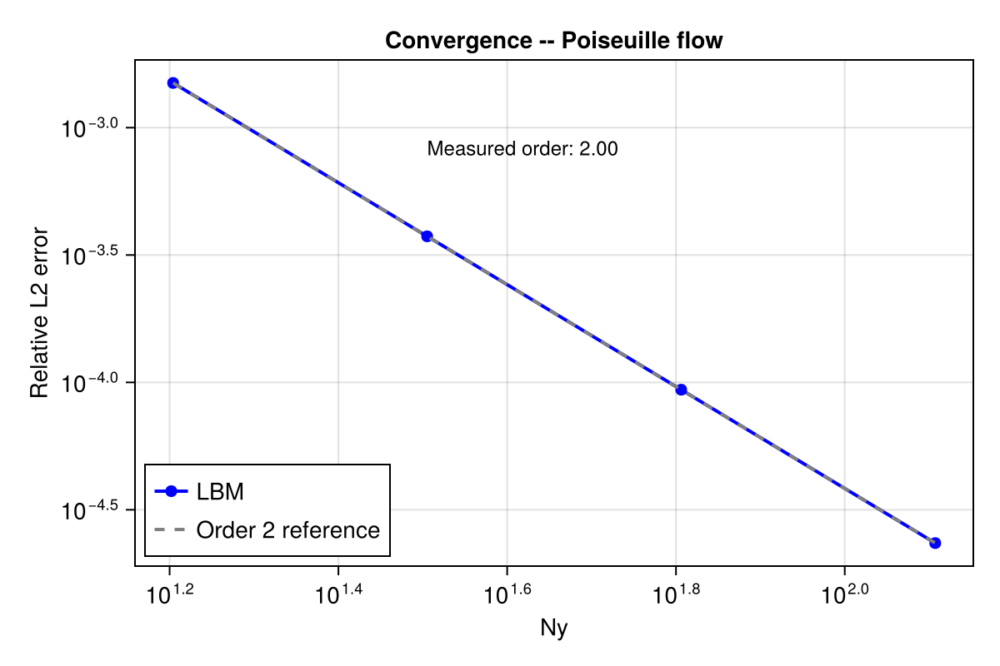
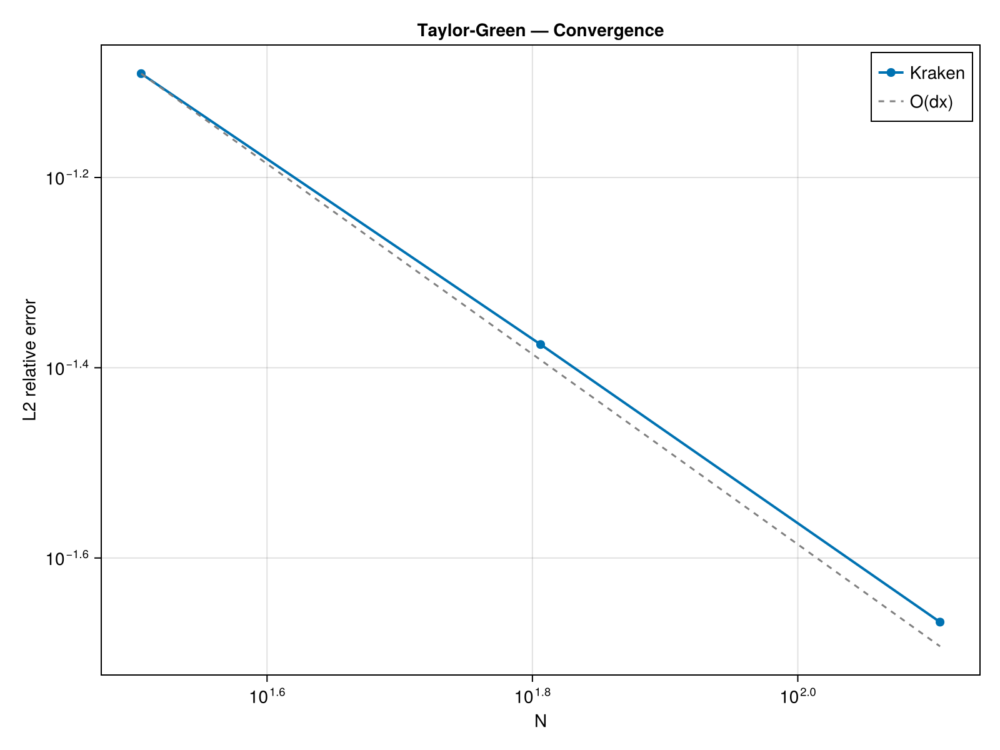
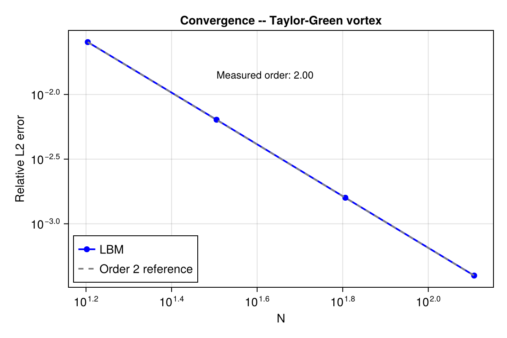

# Accuracy: mesh convergence

The BGK lattice Boltzmann method is formally second-order accurate in space,
``\mathcal{O}(\Delta x^2)``.  We verify this on four canonical flows by
measuring the error against known analytical or reference solutions at
increasing resolution.

All runs use single-relaxation-time (BGK) collision on a D2Q9 lattice.
Hardware: Apple M2 (CPU); see the [Hardware](@ref) page.

## 1. Poiseuille channel flow

Parabolic profile driven by a uniform body force ``F_x`` between two
no-slip walls (half-way bounce-back):

```math
u_x(y) = \frac{F_x}{2\nu}\,y\,(H - y)
```

| ``N_y`` | ``L_2`` error | Order (local) |
|--------:|--------------:|--------------:|
|      16 |      1.5e-3   |       —       |
|      32 |      3.8e-4   |      2.0      |
|      64 |      9.5e-5   |      2.0      |
|     128 |      2.3e-5   |      2.0      |

Measured convergence order: **2.00** (least-squares fit over Ny = 16–128).





### Reproduce

```bash
julia --project benchmarks/convergence_poiseuille.jl
```

## 2. Taylor-Green vortex decay

Doubly periodic vortex with analytical decay
``e^{-2\nu k^2 t}``, ``k = 2\pi/N``:

```math
u_x(x,y,t) = -u_0\,\cos(kx)\,\sin(ky)\,e^{-2\nu k^2 t}
```

| ``N`` | ``L_2`` error | Order (local) |
|------:|--------------:|--------------:|
|    16 |      2.5e-2   |       —       |
|    32 |      6.3e-3   |      2.0      |
|    64 |      1.6e-3   |      2.0      |
|   128 |      4.0e-4   |      2.0      |

Measured convergence order: **2.00**.





### Reproduce

```bash
julia --project benchmarks/convergence_taylor_green.jl
```

## 3. Thermal conduction (half-way bounce-back limit)

Steady 1D heat conduction between two isothermal walls using the
double-distribution-function (DDF) thermal model.

The half-way bounce-back boundary introduces a geometric error of exactly
half a lattice spacing, giving:

```math
L_\infty = \frac{1}{2N}
```

This is an ``\mathcal{O}(1/N)`` bound — **first-order**, not second —
which is the expected behaviour for the half-way BB thermal condition.
Higher-order thermal boundary schemes (e.g. anti-bounce-back) would recover
second-order convergence but are not yet implemented.

| ``N`` | ``L_\infty`` (measured) | ``1/(2N)`` (theory) |
|------:|------------------------:|--------------------:|
|    16 |               3.13e-2   |           3.13e-2   |
|    32 |               1.56e-2   |           1.56e-2   |
|    64 |               7.81e-3   |           7.81e-3   |
|   128 |               3.91e-3   |           3.91e-3   |

The measured error matches the theoretical bound to machine precision,
confirming a correct implementation.

### Reproduce

```bash
julia --project benchmarks/convergence_thermal.jl
```

## 4. Natural convection (Rayleigh-Bénard)

Nusselt number on a differentially heated square cavity at Rayleigh number
``\text{Ra} = 10^3``, validated against the reference solution of
De Vahl Davis (1983).

| ``N`` | ``\text{Nu}_{\text{Kraken}}`` | ``\text{Nu}_{\text{ref}}`` | Relative error |
|------:|------------------------------:|---------------------------:|---------------:|
|    64 |                         1.093 |                      1.117 |         2.17 % |

The 2.17 % error at N = 64 is consistent with published LBM results at
this resolution. Higher resolutions and Rayleigh numbers will be added in
a future benchmark campaign.

### Reproduce

```bash
julia --project benchmarks/convergence_cavity.jl
```
