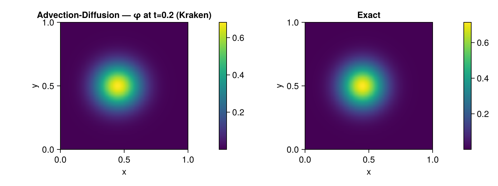
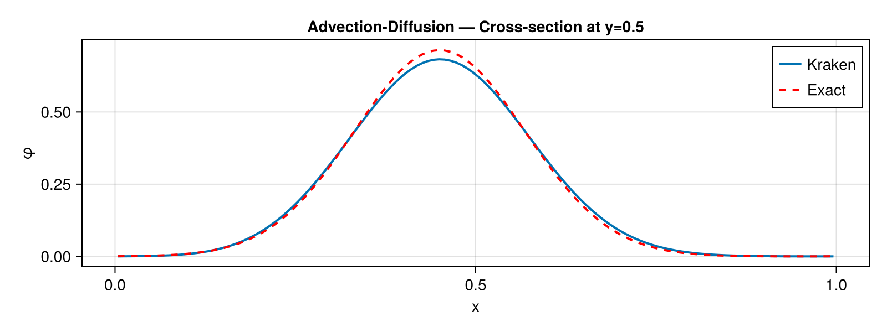

# Advection-Diffusion

## Problem Description

Combined advection and diffusion of a Gaussian bump on a periodic domain ``[0,1]^2``. A uniform velocity field ``(u, v) = (1, 0)`` advects the bump while diffusion with ``\kappa = 0.01`` simultaneously broadens it. The initial bump is centered at ``(0.25, 0.5)`` with width ``\sigma_0 = 0.1``.

This benchmark validates the coupling between [`advect!`](@ref) and [`laplacian!`](@ref).

## Equations

```math
\frac{\partial \varphi}{\partial t} + \mathbf{u} \cdot \nabla \varphi = \kappa \nabla^2 \varphi
```

with ``\mathbf{u} = (1, 0)`` and ``\kappa = 0.01``.

## Exact Solution

The exact solution is an advected and diffused Gaussian:

```math
\varphi(x,y,t) = \frac{\sigma_0^2}{\sigma(t)^2} \exp\left(-\frac{(x - x_0 - t)^2 + (y - y_0)^2}{2\sigma(t)^2}\right)
```

where ``\sigma(t) = \sqrt{\sigma_0^2 + 2\kappa t}`` accounts for the diffusive broadening, and the ``\sigma_0^2/\sigma(t)^2`` prefactor ensures mass conservation.

## Implementation

The time loop combines both operators:

```julia
for _ in 1:nsteps
    fill!(adv_out, 0.0)
    fill!(lap_out, 0.0)
    advect!(adv_out, u_vel, v_vel, phi, dx)
    laplacian!(lap_out, phi, dx)
    for j in 2:Nt-1, i in 2:Nt-1
        phi[i, j] += dt * (-adv_out[i, j] + κ * lap_out[i, j])
    end
    apply_periodic!(phi, Nt)
end
```

## Results

### Field Comparison



Side-by-side comparison of the computed (left) and exact (right) solutions at ``t = 0.2``. The bump has moved to ``x \approx 0.45`` and broadened due to diffusion.

### Cross-Section at y = 0.5



The computed profile (blue) closely follows the exact solution (red dashed). The slight asymmetry comes from the upwind advection scheme.

### Performance

| Grid | CPU time (s) | Metal time (s) | Speedup |
|------|-------------|----------------|---------|
| 128+2 | TBD | TBD | TBD |

*Measured on Apple M-series, Julia 1.12*

## References

- [1] Hundsdorfer, W., & Verwer, J. G. (2003). *Numerical Solution of Time-Dependent Advection-Diffusion-Reaction Equations*. Springer.
