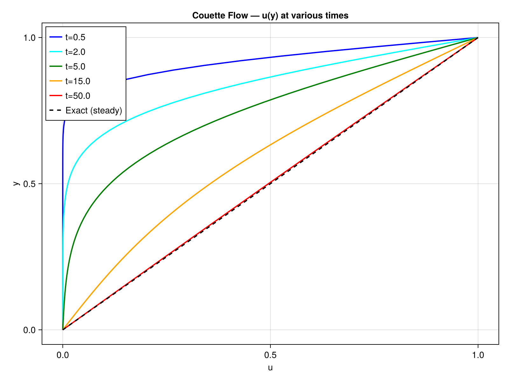
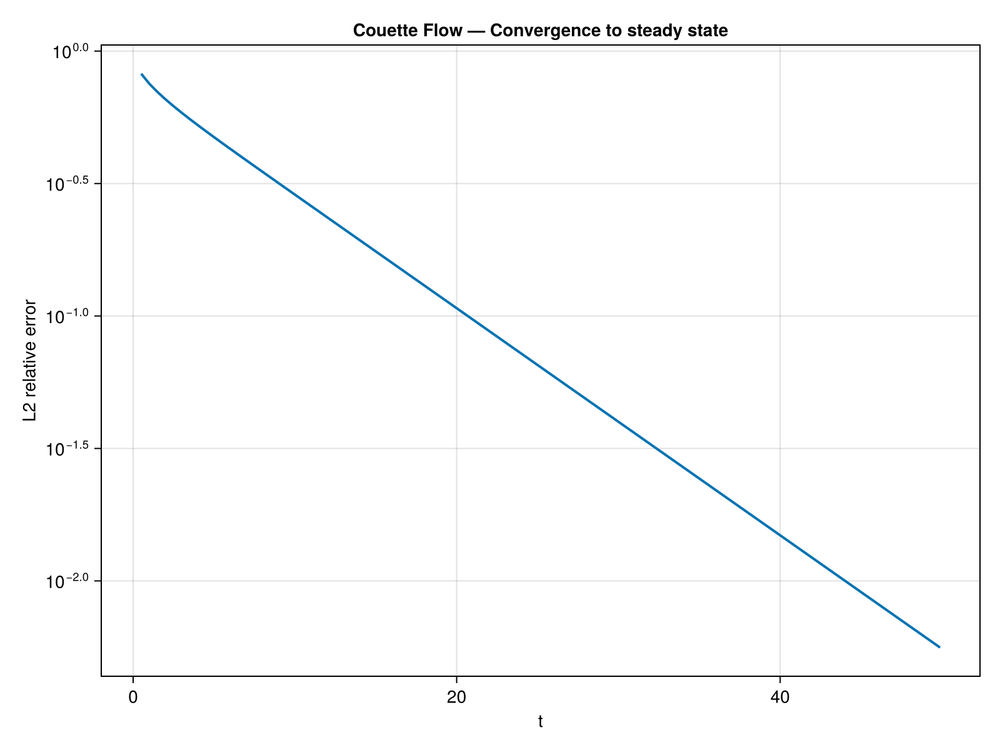

# Couette Flow

## Problem Description

Shear-driven flow between two parallel plates. The bottom wall is stationary (``u=0``) and the top wall moves at constant velocity (``u=1``). Starting from rest, the velocity profile evolves by viscous diffusion toward the linear steady-state solution. Domain ``[0,1]^2`` with ``\nu = 0.01``.

```
       ┌──────────────────────┐ y = 1 (moving wall, u=1)
       │  ════════════════→   │
       │  ═══════════→        │  ← linear profile at steady state
       │  ════════→           │
       │  ═════→              │
       │  ══→                 │
       └──────────────────────┘ y = 0 (fixed wall, u=0)
```

## Equations

```math
\frac{\partial u}{\partial t} = \nu \nabla^2 u
```

with ``u(y=0) = 0`` and ``u(y=1) = 1``.

## Exact Solution

The steady-state solution is simply:

```math
u(y) = y
```

The transient solution involves an infinite series of exponentially decaying Fourier modes that converge to this linear profile.

## Implementation

Pure diffusion with [`laplacian!`](@ref) and wall boundary conditions:

```julia
for step in 1:nsteps
    fill!(lap, 0.0)
    laplacian!(lap, u, dx)
    for j in 2:N-1, i in 2:N-1
        u[i, j] += dt * ν * lap[i, j]
    end
    u[:, 1] .= 0.0   # bottom wall
    u[:, N] .= 1.0   # top wall
end
```

The simulation runs for ``t = 50`` (about 5 diffusion time scales) to ensure convergence to steady state.

## Results

### Velocity Profiles at Various Times



Snapshots at ``t = 0.5, 2, 5, 15, 50`` s show the progressive development of the linear profile. The dashed black line is the exact steady-state solution ``u(y) = y``.

### Convergence to Steady State



The error decays exponentially as the transient Fourier modes are damped out.

### Performance

| Grid | CPU time (s) | Metal time (s) | Speedup |
|------|-------------|----------------|---------|
| 64x64 | TBD | TBD | TBD |

*Measured on Apple M-series, Julia 1.12*

## References

- [1] Couette, M. (1890). Etudes sur le frottement des liquides. *Annales de Chimie et de Physique*, 21, 433-510.
