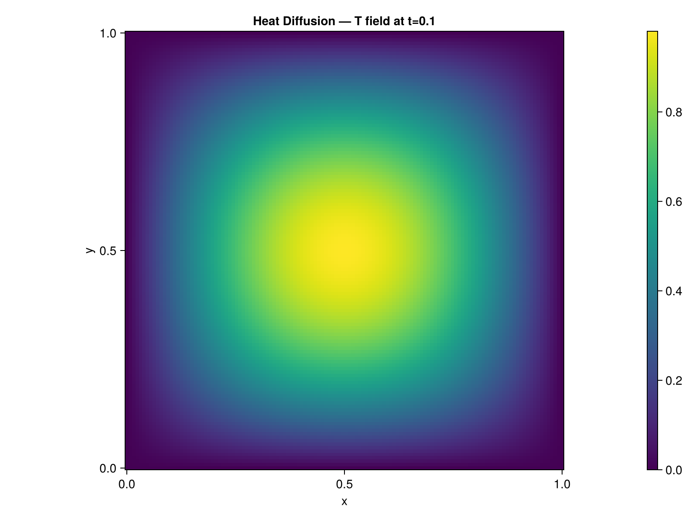
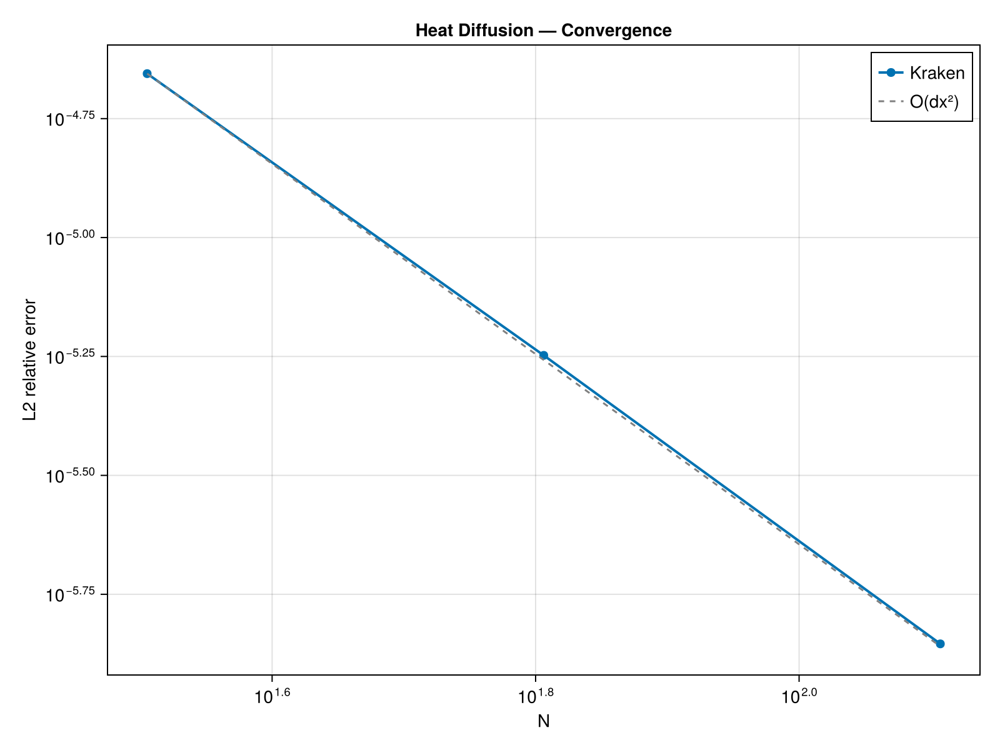
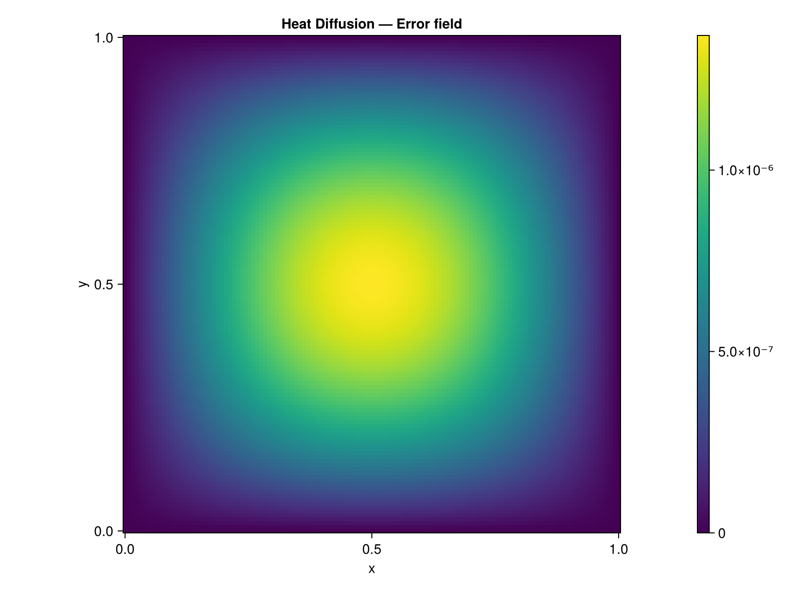

# Heat Diffusion

## Problem Description

Pure 2D heat diffusion on a unit square domain ``[0,1]^2`` with homogeneous Dirichlet boundary conditions (``T=0`` on all walls). The initial condition is a single Fourier mode ``T_0(x,y) = \sin(\pi x)\sin(\pi y)`` with thermal diffusivity ``\kappa = 0.01``. The solution decays exponentially in time.

## Equations

```math
\frac{\partial T}{\partial t} = \kappa \nabla^2 T
```

with ``T = 0`` on ``\partial\Omega`` and ``T(x,y,0) = \sin(\pi x)\sin(\pi y)``.

## Exact Solution

The analytical solution for this initial/boundary value problem is:

```math
T(x,y,t) = \exp(-2\pi^2 \kappa t) \sin(\pi x) \sin(\pi y)
```

At ``t = 0.1`` with ``\kappa = 0.01``, the decay factor is ``\exp(-2\pi^2 \times 0.001) \approx 0.9804``.

## Implementation

The time loop uses explicit Euler integration with the [`laplacian!`](@ref) operator:

```julia
for _ in 1:nsteps
    fill!(lap, 0.0)
    laplacian!(lap, T_field, dx)
    T_field .+= dt * κ .* lap
    # Dirichlet BC: T=0 on boundary
    T_field[1, :] .= 0.0; T_field[N, :] .= 0.0
    T_field[:, 1] .= 0.0; T_field[:, N] .= 0.0
end
```

The time step is chosen for stability: ``\Delta t = 0.2 \, \Delta x^2 / \kappa``.

## Results

### Field Visualization



### Convergence



The second-order spatial discretization of [`laplacian!`](@ref) yields the expected ``O(\Delta x^2)`` convergence rate.

### Error Field



### Performance

| Grid | CPU time (s) | Metal time (s) | Speedup |
|------|-------------|----------------|---------|
| 128x128 | TBD | TBD | TBD |

*Measured on Apple M-series, Julia 1.12*

## References

- Crank, J. (1975). *The Mathematics of Diffusion*. Oxford University Press.
