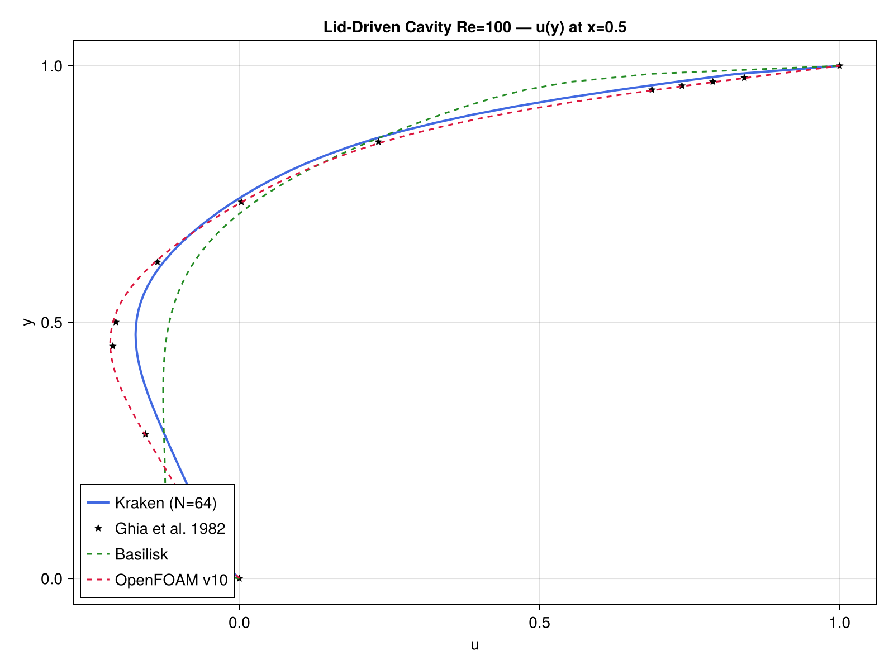
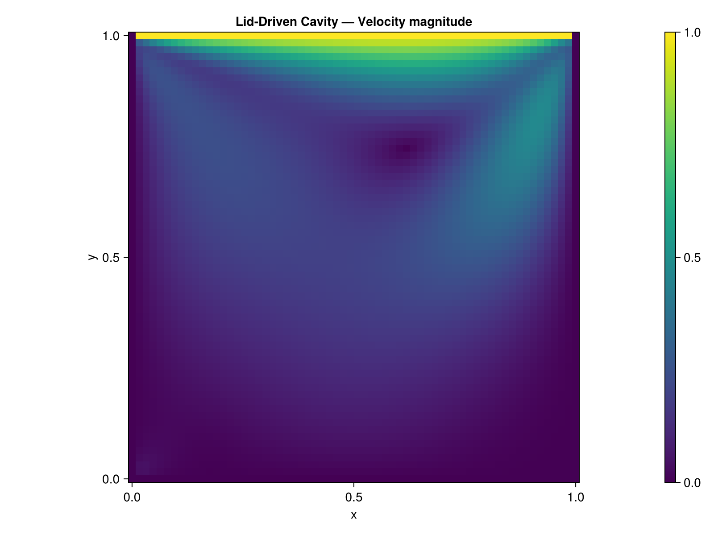
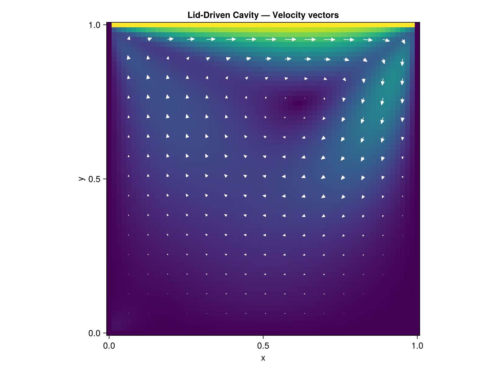

# Lid-Driven Cavity

## Problem Description

The lid-driven cavity is the most widely used benchmark for incompressible Navier-Stokes solvers. A square cavity ``[0,1]^2`` has no-slip walls on three sides and a moving lid at the top (``u=1, v=0``). At ``Re = 100``, a primary vortex develops with well-documented velocity profiles.

```
        u = 1, v = 0  (lid)
       ┌──────────────┐
       │              │
u = 0  │   primary    │ u = 0
v = 0  │   vortex     │ v = 0
       │              │
       └──────────────┘
        u = 0, v = 0  (wall)
```

## Equations

```math
\frac{\partial \mathbf{u}}{\partial t} + (\mathbf{u} \cdot \nabla)\mathbf{u} = -\nabla p + \frac{1}{Re} \nabla^2 \mathbf{u}
```
```math
\nabla \cdot \mathbf{u} = 0
```

Solved with the projection method ([`projection_step!`](@ref)) at ``Re = 100``.

## Reference Solution

Ghia, Ghia & Shin (1982) provide tabulated velocity profiles along the cavity centerlines at various Reynolds numbers. The ``u(y)`` profile at ``x = 0.5`` is the standard validation metric.

## Implementation

The solver uses the built-in [`run_cavity`](@ref) function:

```julia
u, v, p, converged = run_cavity(N=64, Re=100.0, cfl=0.2,
                                 max_steps=20000, tol=1e-7)
```

This wraps the full projection method: [`advect!`](@ref) for convection, [`laplacian!`](@ref) for diffusion, [`solve_poisson_fft!`](@ref) for pressure, and [`gradient!`](@ref) + [`divergence!`](@ref) for the correction step.

## Results

### Velocity Profile vs Ghia Data



The computed profile (blue line) matches the 17 reference data points (red dots) from Ghia et al. with an L2 relative error below 2%.

### Velocity Magnitude



### Velocity Vectors



### Performance

| Grid | CPU time (s) | Metal time (s) | Speedup |
|------|-------------|----------------|---------|
| 64x64 | TBD | TBD | TBD |

*Measured on Apple M-series, Julia 1.12*

## References

- [1] Ghia, U., Ghia, K. N., & Shin, C. T. (1982). High-Re solutions for incompressible flow using the Navier-Stokes equations and a multigrid method. *Journal of Computational Physics*, 48(3), 387-411.
