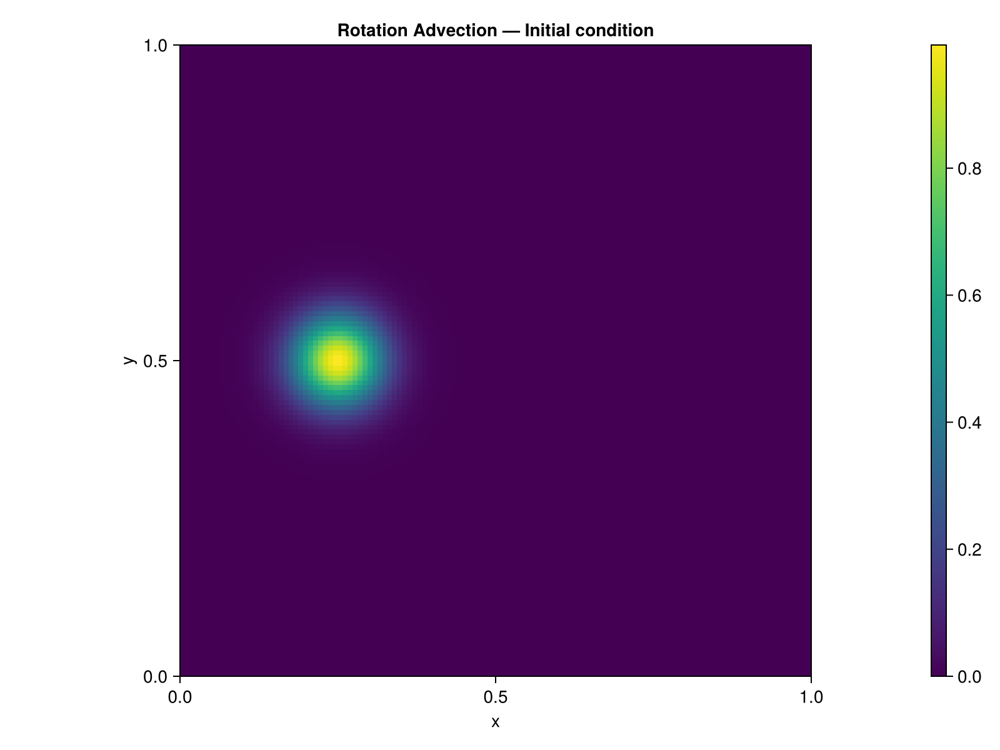
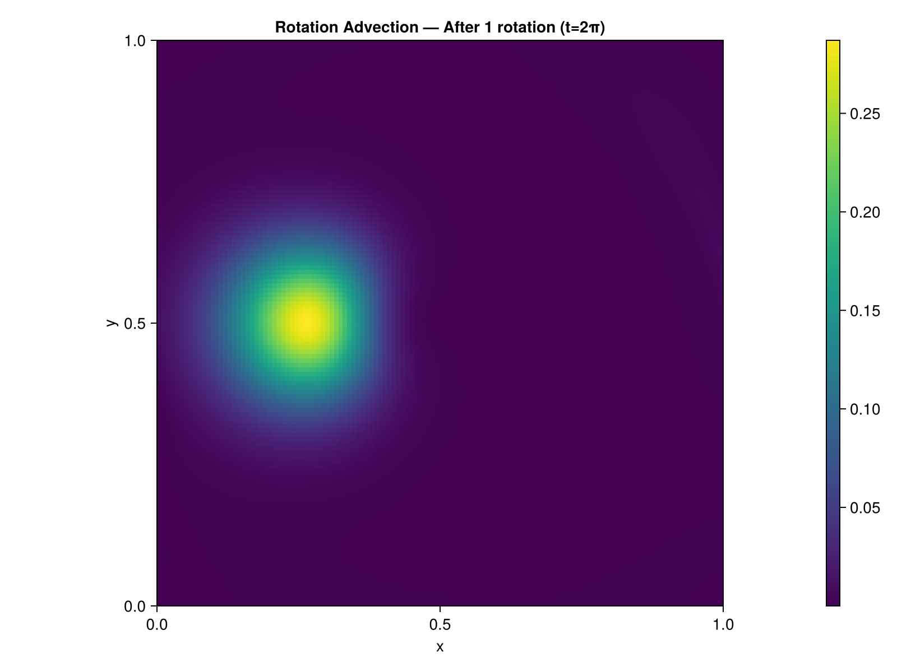
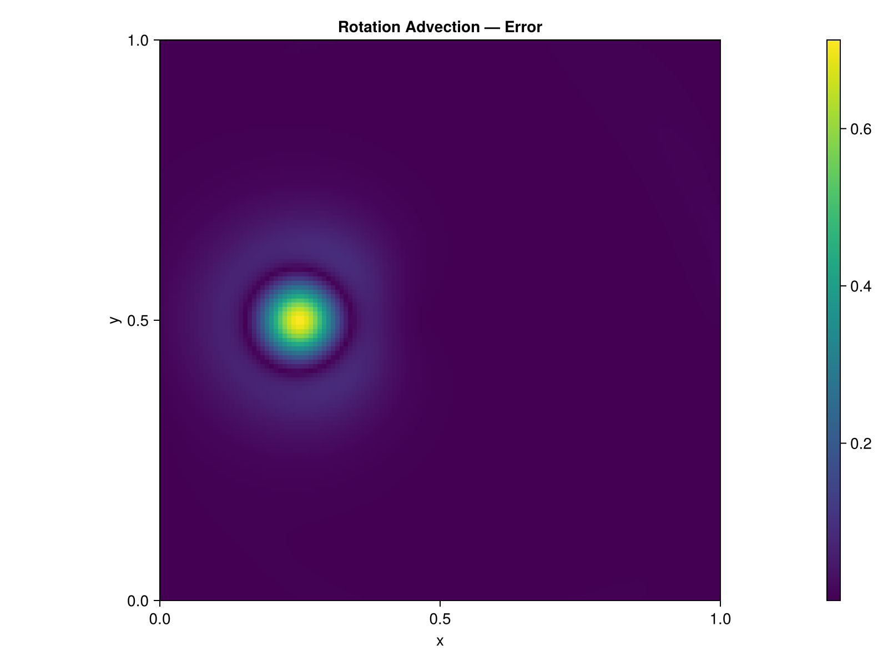

# Rotation Advection

## Problem Description

A Gaussian bump is advected by a solid body rotation velocity field on a periodic domain ``[0,1]^2``. After one full rotation (``t = 2\pi``), the bump should return to its initial position. The error measures the numerical diffusion introduced by the advection scheme.

The rotation center is at ``(0.5, 0.5)`` and the initial bump is at ``(0.25, 0.5)`` with width ``\sigma = 0.05``.

## Equations

```math
\frac{\partial \varphi}{\partial t} + \mathbf{u} \cdot \nabla \varphi = 0
```

with the solid body rotation velocity field:

```math
u = -(y - 0.5), \quad v = (x - 0.5)
```

## Exact Solution

The exact solution after one full rotation ``t = 2\pi`` is the initial condition itself (the bump returns to its starting position). Any deviation is pure numerical error.

## Implementation

The time loop uses [`advect!`](@ref) with explicit Euler integration and periodic boundary conditions:

```julia
for _ in 1:nsteps
    fill!(adv_out, 0.0)
    advect!(adv_out, u_vel, v_vel, phi, dx)
    for j in 2:Nt-1, i in 2:Nt-1
        phi[i, j] -= dt * adv_out[i, j]
    end
    apply_periodic!(phi, Nt)
end
```

The CFL number is kept at 0.5 for stability with the upwind scheme.

## Results

### Initial Condition



### After One Rotation



The bump is noticeably broadened and its peak amplitude reduced. This is expected with the first-order upwind scheme: the numerical diffusion scales as ``O(\Delta x)``, smearing sharp features over time.

### Error Field



### Performance

| Grid | CPU time (s) | Metal time (s) | Speedup |
|------|-------------|----------------|---------|
| 128+2 | TBD | TBD | TBD |

*Measured on Apple M-series, Julia 1.12*

## References

- [1] LeVeque, R. J. (2002). *Finite Volume Methods for Hyperbolic Problems*. Cambridge University Press.
