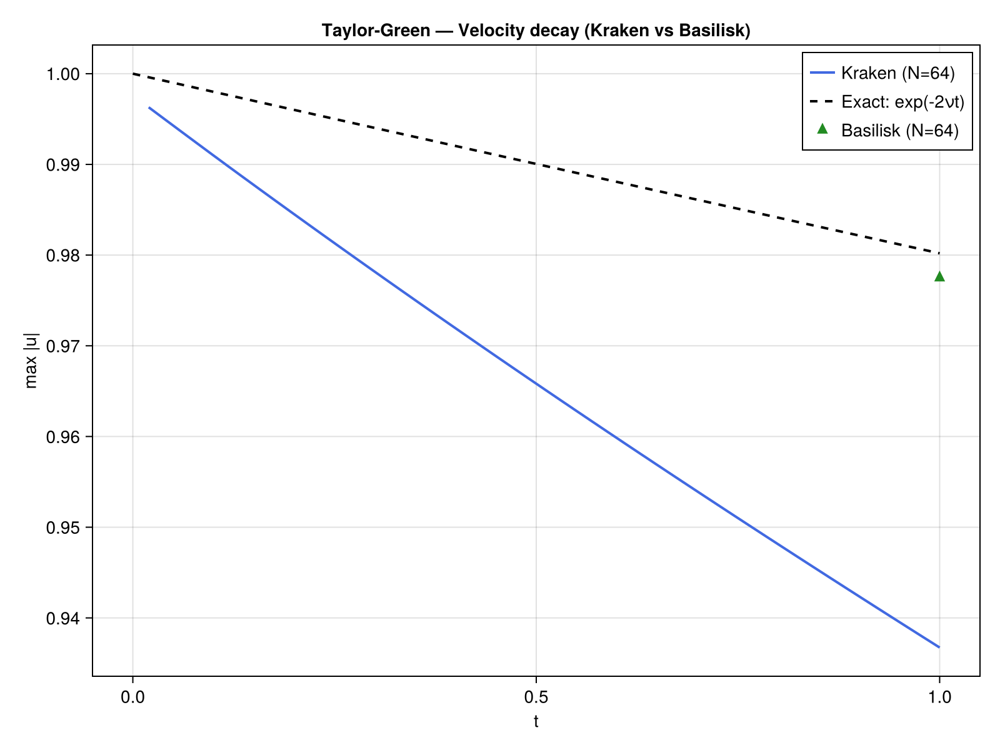

# Taylor-Green Vortex

## Problem Description

The 2D Taylor-Green vortex is a periodic flow with an exact time-dependent solution for the incompressible Navier-Stokes equations. Domain ``[0, 2\pi]^2`` with periodic boundary conditions and kinematic viscosity ``\nu = 0.01``. The vortices decay exponentially due to viscous dissipation.

## Equations

```math
\frac{\partial \mathbf{u}}{\partial t} + (\mathbf{u} \cdot \nabla)\mathbf{u} = -\nabla p + \nu \nabla^2 \mathbf{u}
```
```math
\nabla \cdot \mathbf{u} = 0
```

## Exact Solution

```math
u(x,y,t) = \cos(x)\sin(y) \, e^{-2\nu t}
```
```math
v(x,y,t) = -\sin(x)\cos(y) \, e^{-2\nu t}
```
```math
p(x,y,t) = -\frac{1}{4}\left[\cos(2x) + \cos(2y)\right] e^{-4\nu t}
```

## Implementation

The time loop manually combines all operators with the FFT Poisson solver for periodic pressure:

```julia
for _ in 1:nsteps
    # Advection
    advect!(adv_u, u, v, u, dx)
    advect!(adv_v, u, v, v, dx)
    # Diffusion
    laplacian!(lap_u, u, dx)
    laplacian!(lap_v, v, dx)
    # Euler explicit: u* = u + dt*(-adv + nu*lap)
    for j in 2:Nt-1, i in 2:Nt-1
        u[i,j] += dt * (-adv_u[i,j] + ν * lap_u[i,j])
        v[i,j] += dt * (-adv_v[i,j] + ν * lap_v[i,j])
    end
    apply_periodic_bc!(u, Nt)
    apply_periodic_bc!(v, Nt)
    # Pressure correction
    divergence!(div_f, u, v, dx)
    solve_poisson_fft!(phi, div_f[2:Nt-1, 2:Nt-1] ./ dt, dx)
    gradient!(gx, gy, p, dx)
    for j in 2:Nt-1, i in 2:Nt-1
        u[i,j] -= dt * gx[i,j]
        v[i,j] -= dt * gy[i,j]
    end
end
```

## Results

### Vorticity Field


### Convergence


The convergence is limited to O(h) by the first-order upwind scheme used in [`advect!`](@ref). This is expected: the upwind scheme introduces numerical diffusion proportional to ``\Delta x``, which dominates the second-order diffusion discretization.

### Velocity Decay



The velocity amplitude decays as ``e^{-2\nu t}``, matching the exact solution.

### Performance

| Grid | CPU time (s) | Metal time (s) | Speedup |
|------|-------------|----------------|---------|
| 128+2 | TBD | -- | -- |

*FFT solver falls back to CPU for Metal backend. Measured on Apple M-series, Julia 1.12.*

## References

- [1] Taylor, G. I., & Green, A. E. (1937). Mechanism of the production of small eddies from large ones. *Proceedings of the Royal Society A*, 158(895), 499-521.
