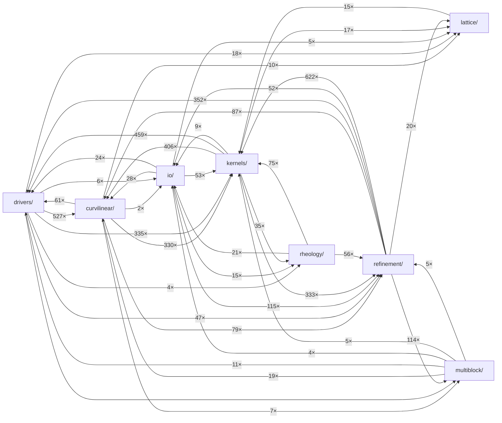

<!-- Auto-generated by scripts/extract_callgraph.jl — do NOT edit by hand. -->
<!-- Regenerate with: julia scripts/extract_callgraph.jl -->

# Auto-generated call graph

Cross-module function-call edges extracted from `src/` by static regex.
Edge weight = number of call sites. Intra-module calls are not shown.
Compare against the curated [Architecture page](architecture.md) — if
the two disagree, a PR has either added an undocumented coupling or
this graph needs regeneration.

**Stats**: 1503 functions across 8 modules, 40 cross-module call-site pairs.

## Module-level call graph

## Functions defined per module

### drivers/

Top-level definitions (136): `BCSpec2D`, `LBMConfig`, `Setup`, `_compute_drag_libb_mei_2d_gpu_cached`, `_compute_drag_libb_mei_2d_host`, `add_axisym_viscous_correction_2d!`, `add_axisym_viscous_weighted_2d!`, `add_azimuthal_allen_cahn_source_2d!`, `add_azimuthal_chemical_potential_2d!`, `add_azimuthal_curvature_2d!`, `advect_vof_plic_step!`, `advect_vof_step!`, `apply_bc_rebuild_2d!`, `apply_bounce_back_wall_2d!`, `apply_fixed_temp_east_2d!`, `apply_fixed_temp_east_3d!`, `apply_fixed_temp_north_2d!`, `apply_fixed_temp_south_2d!`, `apply_fixed_temp_west_2d!`, `apply_fixed_temp_west_3d!`, `apply_zou_he_north_2d!`, `apply_zou_he_pressure_east_2d!`, `apply_zou_he_south_2d!`, `apply_zou_he_top_3d!`, `apply_zou_he_west_2d!`, `apply_zou_he_west_spatial_2d!`, `benchmark_mlups`, `collide_2d!`, `collide_3d!`, `collide_allen_cahn_2d!`, … (truncated)

### io/

Top-level definitions (126): `ArrheniusCoupling`, `BoundarySetup`, `Expr`, `IsothermalCoupling`, `OutputSetup`, `RefineSetup`, `STLMesh`, `STLTriangle`, `WLFCoupling`, `_apply_setup_helpers!`, `_check_compressibility!`, `_check_refinement!`, `_check_relaxation!`, `_check_resolution!`, `_check_rheology!`, `_check_thermal!`, `_check_twophase!`, `_collect_vars!`, `_compile_expr`, `_deduplicate_hits!`, `_emit_issues`, `_eval_domain_value`, `_eval_number`, `_expand_preset`, `_extract_balanced_parens`, `_first_word`, `_is_ascii_stl`, `_levenshtein`, `_parse_boundary`, `_parse_define`, … (truncated)

### kernels/

Top-level definitions (308): `BCSpec3D`, `CutLinkList`, `Int32`, `LBMSpec`, `PullHalfwayBB`, `PullHalfwayBB_3D`, `T`, `ZouHePressure`, `ZouHeVelocity`, `_apply_bc_2d_east!`, `_apply_bc_2d_east_local!`, `_apply_bc_2d_north!`, `_apply_bc_2d_south!`, `_apply_bc_2d_west!`, `_apply_bc_2d_west_local!`, `_apply_bc_3d_bottom!`, `_apply_bc_3d_east!`, `_apply_bc_3d_east_local!`, `_apply_bc_3d_north!`, `_apply_bc_3d_south!`, `_apply_bc_3d_top!`, `_apply_bc_3d_west!`, `_apply_bc_3d_west_local!`, `_apply_zou_he_pressure_3d!`, `_apply_zou_he_velocity_3d!`, `_bc_bottom_halfwaybb_3d!`, `_bc_east_zh_pressure_2d!`, `_bc_east_zh_pressure_3d!`, `_bc_east_zh_pressure_local_2d!`, `_bc_east_zh_pressure_local_3d!`, … (truncated)

### lattice/

Top-level definitions (11): `AbstractLattice`, `cs2`, `equilibrium`, `lattice_dim`, `lattice_q`, `opposite`, `velocities`, `velocities_x`, `velocities_y`, `velocities_z`, `weights`

### refinement/

Top-level definitions (742): `CartesianMetrics2D`, `ConservativeTreeAdaptationPolicy2D`, `ConservativeTreePatchProposal2D`, `ConservativeTreeRefineBlock2D`, `ConservativeTreeSubcyclePackedLedgerPair2D`, `ConservativeTreeSubcycleRoutePacketCache2D`, `ConservativeTreeWallPhaseScatter2D`, `D2Q9`, `Formula`, `RefinedDomain`, `RefinementPatch`, `String`, `ThermalPatchArrays`, `TwophaseRefinedArrays`, `UInt8`, `Val`, `_accumulate_route_spec_2d!`, `_active_fluid_mass_conservative_tree_F_2d`, `_active_leaf_covering_sample_2d`, `_active_mass_conservative_tree_F_2d`, `_add_and_clear_conservative_tree_gpu_level_rows_2d_kernel!`, `_add_and_clear_conservative_tree_level_rows_2d!`, `_add_cell_Fq_2d!`, `_add_cell_Fq_3d!`, `_allocate_conservative_tree_backend_array_2d`, `_allocate_conservative_tree_gpu_array_2d`, `_allocate_conservative_tree_gpu_matrix_2d`, `_amr_d_body_force_2d`, `_amr_d_boundary_type_map_2d`, `_amr_d_boundary_value_2d`, … (truncated)

### multiblock/

Top-level definitions (78): `Block`, `BlockState2D`, `Interface`, `MultiBlockMesh2D`, `MultiBlockSanityIssue`, `Operations`, `_apply_orient_to_edge`, `_autodetect_interfaces_2d`, `_check_edge_tags_known!`, `_check_every_marked_edge_used!`, `_check_interface_both_edges_marked!`, `_check_interface_edges_colocated!`, `_check_interface_edges_same_length!`, `_check_interface_orientation_trivial!`, `_check_interface_refs_exist!`, `_check_no_duplicate_block_ids!`, `_check_uniform_element_type!`, `_choose_root_orientation`, `_copy_col_kernel_2d!`, `_copy_row_kernel_2d!`, `_curve_endpoint_coords_2d`, `_curve_midpoint_coords_2d`, `_detect_flip`, `_edge_first_last`, `_edge_params`, `_edge_params_shared`, `_exchange_pair_ghost_2d!`, `_exchange_pair_ghost_shared_node_2d!`, `_extrap_col_kernel_2d!`, `_extrap_row_kernel_2d!`, … (truncated)

### curvilinear/

Top-level definitions (80): `ApplyLiBBPrePhase`, `ApplyLiBBPrePhase_3D`, `CurvilinearMesh`, `CurvilinearMesh3D`, `ET`, `FT`, `Moments`, `Moments_3D`, `PullSLBM`, `PullSLBMBiquad`, `PullSLBM_3D`, `SLBMGeometry`, `SLBMGeometry3D`, `WriteMoments`, `WriteMoments_3D`, `_default_dx_ref`, `_default_dx_ref_3d`, `_layout_annulus_periodic_xi_2d`, `_layout_axis_aligned_2d`, `_layout_quad_block_2d`, `_layout_topological_2d`, `_load_2d_open`, `_load_3d_open`, `_read_physical_groups`, `_stretch`, `_wrap_or_clamp`, `bilinear_f`, `biquadratic_f`, `build_mesh`, `build_mesh_3d`, … (truncated)

### rheology/

Top-level definitions (22): `Bingham`, `CarreauYasuda`, `Cross`, `FENEP`, `HerschelBulkley`, `LogConfFormulation`, `Newtonian`, `OldroydB`, `PowerLaw`, `Saramito`, `StressFormulation`, `decompose_velocity_gradient`, `effective_viscosity`, `effective_viscosity_thermal`, `eigen_sym2x2`, `exp`, `log`, `mat_exp_sym2x2`, `mat_log_sym2x2`, `strain_rate_magnitude_2d`, `strain_rate_magnitude_3d`, `thermal_shift_factor`

