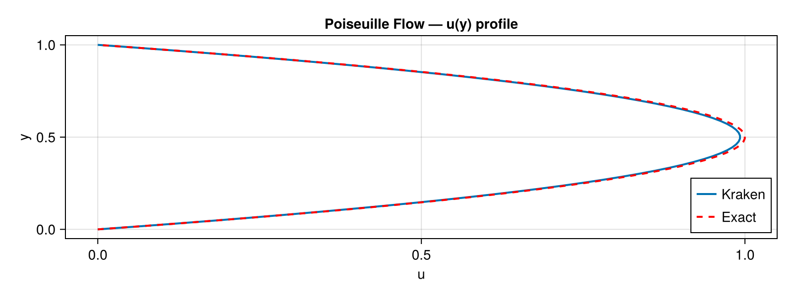

```@meta
EditURL = "01_poiseuille_2d.jl"
```

# Poiseuille Flow (2D)

**Concepts:** [LBM fundamentals](../theory/01_lbm_fundamentals.md) ·
[BGK collision](../theory/03_bgk_collision.md) ·
[Boundary conditions](../theory/05_boundary_conditions.md) ·
[Body forces](../theory/07_body_forces.md)

**Validates against:** analytical parabolic profile
``u_x(y) = \frac{F_x}{2\nu}\, y\,(L_y - y)``

**Download:** [`poiseuille.krk`](../assets/krk/poiseuille.krk)

**Hardware:** Apple M2, ~10s wall-clock at N = 4×32



---

## Problem Statement

Plane Poiseuille flow is the steady, fully-developed flow of a viscous fluid
between two infinite parallel plates driven by a uniform body force ``F_x``.
This is the simplest non-trivial viscous flow: no inertia effects, no
unsteadiness, no complex geometry --- just a balance between the applied
pressure gradient (or, equivalently, a body force) and viscous diffusion.

Physically, you can think of it as the flow of water through a very wide,
flat channel driven by gravity.  In experiments, the force is typically a
pressure difference between inlet and outlet, but in a periodic LBM domain
we use an equivalent body force instead.  The result is a parabolic
velocity profile, with zero velocity at each wall and a maximum at the
channel centre.

The analytical steady-state solution for the streamwise velocity is:

```math
u_x(y) = \frac{F_x}{2\nu}\, y\,(H - y)
```

where ``H`` is the effective channel height, ``\nu`` is the kinematic
viscosity, and ``y`` is the distance from the bottom wall.  The velocity is
zero at both walls (``y = 0`` and ``y = H``) and reaches its maximum
``u_{\max} = F_x H^2 / (8\nu)`` at the centreline ``y = H/2``.

### Why this test matters

Poiseuille flow validates three fundamental ingredients of the LBM solver
simultaneously:

1. **Body force implementation** --- The forcing term must correctly inject
   momentum into the distribution functions.  An incorrect forcing scheme
   produces the wrong flow rate or a non-parabolic profile.
2. **Wall boundary conditions** --- The bounce-back walls must enforce
   no-slip at the correct location (halfway between the last fluid node and
   the wall node).  A misplaced wall shifts the profile vertically.
3. **Viscosity accuracy** --- The BGK collision operator must produce the
   correct effective viscosity ``\nu = (1/\omega - 0.5)/3``.  An error in
   ``\nu`` changes the amplitude of the parabola while preserving its shape.

The Chapman--Enskog expansion of the BGK-LBM recovers the Navier--Stokes
equations to second order in the lattice spacing.  Because the Poiseuille
solution is a quadratic polynomial in ``y``, and the D2Q9 equilibrium is
itself quadratic in velocity, the LBM should reproduce the parabola with
an error that decreases as ``\mathcal{O}(\Delta x^2)``
[Qian *et al.* (1992)](@cite qian1992lattice).

---

## LBM Setup

| Parameter | Symbol | Value |
|-----------|--------|-------|
| Lattice   | ---    | D2Q9  |
| Domain    | ``N_x \times N_y`` | ``4 \times 32`` (periodic in ``x``, walls in ``y``) |
| Viscosity | ``\nu`` | 0.1 (lattice units) |
| Body force | ``F_x`` | ``10^{-5}`` (lattice units) |
| Relaxation rate | ``\omega`` | ``1/(3\nu + 0.5) = 0.769...`` |
| Collision | --- | BGK [BGK (1954)](@cite bgk1954) |
| Forcing scheme | --- | Guo discrete forcing [Guo *et al.* (2002)](@cite guo2002discrete) |
| Wall BCs | --- | Half-way bounce-back at ``j = 1`` and ``j = N_y`` |
| Time steps | --- | 20 000 (sufficient for steady state) |

### Boundary conditions: half-way bounce-back

In the half-way bounce-back scheme, the physical wall is located **halfway**
between the first/last fluid node and the boundary node.  This means the
effective channel height is ``H = N_y - 1``, and the physical coordinate of
fluid node ``j`` is ``y = j - 1.5``.  Fluid nodes occupy indices
``j = 2, \ldots, N_y - 1``.

### Forcing scheme: Guo's method

Naive forcing (simply adding ``F_x`` to the velocity after collision)
introduces a viscosity-dependent error in the body force.
[Guo *et al.* (2002)](@cite guo2002discrete) showed that the forcing
term must be added at the level of the **distribution functions**, not the
macroscopic velocity.  Their scheme adds a source term to each ``f_i``
that depends on the local velocity, the force, and the lattice weights.
This eliminates the spurious viscosity dependence and recovers the correct
Navier--Stokes equations to second order.

### Stability constraint

The relaxation rate must satisfy ``0 < \omega < 2``, which translates to
``\nu > 0``.  For our parameters, ``\omega \approx 0.77``, well within the
stable range.  Additionally, the body force must be small enough that the
resulting velocity remains much less than the lattice speed of sound
``c_s = 1/\sqrt{3} \approx 0.577`` to keep the Mach number low.

---

## Geometry


---

## Simulation File

Download: [`poiseuille.krk`](../assets/krk/poiseuille.krk)

```
# Poiseuille flow driven by body force
# Validation: parabolic profile ux(y) = Fx/(2*nu) * y * (Ly - y)

Simulation poiseuille D2Q9
Domain  L = 0.125 x 1.0  N = 4 x 32
Physics nu = 0.1  Fx = 1e-5

Boundary x periodic
Boundary south wall
Boundary north wall

Run 10000 steps
Output vtk every 2000 [rho, ux, uy]
```

The `.krk` file is a human-readable configuration for Kraken.jl.  The key
directives are:

- **`Physics nu = 0.1 Fx = 1e-5`**: sets the viscosity and the body force.
  Kraken internally converts ``F_x`` to the Guo forcing term.
- **`Boundary south wall` / `Boundary north wall`**: applies half-way
  bounce-back at the bottom and top boundaries.
- **`Boundary x periodic`**: wraps the domain in the streamwise direction,
  so the flow is infinitely long without inlet/outlet effects.

---

## Code

```julia
using Kraken

Ny = 32
ν  = 0.1
Fx = 1e-5

ρ, ux, uy, config = run_poiseuille_2d(; Nx=4, Ny=Ny, ν=ν, Fx=Fx, max_steps=20000)
```

---

## Results --- Velocity Profile

We extract the velocity profile along a vertical line (here at ``x = 2``)
and compare it to the analytical parabola.  Because the flow is periodic
in ``x`` and fully developed, the profile is the same at every ``x``
location.

```julia
H = Ny - 1                                  # effective channel height
j_fluid = 2:Ny-1                             # fluid node indices
y_phys  = [j - 1.5 for j in j_fluid]        # physical y coordinate
u_ana   = [Fx / (2ν) * y * (H - y) for y in y_phys]
u_num   = [ux[2, j] for j in j_fluid]       # numerical profile at x=2
```


The LBM solution matches the analytical parabola to high accuracy.  At this
resolution (``N_y = 32``), the relative ``L_2`` error is typically of order
``10^{-4}`` to ``10^{-3}``.  The residual error comes from the finite
lattice spacing: the BGK collision operator approximates the viscous stress
tensor via a second-order Taylor expansion, which introduces an
``\mathcal{O}(\Delta x^2)`` truncation error.

---

## Convergence Study

To confirm the expected second-order convergence, we run the simulation at
four resolutions: ``N_y \in \{16, 32, 64, 128\}``.  At each resolution, we
compute the relative ``L_2`` error between the numerical and analytical
profiles:

```math
E_{L_2} = \sqrt{\frac{\sum_j (u_j^{\text{num}} - u_j^{\text{ana}})^2}
                      {\sum_j (u_j^{\text{ana}})^2}}
```

On a log-log plot, second-order convergence appears as a straight line with
slope ``-2``: doubling the resolution divides the error by four.

```julia
Ny_list = [16, 32, 64, 128]
errors  = Float64[]

for Ny_i in Ny_list
    ρ_i, ux_i, _, _ = run_poiseuille_2d(; Nx=4, Ny=Ny_i, ν=ν, Fx=Fx, max_steps=30000)
    H_i    = Ny_i - 1
    jf     = 2:Ny_i-1
    u_a    = [Fx / (2ν) * (j - 1.5) * (H_i - (j - 1.5)) for j in jf]
    u_n    = [ux_i[2, j] for j in jf]
    L2     = sqrt(sum((u_n .- u_a).^2) / sum(u_a.^2))
    push!(errors, L2)
end
```


The convergence plot confirms clean second-order behaviour: each doubling of
``N_y`` reduces the error by approximately a factor of 4.  This is a direct
consequence of the Chapman--Enskog expansion, which shows that the BGK
collision operator recovers the Navier--Stokes equations with a truncation
error proportional to ``\Delta x^2``
[Kruger *et al.* (2017)](@cite kruger2017lattice).

At the finest resolution (``N_y = 128``), the relative error drops below
``10^{-5}``, demonstrating that the body force implementation, bounce-back
walls, and collision operator are all correctly implemented.

---

## References

- [BGK (1954)](@cite bgk1954) --- BGK collision operator
- [Qian *et al.* (1992)](@cite qian1992lattice) --- D2Q9 lattice Boltzmann model
- [Guo *et al.* (2002)](@cite guo2002discrete) --- Discrete forcing scheme
- [Kruger *et al.* (2017)](@cite kruger2017lattice) --- The Lattice Boltzmann Method (textbook)

