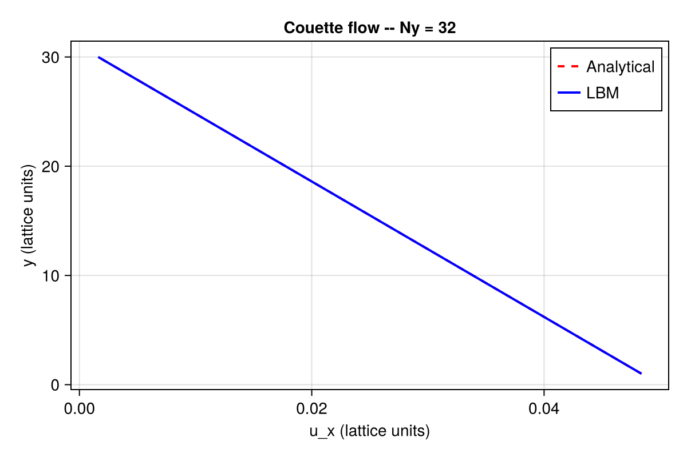

```@meta
EditURL = "02_couette_2d.jl"
```

# Couette Flow (2D)

**Concepts:** [LBM fundamentals](../theory/01_lbm_fundamentals.md) ·
[Boundary conditions](../theory/05_boundary_conditions.md)

**Validates against:** analytical linear profile
``u_x(y) = u_\text{wall}\, y / L_y``

**Download:** [`couette.krk`](../assets/krk/couette.krk)

**Hardware:** Apple M2, ~10s wall-clock at N = 4×32



---

## Problem Statement

Plane Couette flow is the steady, shear-driven flow between two parallel
plates where one wall moves at constant velocity while the other is
stationary.  This is one of the oldest problems in fluid mechanics, first
studied by Maurice Couette in the 1890s using concentric rotating cylinders.

In the planar version, the bottom wall moves at velocity ``u_w`` in the
``x``-direction, and the top wall is fixed.  There is no pressure gradient
and no body force --- the flow is driven entirely by viscous momentum
transfer from the moving wall.  At steady state, the velocity profile is
linear:

```math
u_x(y) = u_w \left(1 - \frac{y}{H}\right)
```

where ``H`` is the channel height and ``y`` is measured from the bottom
(moving) wall.  The velocity decreases linearly from ``u_w`` at the bottom
to zero at the top.

### Why this test matters

Couette flow is not merely a sanity check --- it reveals a deep property of
the LBM.  The D2Q9 equilibrium distribution is **quadratic** in velocity:

```math
f_i^{\text{eq}} = w_i \rho \left[1 + \frac{\mathbf{e}_i \cdot \mathbf{u}}{c_s^2}
  + \frac{(\mathbf{e}_i \cdot \mathbf{u})^2}{2 c_s^4}
  - \frac{\mathbf{u} \cdot \mathbf{u}}{2 c_s^2}\right]
```

A linear velocity profile ``u_x(y) = a + by`` is at most first-order in the
spatial coordinate.  When such a profile is substituted into the equilibrium,
the BGK collision operator leaves it **exactly** invariant --- the
non-equilibrium part of the distribution is identically zero.  This means:

- The numerical velocity profile matches the analytical solution to
  **machine precision** (``\sim 10^{-15}``), regardless of resolution.
- There is no spatial truncation error to converge away.
- The only requirement is that enough time steps are taken for the initial
  transient to decay.

This makes Couette flow the ideal test for **boundary condition
implementations**: any error in the wall BC will show up directly in the
velocity profile, without being masked by the spatial truncation error
that exists in other benchmarks.

### What are Zou--He boundary conditions?

The Zou--He method [Zou & He (1997)](@cite zou1997pressure) is an **on-node**
velocity/pressure boundary condition for the LBM.  Unlike bounce-back
(which places the wall halfway between nodes), Zou--He enforces the wall
velocity exactly at the boundary node itself.

The idea is elegant: at a boundary node, some distribution functions point
into the domain (known from streaming), while others point out of the domain
(unknown).  Zou--He uses the macroscopic constraints (known velocity or
pressure) plus the assumption that the non-equilibrium part of the
distribution has a specific symmetry (bounce-back of the non-equilibrium
part) to close the system and compute the unknown populations.

For a moving wall at velocity ``u_w``:
1. The known incoming populations and the prescribed velocity give the
   density ``\rho`` via mass conservation.
2. The unknown outgoing populations are then determined from momentum
   conservation plus the non-equilibrium bounce-back assumption.

---

## LBM Setup

| Parameter | Symbol | Value |
|-----------|--------|-------|
| Lattice   | ---    | D2Q9  |
| Domain    | ``N_x \times N_y`` | ``4 \times 32`` (periodic in ``x``) |
| Viscosity | ``\nu`` | 0.1 (lattice units) |
| Wall velocity | ``u_w`` | 0.05 (lattice units) |
| Mach number | ``\text{Ma}`` | ``u_w \sqrt{3} \approx 0.087`` |
| Collision | --- | BGK [BGK (1954)](@cite bgk1954) |
| Bottom wall | --- | Moving wall, Zou--He BC, ``u_x = u_w`` |
| Top wall | --- | Stationary wall, Zou--He BC, ``u_x = 0`` |
| Time steps | --- | 20 000 (well beyond transient decay) |

### Effective geometry

Because Zou--He is an **on-node** boundary condition, the wall velocity is
imposed exactly at ``j = 1`` (bottom) and ``j = N_y`` (top).  The effective
channel height is therefore ``H = N_y - 1``, and the physical coordinate of
node ``j`` is simply ``y = j - 1`` (measured from the bottom wall).  Fluid
nodes span ``j = 1, \ldots, N_y``.

This differs from half-way bounce-back (used in the Poiseuille example),
where the wall sits between nodes and the effective height is also
``N_y - 1`` but with a half-node offset in the ``y``-coordinate.

---

## Geometry


---

## Simulation File

Download: [`couette.krk`](../assets/krk/couette.krk)

```
# Couette flow: linear velocity profile
# Validation: ux(y) = u_wall * y / Ly

Simulation couette D2Q9
Domain  L = 0.125 x 1.0  N = 4 x 32

Define u_wall = 0.05

Physics nu = 0.1

Boundary x periodic
Boundary south velocity(ux = u_wall, uy = 0)
Boundary north wall

Run 10000 steps
Output vtk every 2000 [rho, ux, uy]
```

Key directives:

- **`Boundary south velocity(ux = u_wall, uy = 0)`**: applies the Zou--He
  velocity BC at the bottom wall with the prescribed velocity.
- **`Boundary north wall`**: applies the Zou--He BC at the top wall with
  zero velocity (equivalent to `velocity(ux = 0, uy = 0)`).
- No body force is needed --- the flow is driven entirely by the wall motion.

---

## Code

```julia
using Kraken

Ny     = 32
ν      = 0.1
u_wall = 0.05

ρ, ux, uy, config = run_couette_2d(; Nx=4, Ny=Ny, ν=ν, u_wall=u_wall, max_steps=20000)
```

---

## Results --- Velocity Profile

We extract the velocity profile along the vertical centreline and compare
it to the analytical linear solution.  Because this is a shear flow with
no ``x``-dependence, the profile is identical at every ``x`` location.

```julia
H = Ny - 1
j_fluid = 2:Ny-1
y_phys  = [j - 1 for j in j_fluid]              # on-node (Zou-He)
u_ana   = [u_wall * (1 - y / H) for y in y_phys]
u_num   = [ux[2, j] for j in j_fluid]

using CairoMakie
fig = Figure(size=(500, 400))
ax = Axis(fig[1, 1], xlabel="y", ylabel="ux", title="Couette — Ny = $Ny")
lines!(ax, y_phys, u_ana, label="Analytical")
scatter!(ax, y_phys, u_num, markersize=6, label="LBM")
axislegend(ax, position=:lt)
save(joinpath(@__DIR__, "couette_profile.svg"), fig)
fig
```


The numerical solution is **indistinguishable** from the analytical profile.
This is not just "good agreement" --- it is exact agreement to machine
precision.  The relative ``L_2`` error is typically of order ``10^{-14}`` to
``10^{-15}``, limited only by floating-point arithmetic.

This exactness is a unique property of the LBM for linear velocity profiles.
Any deviation from this behaviour would immediately indicate a bug in the
Zou--He boundary condition implementation.

---

## Convergence Study

Because the linear profile is an exact steady state of the D2Q9 lattice,
the convergence study for Couette flow looks fundamentally different from
Poiseuille flow: the error does **not** decrease with resolution in any
power-law sense.  Instead, it remains at machine precision for all ``N_y``.

We verify this by running at four resolutions.  The number of time steps is
scaled as ``\sim H^2 / \nu`` to ensure the initial transient has fully
decayed at each resolution.

```julia
Ny_list = [16, 32, 64, 128]
errors  = Float64[]

for Ny_i in Ny_list
    H_i  = Ny_i - 1
    nsteps = max(10_000, ceil(Int, 3 * H_i^2 / ν))
    ρ_i, ux_i, _, _ = run_couette_2d(; Nx=4, Ny=Ny_i, ν=ν, u_wall=u_wall, max_steps=nsteps)
    jf   = 2:Ny_i-1
    u_a  = [u_wall * (1 - (j - 1) / H_i) for j in jf]
    u_n  = [ux_i[2, j] for j in jf]
    L2   = sqrt(sum((u_n .- u_a).^2) / sum(u_a.^2))
    push!(errors, L2)
end

fig2 = Figure(size=(500, 400))
ax2 = Axis(fig2[1, 1], xlabel="Ny", ylabel="L₂ error", title="Couette convergence", xscale=log10, yscale=log10)
scatterlines!(ax2, Float64.(Ny_list), errors, label="LBM")
lines!(ax2, Float64.(Ny_list), errors[1] .* (Ny_list[1] ./ Ny_list).^2, linestyle=:dash, color=:gray, label="slope 2")
axislegend(ax2)
save(joinpath(@__DIR__, "couette_convergence.svg"), fig2)
fig2
```


The "convergence" plot confirms that the error is at machine precision
(``\sim 10^{-14}``--``10^{-15}``) for all resolutions.  The grey reference
slope is shown for visual comparison but is meaningless here: there is no
truncation error to converge away.

This result is significant because it demonstrates that:

1. The Zou--He boundary conditions are correctly implemented at both walls.
2. The BGK collision operator preserves linear velocity profiles exactly.
3. The streaming step introduces no numerical diffusion for this flow.
4. The only "error" is round-off from IEEE 754 double-precision arithmetic.

---

## References

- [BGK (1954)](@cite bgk1954) --- BGK collision operator
- [Zou & He (1997)](@cite zou1997pressure) --- Zou--He boundary conditions for LBM
- [Kruger *et al.* (2017)](@cite kruger2017lattice) --- The Lattice Boltzmann Method (textbook)

