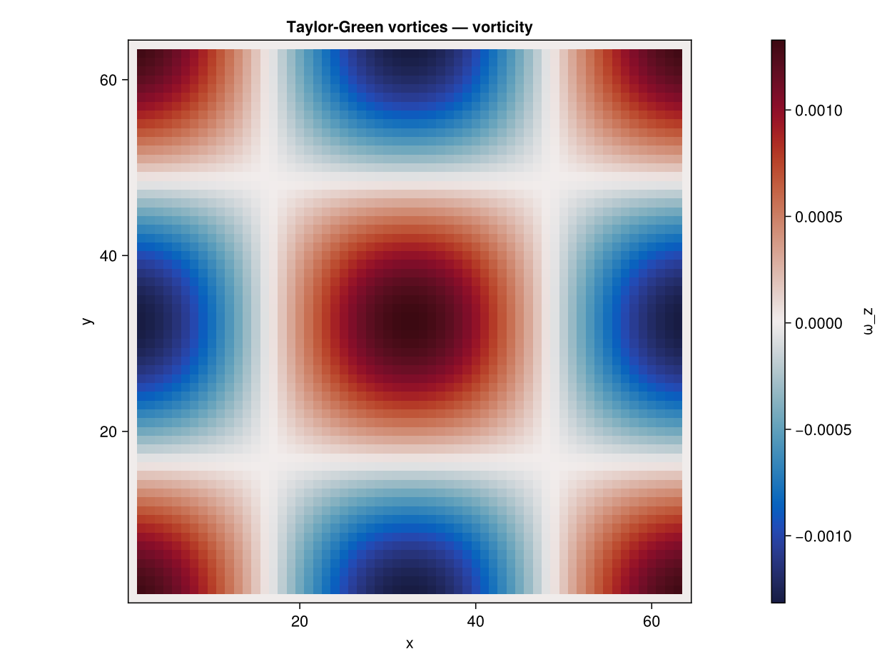

```@meta
EditURL = "03_taylor_green_2d.jl"
```

# Taylor--Green Vortex (2D)

**Concepts:** [LBM fundamentals](../theory/01_lbm_fundamentals.md) ·
[BGK collision](../theory/03_bgk_collision.md)

**Validates against:** analytical exponential decay
``u(t) = u_0\,\exp(-2\nu k^2 t)``

**Download:** [`taylor_green.krk`](../assets/taylor_green.krk)

**Hardware:** Apple M2, ~5s wall-clock at N = 64×64


*(figure pending — generated by KrakenView in Phase 4.3 Pass B)*

---

## Problem Statement

The Taylor--Green vortex is one of the few **exact unsteady solutions** of
the incompressible Navier--Stokes equations.  First derived by
[Taylor & Green (1937)](@cite taylor1937mechanism), it describes an array of
counter-rotating vortices on a doubly-periodic domain that decay smoothly
under the action of viscosity.  No boundaries, no forcing, no
approximations --- just pure viscous decay.

The initial velocity field consists of sinusoidal vortices:

```math
u_x(x, y, 0) =  u_0 \sin(kx)\,\cos(ky), \qquad
u_y(x, y, 0) = -u_0 \cos(kx)\,\sin(ky)
```

where ``u_0`` is the peak velocity amplitude and ``k = 2\pi / N`` is the
wavenumber (one full wavelength fits in the domain of size ``N``).  This
velocity field is divergence-free (``\nabla \cdot \mathbf{u} = 0``) by
construction, and the two components are related by continuity.

Because the Navier--Stokes equations for this configuration decouple into
independent Fourier modes, the solution at any time ``t > 0`` is simply
the initial field multiplied by an exponential decay factor:

```math
u_x(x, y, t) =  u_0 \sin(kx)\,\cos(ky)\; e^{-2\nu k^2 t}
```
```math
u_y(x, y, t) = -u_0 \cos(kx)\,\sin(ky)\; e^{-2\nu k^2 t}
```

The corresponding pressure field is:

```math
p(x, y, t) = -\frac{\rho_0 u_0^2}{4}\left[\cos(2kx) + \cos(2ky)\right] e^{-4\nu k^2 t}
```

### Kinetic energy decay

The domain-averaged kinetic energy per unit mass is:

```math
E(t) = \frac{1}{N^2} \sum_{i,j} \frac{1}{2}\left(u_x^2 + u_y^2\right)
      = \frac{u_0^2}{4}\, e^{-4\nu k^2 t} \equiv E_0\, e^{-4\nu k^2 t}
```

where ``E_0 = u_0^2 / 4`` (the factor 1/4 comes from the spatial average of
``\sin^2 \cos^2``).  The decay rate ``4\nu k^2`` depends linearly on the
viscosity.  If the LBM solver has the correct effective viscosity, the
numerical energy decay will match this exponential exactly.  If the
effective viscosity is slightly wrong --- for instance due to numerical
dissipation or a coding error --- the decay rate will differ, and this
discrepancy is easy to detect.

### Why this test matters

The Taylor--Green vortex is **the** accuracy benchmark for LBM solvers.
It tests the solver in the cleanest possible setting:

1. **No boundaries** --- The domain is fully periodic, so boundary condition
   errors are eliminated entirely.  Any deviation from the analytical
   solution comes from the collision operator and streaming step alone.
2. **Unsteady dynamics** --- Unlike Poiseuille or Couette flow, the solution
   evolves in time.  This tests the temporal accuracy of the BGK operator,
   not just its steady-state behaviour.
3. **Effective viscosity** --- The decay rate is directly proportional to
   ``\nu``.  Measuring the numerical decay and comparing it to
   ``E_0 \exp(-4\nu k^2 t)`` gives a precise measurement of the solver's
   effective viscosity.
4. **Compressibility error** --- The LBM is inherently weakly compressible
   (finite speed of sound ``c_s = 1/\sqrt{3}``).  The pressure field
   generates density fluctuations of order ``\text{Ma}^2``, which can
   perturb the velocity field.  Keeping ``\text{Ma} = u_0 \sqrt{3} \ll 1``
   ensures these effects are negligible.

This test is widely used in the LBM literature
[Chen & Doolen (1998)](@cite chen1998lattice) and is recommended as the
first unsteady validation case in the textbook by
[Kruger *et al.* (2017)](@cite kruger2017lattice).

---

## LBM Setup

| Parameter | Symbol | Value |
|-----------|--------|-------|
| Lattice   | ---    | D2Q9, fully periodic |
| Resolution | ``N`` | ``64 \times 64`` |
| Viscosity | ``\nu`` | 0.01 (lattice units) |
| Peak velocity | ``u_0`` | 0.01 (lattice units) |
| Wavenumber | ``k`` | ``2\pi / 64 \approx 0.098`` |
| Mach number | ``\text{Ma}`` | ``u_0\sqrt{3} \approx 0.017`` |
| Collision | --- | BGK [BGK (1954)](@cite bgk1954) |
| Boundaries | --- | Periodic in both ``x`` and ``y`` |
| Time steps | --- | 2000 |
| Decay time scale | ``\tau_d = 1/(2\nu k^2)`` | ``\approx 5190`` steps |

With ``\text{Ma} \approx 0.017``, compressibility effects are of order
``\text{Ma}^2 \approx 3 \times 10^{-4}`` and can be safely neglected.
The viscosity ``\nu = 0.01`` gives a relaxation rate
``\omega = 1/(3 \times 0.01 + 0.5) = 1/0.53 \approx 1.89``, which is close
to the upper stability limit ``\omega = 2`` but still stable.  This is
intentional: low viscosity (high Reynolds number) tests the solver in a
regime where numerical dissipation is most visible.

---

## Geometry


---

## Simulation File

Download: [`taylor_green.krk`](../assets/krk/taylor_green.krk)

```
# Taylor-Green vortex decay in a fully periodic domain
# Validation: exponential decay rate exp(-2*nu*k^2*t)

Simulation taylor_green D2Q9
Domain  L = 64 x 64  N = 64 x 64

Define u0 = 0.01

Physics nu = 0.01

Boundary x periodic
Boundary y periodic

Initial { ux = u0*sin(2*pi*x/Lx)*cos(2*pi*y/Ly)
          uy = -u0*cos(2*pi*x/Lx)*sin(2*pi*y/Ly)
          rho = 1 - 3*u0^2/4*(cos(4*pi*x/Lx) + cos(4*pi*y/Ly)) }

Run 2000 steps
Output vtk every 500 [rho, ux, uy]
```

The `Initial` block prescribes the exact Taylor--Green velocity and
density fields.  The density expression
``\rho = 1 - 3u_0^2/4 [\cos(4\pi x/L_x) + \cos(4\pi y/L_y)]`` is the
consistent initial pressure field divided by ``c_s^2``, which minimises
acoustic transients at startup.  Without this density initialisation, the
solver would need several acoustic time scales to adjust the pressure
field, during which the velocity would be perturbed.

---

## Code

```julia
using Kraken

N  = 64
ν  = 0.01
u0 = 0.01

ρ, ux, uy, config, u0_out, k, max_steps = run_taylor_green_2d(;
    N=N, ν=ν, u0=u0, max_steps=2000)
```

---

## Results --- Energy Decay

We measure the domain-averaged kinetic energy at several time checkpoints
by re-running the simulation with different numbers of steps.  Each point
gives the instantaneous energy; we compare the result to the analytical
exponential decay ``E(t) = E_0 \exp(-4\nu k^2 t)``.

```julia
steps_list = 0:200:2000
E_num = Float64[]
E_ana = Float64[]
E0    = 0.5 * u0^2

for s in steps_list
    if s == 0
        push!(E_num, E0)
    else
        ρ_s, ux_s, uy_s, _ = run_taylor_green_2d(; N=N, ν=ν, u0=u0, max_steps=s)[1:4]
        KE = 0.0
        for j in 1:N, i in 1:N
            KE += 0.5 * (ux_s[i,j]^2 + uy_s[i,j]^2)
        end
        push!(E_num, KE / (N * N))
    end
    push!(E_ana, E0 * exp(-4ν * k^2 * s))
end
```


The numerical energy decay follows the analytical exponential with
excellent agreement.  This confirms that the effective viscosity of the
BGK operator matches the prescribed value ``\nu = 0.01`` to high accuracy.

At ``t = 2000`` steps, the analytical decay factor is
``\exp(-4 \times 0.01 \times k^2 \times 2000) \approx 0.46``, meaning the
vortices have lost about half their kinetic energy.  The numerical values
track this decay without any visible drift, which would indicate a
viscosity mismatch.

### Interpreting deviations

If the numerical decay were **faster** than the analytical curve, it would
mean the solver has excess numerical dissipation (effective
``\nu > 0.01``).  If the decay were **slower**, the solver would be
under-dissipating.  For BGK-LBM with correct implementation, the match
should be within ``\mathcal{O}(\text{Ma}^2)`` of the analytical curve.

---

## Vorticity Field

To visualise the spatial structure of the flow, we compute the
``z``-component of vorticity from the final velocity field using central
finite differences on the periodic domain:

```math
\omega_z(i,j) = \frac{u_y(i+1,j) - u_y(i-1,j)}{2}
              - \frac{u_x(i,j+1) - u_x(i,j-1)}{2}
```

where periodic wrapping handles the boundary indices.

```julia
ωz = zeros(N, N)
for j in 1:N, i in 1:N
    ip = mod1(i + 1, N); im = mod1(i - 1, N)
    jp = mod1(j + 1, N); jm = mod1(j - 1, N)
    ωz[i, j] = 0.5 * (uy[ip, j] - uy[im, j]) - 0.5 * (ux[i, jp] - ux[i, jm])
end
```

![Vorticity field at t = 2000 steps.  The balanced (red-blue) colour map shows the four counter-rotating vortices of the Taylor-Green pattern.  The spatial structure is identical to the initial condition --- the sinusoidal pattern is preserved exactly, only the amplitude has decreased due to viscous decay.  Red regions correspond to positive (counter-clockwise) vorticity, blue to negative (clockwise).  The smooth, symmetric pattern confirms that no spurious asymmetries or numerical artifacts have developed during the simulation.](taylor_green_vorticity.svg)

The vorticity field at ``t = 2000`` retains the clean four-vortex pattern
of the initial condition.  The spatial structure (sinusoidal with
wavenumber ``k``) is perfectly preserved; only the amplitude has decreased.
This is exactly what the analytical solution predicts: the spatial mode
shape is an eigenfunction of the diffusion operator, so it decays in
amplitude without changing shape.

The symmetry of the pattern (identical magnitudes in all four quadrants,
no asymmetric distortions) confirms that the streaming step and periodic
boundary conditions introduce no directional bias.  Any lattice artifacts
(such as those caused by insufficient isotropy of the lattice tensor)
would manifest as asymmetric distortions of the vortex cores, which are
absent here.

---

## References

- [Taylor & Green (1937)](@cite taylor1937mechanism) --- Original analytical solution of the decaying vortex
- [BGK (1954)](@cite bgk1954) --- BGK collision operator
- [Chen & Doolen (1998)](@cite chen1998lattice) --- Lattice Boltzmann method for fluid flows (review)
- [Kruger *et al.* (2017)](@cite kruger2017lattice) --- The Lattice Boltzmann Method (textbook)

