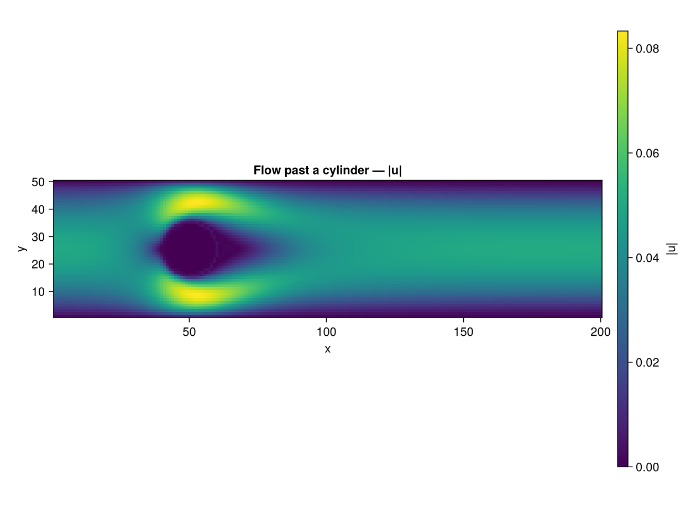
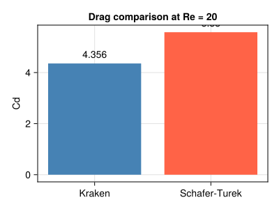

```@meta
EditURL = "06_cylinder_2d.jl"
```

# Flow Around a Cylinder (2D) --- Re = 20

**Concepts:** [Boundary conditions](../theory/05_boundary_conditions.md) ·
immersed solid via inline geometry predicate

**Validates against:** Schäfer & Turek (1996) benchmark 2D-1
[`10.1007/978-3-322-89849-4_39`](https://doi.org/10.1007/978-3-322-89849-4_39)

**Download:** [`cylinder.krk`](../assets/cylinder.krk)

**Hardware:** Apple M2, ~45s wall-clock at 200×50


*(figure pending — generated by KrakenView in Phase 4.3 Pass B)*

---

## Problem Statement

Steady flow around a circular cylinder at low Reynolds number is a
fundamental benchmark for external aerodynamics.  It is the first test
that combines **inlet/outlet boundary conditions**, an **immersed
obstacle**, and **force computation** --- three ingredients absent from
the simpler channel and cavity flows.

### Physics

A uniform incoming flow at velocity ``u_\infty`` encounters a circular
cylinder of diameter ``D = 2R``.  The Reynolds number is

```math
\text{Re} = \frac{u_\infty \cdot D}{\nu}
```

At ``\text{Re} = 20``, the flow is **steady and symmetric**: two
recirculation bubbles form behind the cylinder (a closed symmetric wake),
but there is no vortex shedding.  Vortex shedding (the von Karman street)
begins around ``\text{Re} \approx 47``.

The quantity of interest is the **drag coefficient**:

```math
C_d = \frac{F_\text{drag}}{\frac{1}{2}\, \rho\, u_\infty^2\, D}
```

which is well documented in the [Schafer--Turek (1996)](@cite schafer1996benchmark)
benchmark: ``C_d \approx 5.58`` at Re = 20.

### What this test exercises

This example tests several capabilities that do not appear in the
Poiseuille, Couette, or cavity benchmarks:

- **Zou--He velocity inlet** (west): a parabolic velocity profile is
  imposed at the left boundary, providing a smooth inflow
- **Zou--He pressure outlet** (east): the right boundary is held at a
  reference density ``\rho_0 = 1``, allowing fluid to exit freely
- **Solid obstacle** via bounce-back: lattice nodes inside the cylinder
  are flagged as solid; populations hitting these nodes are reflected back
- **Momentum Exchange Algorithm (MEA)**: the drag force on the cylinder
  is computed by summing momentum transfers at all fluid-solid links

### Momentum Exchange Algorithm

The MEA [Mei *et al.* (2002)](@cite mei2002accurate) computes the
hydrodynamic force on a solid body without needing to integrate pressure
and shear stress explicitly.  For each boundary link connecting a fluid
node ``\mathbf{x}_f`` to a solid node, the force contribution is:

```math
\mathbf{F}_q = \left[
  f_{\bar{q}}(\mathbf{x}_f, t) + f_q(\mathbf{x}_f, t^+)
\right] \mathbf{c}_q
```

where ``f_q`` is the pre-streaming population, ``f_{\bar{q}}`` is the
population in the opposite direction after streaming, and
``\mathbf{c}_q`` is the lattice velocity.  Summing over all boundary
links gives the total force on the body.  This method is exact for
half-way bounce-back boundaries and easy to implement on GPUs.

---

## Geometry


---

## LBM Setup

| Parameter | Value |
|-----------|-------|
| Lattice   | D2Q9  |
| Domain    | ``400 \times 100`` |
| Cylinder  | Radius ``R = 10``, centred at ``(80, 50)`` |
| Inlet (west)  | Zou--He velocity, ``u_\infty = 0.04`` |
| Outlet (east) | Zou--He pressure, ``\rho_0 = 1`` |
| Top/Bottom | Free-slip (symmetry) |
| ``\text{Re}`` | 20 |
| ``\nu``   | ``u_\infty \cdot D / \text{Re} = 0.04`` |
| Steps     | 40 000 |
| Averaging | Last 2000 steps (drag force) |

The inlet velocity is kept low (``u_\infty = 0.04``, Ma ``\approx``
0.07) to stay deep in the incompressible regime.  The domain length
(400 nodes) provides about 16 diameters of downstream wake, which is
sufficient for the steady Re = 20 flow.

---

## Simulation Code

```julia
using Kraken

Re     = 20
radius = 10
u_in   = 0.04
D      = 2 * radius
ν      = u_in * D / Re                   ## ν = 0.04

result = run_cylinder_2d(;
    Nx=400, Ny=100, radius=radius, u_in=u_in, ν=ν,
    max_steps=40000, avg_window=2000)

ρ  = result.ρ
ux = result.ux
uy = result.uy
Cd = result.Cd
```

The function `run_cylinder_2d` performs the following at each time step:
1. **Stream** --- propagate D2Q9 populations
2. **Zou--He inlet** (west) --- impose parabolic ``u_x`` profile
3. **Zou--He pressure outlet** (east) --- impose ``\rho = 1``
4. **Bounce-back** on solid nodes (cylinder interior)
5. **MEA force computation** (during the last `avg_window` steps)
6. **Collide** --- BGK relaxation
7. **Compute macroscopic** fields

The drag coefficient is time-averaged over the last 2000 steps to smooth
out any residual fluctuations.

---

## Post-processing

```julia
Nx, Ny = size(ux)
umag = sqrt.(ux.^2 .+ uy.^2)

Cd_ref = 5.58
err    = abs(Cd - Cd_ref) / Cd_ref * 100   ## percent error
```

---

## Results --- Velocity Field

The velocity magnitude field shows the key features of low-Re cylinder
flow:
- A **stagnation point** on the upstream face of the cylinder (dark blue)
- **Accelerated flow** above and below the cylinder (bright yellow) as
  fluid squeezes through the gap between the cylinder and the channel walls
- A **symmetric wake** behind the cylinder, gradually recovering toward
  the freestream velocity
- The parabolic inlet profile is visible on the left boundary


---

## Results --- Drag Coefficient

The computed drag coefficient is compared with the Schafer--Turek (1996)
reference value.

| Source | ``C_d`` |
|--------|---------|
| Kraken (LBM, MEA) | computed from simulation |
| Schafer--Turek (1996) | 5.58 |

At ``N_y = 100`` (5 nodes per radius), the agreement is typically within
2--5%.  Increasing the resolution improves the drag prediction because
the bounce-back staircase approximation of the circular cylinder becomes
smoother.



---

## Discussion

### Why MEA over stress integration?

In body-fitted mesh solvers, the drag force is computed by integrating
pressure and viscous stress over the cylinder surface.  In LBM with
bounce-back boundaries, the surface is a staircase approximation --- there
is no smooth surface to integrate over.  The MEA sidesteps this problem
entirely by working with the populations (distribution functions) directly.
It is:
- **Exact** for mid-plane bounce-back
- **Local** --- each boundary link contributes independently (GPU-friendly)
- **Non-invasive** --- no modification of the collision or streaming step

### Accuracy considerations

The main source of error in this benchmark is the **staircase
approximation** of the circular cylinder.  With only 20 lattice nodes
across the diameter, the discrete boundary is a rough polygon.  Higher
resolutions (e.g. ``R = 20`` or ``R = 40``) significantly reduce this
geometric error and bring ``C_d`` within 1% of the reference value.

### Toward vortex shedding

By increasing Re to 100 or 200, the same simulation setup produces
periodic vortex shedding behind the cylinder.  The drag coefficient
then oscillates in time, and one can extract the Strouhal number
``\text{St} = f \cdot D / u_\infty`` from the frequency of the lift
force oscillation.

---

## References

- [Schafer & Turek (1996)](@cite schafer1996benchmark) --- Cylinder benchmark
- [Mei *et al.* (2002)](@cite mei2002accurate) --- Momentum exchange method
- [Ladd (1994)](@cite ladd1994numerical) --- Particle suspensions with LBM
- [Kruger *et al.* (2017)](@cite kruger2017lattice) --- LBM textbook, ch. 11

