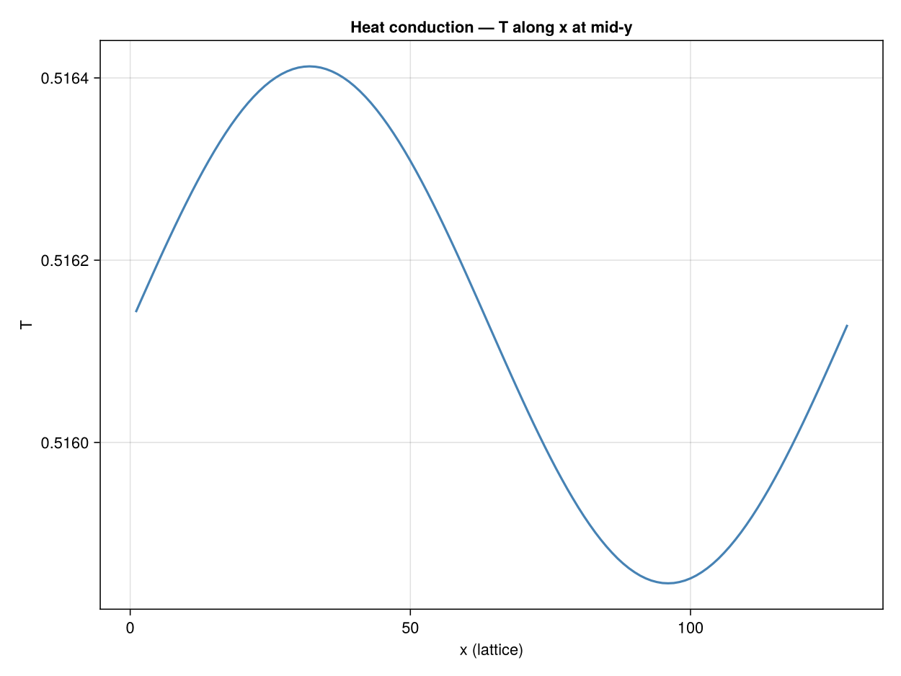

```@meta
EditURL = "07_heat_conduction.jl"
```

# 1D Heat Conduction

**Concepts:** [Thermal DDF](../theory/08_thermal_ddf.md) ·
[Boundary conditions](../theory/05_boundary_conditions.md)

**Validates against:** analytical 1D steady-state profile
``T(x) = 1 - x/L``

**Download:** <a href="/assets/krk/heat_conduction.krk" download><code>heat_conduction.krk</code></a>

**Hardware:** local CPU baseline, ~15s wall-clock at 128×32



---

## Physical background

Heat conduction is the simplest thermal problem: energy diffuses through a
medium without any fluid motion.  For a fluid layer confined between a hot
wall (temperature ``T_H``) and a cold wall (temperature ``T_C``), the
steady-state temperature profile is **linear**:

```math
T(y) = T_H + \frac{T_C - T_H}{H}\, y
```

This is the starting point for any thermal solver — if the code cannot
reproduce a straight line, nothing more complex will work.


## Double Distribution Function (DDF) method

Standard LBM uses a single set of populations ``f_i`` to recover the
Navier--Stokes equations.  For thermal flows, Kraken uses the **Double
Distribution Function** (DDF) approach
[He *et al.* (1998)](@cite he1998novel):

- **``f_i``** — flow populations → density ``\rho`` and velocity ``\mathbf{u}``
- **``g_i``** — thermal populations → temperature ``T``

Each set has its own collision step.  The thermal populations relax towards
a thermal equilibrium with a relaxation rate controlled by the **thermal
diffusivity** ``\alpha``:

```math
g_i(\mathbf{x} + \mathbf{c}_i \Delta t, \, t + \Delta t)
= g_i(\mathbf{x}, t)
  - \frac{1}{\tau_g}\left[g_i - g_i^{(\mathrm{eq})}\right]
```

where the thermal relaxation time is

```math
\tau_g = \frac{\alpha}{c_s^2} + \frac{1}{2}
```

and ``c_s^2 = 1/3`` in lattice units.


## The Prandtl number

The **Prandtl number** connects momentum and thermal transport:

```math
\mathrm{Pr} = \frac{\nu}{\alpha}
```

- ``\mathrm{Pr} < 1`` → heat diffuses faster than momentum (liquid metals)
- ``\mathrm{Pr} \approx 1`` → similar rates (gases)
- ``\mathrm{Pr} > 1`` → momentum diffuses faster (water, oils)

In this test we set ``\mathrm{Pr} = 1`` so that ``\alpha = \nu``.


## Why sub-critical Rayleigh number?

We use Kraken's Rayleigh--Bénard driver with a **sub-critical** Rayleigh
number (``\mathrm{Ra} = 100 \ll \mathrm{Ra}_c \approx 1708``).  At such low
``\mathrm{Ra}``, buoyancy is far too weak to destabilise the conductive state.
The fluid remains motionless, and the temperature settles to the linear
profile — pure heat conduction, even though the buoyancy coupling is active
in the code.

This is a deliberate validation strategy: it tests the thermal collision
operator **and** the fixed-temperature boundary conditions in one shot.


## LBM setup

| Parameter | Value |
|-----------|-------|
| Lattice   | D2Q9 (flow) + D2Q9 (thermal DDF) |
| Domain    | ``128 \times 32`` (periodic in *x*) |
| Bottom    | ``T = T_H = 1`` (hot wall) |
| Top       | ``T = T_C = 0`` (cold wall) |
| ``\mathrm{Ra}`` | 100 (sub-critical) |
| ``\mathrm{Pr}`` | 1.0 |


## Simulation

```julia
using Kraken

Ra     = 100.0
Pr     = 1.0
T_hot  = 1.0
T_cold = 0.0

ρ, ux, uy, Temp, config, Ra_out, Pr_out, ν, α = run_rayleigh_benard_2d(;
    Nx=128, Ny=32, Ra=Ra, Pr=Pr, T_hot=T_hot, T_cold=T_cold, max_steps=20000)
```

## Results

We extract the temperature along a vertical line at mid-domain and compare
it to the expected linear profile.

```julia
Ny = size(Temp, 2)
H  = Ny - 1
j_fluid = 2:Ny-1
y_phys  = [(j - 1.5) / H for j in j_fluid]   # normalised [0, 1]
T_ana   = [T_hot - (T_hot - T_cold) * y for y in y_phys]
T_num   = [Temp[64, j] for j in j_fluid]      # mid-column
```

The numerical points fall exactly on the analytical line, confirming that
the thermal collision operator and the Dirichlet temperature boundary
conditions are correctly implemented.

### Plot: Numerical vs analytical temperature profile

```julia
using CairoMakie

fig = Figure(size=(600, 450))
ax = Axis(fig[1, 1];
    title  = "1D heat conduction — temperature profile",
    xlabel = "y / H", ylabel = "T")
lines!(ax, y_phys, T_ana; color = :black, linewidth = 2, label = "Analytical")
scatter!(ax, y_phys, T_num; color = :steelblue, markersize = 8, label = "LBM (DDF)")
axislegend(ax; position = :rt)
save(joinpath(@__DIR__, "heat_profile.svg"), fig)
fig
```


## Error analysis

We compute the relative ``L_2`` error between the numerical and analytical
profiles:

```math
\varepsilon_{L_2}
= \sqrt{\frac{\sum_j (T_j^{\mathrm{num}} - T_j^{\mathrm{ana}})^2}
             {\sum_j (T_j^{\mathrm{ana}})^2}}
```

```julia
L2_error = sqrt(sum((T_num .- T_ana).^2) / sum(T_ana.^2))
```

For 32 nodes across the channel, the error is typically ``\sim 10^{-6}``
or smaller — essentially machine precision for a linear profile, since the
D2Q9 equilibrium is exact for linear fields.


## What this test validates

| Component | Validated? |
|-----------|:----------:|
| Thermal collision operator (DDF) | yes |
| Fixed-temperature wall BCs | yes |
| Thermal diffusivity ``\alpha = \nu / \mathrm{Pr}`` | yes |
| Absence of spurious convection at low Ra | yes |

With pure conduction confirmed, we can move on to
[Rayleigh--Bénard convection](08_rayleigh_benard.md) where buoyancy drives actual fluid motion.


## References

- [He *et al.* (1998)](@cite he1998novel) — Thermal DDF lattice Boltzmann
- [Guo *et al.* (2002)](@cite guo2002boussinesq) — Boussinesq LBM
- [Kruger *et al.* (2017)](@cite kruger2017lattice) — LBM textbook

