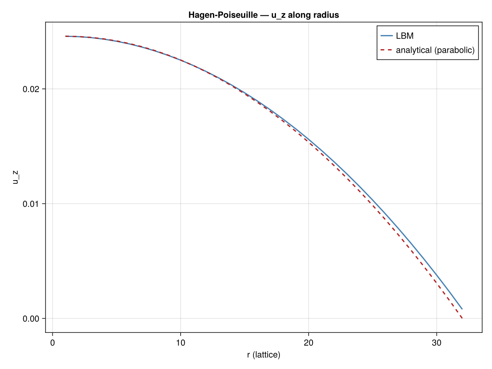

```@meta
EditURL = "09_hagen_poiseuille.jl"
```

# Hagen--Poiseuille Flow (Axisymmetric)

**Concepts:** [Axisymmetric LBM](../theory/09_axisymmetric.md) ·
[Body forces](../theory/07_body_forces.md)

**Validates against:** analytical parabolic profile
``u_z(r) = \frac{F_z R^2}{4\nu}\left(1 - (r/R)^2\right)``

**Download:** [`hagen_poiseuille.krk`](../assets/krk/hagen_poiseuille.krk)

**Hardware:** Apple M2, ~10s wall-clock at Nz = 4, Nr = 32



---

## Physical background

Hagen--Poiseuille flow is the steady, fully-developed laminar flow inside a
**circular pipe** driven by a uniform pressure gradient (or equivalently, a
body force ``F_z``).  It is the cylindrical counterpart of 2D Poiseuille flow
and produces a **parabolic** velocity profile:

```math
u_z(r) = \frac{F_z}{4\nu}\left(R^2 - r^2\right)
```

where ``R`` is the pipe radius, ``r`` the radial distance from the axis, and
``\nu`` the kinematic viscosity.

This example is special because it is the **first axisymmetric case** in the
Kraken tutorial series.  It validates the cylindrical source-term formulation
before we apply it to more complex problems like the Rayleigh--Plateau
instability.


## From 3D pipe to 2D half-plane

A fully 3D pipe simulation would be expensive.  For axisymmetric problems
(no variation in the azimuthal direction ``\theta``), we can work in the
**meridional half-plane** ``(z, r)`` with ``r \geq 0``.

In practice, Kraken uses a standard **D2Q9 lattice** where:
- the *x*-direction maps to the **axial** coordinate ``z``
- the *y*-direction maps to the **radial** coordinate ``r``

The cylindrical Navier--Stokes equations contain ``1/r`` terms that do not
appear in Cartesian geometry.  In LBM, these extra terms are introduced as
**source terms** added to the collision operator.


## Axisymmetric source terms

Two schemes are available in Kraken for the axisymmetric source terms:

### Zhou (2011) — simple scheme

The simplest approach adds a source term proportional to the equilibrium
distribution:

```math
S_i = -\frac{f_i^{(\mathrm{eq})} \, u_r}{r}
```

This captures the leading ``1/r`` correction.  It is easy to implement but
can suffer from reduced accuracy near the axis where ``r \to 0``.

### Li *et al.* (2010) — improved scheme

The improved scheme of [Li (2010)](@cite li2010improved) uses
**direction-dependent** source terms that correctly account for all ``1/r``
contributions in both the continuity and momentum equations.  It provides
higher accuracy, especially near the symmetry axis.

For this validation, we use the Li scheme (`:li`).


## Boundary conditions

The axisymmetric geometry requires two special boundary conditions:

### Axis (``r = 0``): specular reflection

At the symmetry axis, we **cannot** use standard bounce-back.  Bounce-back
would reverse all velocity components, but symmetry only reverses the
*radial* component while preserving the *axial* one.

**Specular reflection** does exactly this: populations travelling upward
(away from axis) are reflected to travel downward (toward the axis) without
changing their axial momentum.  Think of a mirror placed along the axis.

### Wall (``r = R``): half-way bounce-back

The outer pipe wall uses standard half-way bounce-back, placing the
no-slip wall at ``r = R = N_r - 0.5`` (half a lattice spacing beyond the
last fluid node).


## LBM setup

| Parameter | Value |
|-----------|-------|
| Lattice   | D2Q9 in ``(z, r)`` half-plane |
| Domain    | ``N_z = 8``, ``N_r = 32`` |
| Axis      | Specular reflection at ``j = 1`` |
| Wall      | Half-way bounce-back at ``j = N_r`` |
| Forcing   | Axisymmetric Guo scheme, Li (2010) source terms |
| Collision | BGK, ``\omega = 1/(3\nu + 0.5)`` |
| ``\nu``   | 0.1 |
| ``F_z``   | ``10^{-5}`` |

The effective pipe radius with half-way BB is ``R = N_r - 0.5``.  The radial
coordinate is ``r = j - 0.5`` for lattice index ``j`` (where ``j = 1`` is the
axis).


## Simulation

```julia
using Kraken

Nr = 32
Nz = 8
ν  = 0.1
Fz = 1e-5

ρ, uz, ur, config = run_hagen_poiseuille_2d(;
    Nz=Nz, Nr=Nr, ν=ν, Fz=Fz, scheme=:li, max_steps=30000)
```

## Results

We extract the axial velocity profile ``u_z(r)`` from a cross-section and
compare it to the analytical parabola.

```julia
R_eff   = Nr - 0.5                            # effective radius (half-way BB)
j_fluid = 1:Nr                                # all nodes: axis to wall
r_phys  = [j - 0.5 for j in j_fluid]          # physical radial coordinate
u_ana   = [Fz / (4ν) * (R_eff^2 - r^2) for r in r_phys]
u_num   = [uz[2, j] for j in j_fluid]         # profile at z = 2
```

The numerical profile matches the analytical parabola closely.  Note that
the velocity is maximum at the axis (``r = 0``) and vanishes at the wall
(``r = R``), as expected.


## Error analysis

We compute the relative ``L_2`` error between the numerical and analytical
velocity profiles:

```julia
L2_error = sqrt(sum((u_num .- u_ana).^2) / sum(u_ana.^2))
```

For ``N_r = 32``, the error is typically of order ``10^{-3}`` — much larger
than the Cartesian Poiseuille case.  This is expected: the axisymmetric
source terms introduce additional discretisation errors, especially near the
axis where the ``1/r`` terms are largest.


## Convergence study

To verify that the axisymmetric formulation maintains **second-order**
spatial convergence, we run the same problem at increasing resolutions:

```julia
Nr_list = [16, 32, 64, 128]
errors  = Float64[]

for Nr_i in Nr_list
    ρ_i, uz_i, _, _ = run_hagen_poiseuille_2d(;
        Nz=4, Nr=Nr_i, ν=ν, Fz=Fz, scheme=:li, max_steps=30000)
    R_i  = Nr_i - 0.5
    jf   = 1:Nr_i
    u_a  = [Fz / (4ν) * (R_i^2 - (j - 0.5)^2) for j in jf]
    u_n  = [uz_i[2, j] for j in jf]
    L2   = sqrt(sum((u_n .- u_a).^2) / sum(u_a.^2))
    push!(errors, L2)
end
```

If the error decreases by a factor of 4 each time the resolution doubles,
the scheme is second-order accurate (slope 2 on a log-log plot).  The Li
(2010) source terms are designed to achieve this.


## What this test validates

| Component | Validated? |
|-----------|:----------:|
| Axisymmetric source terms (Li 2010) | yes |
| Specular reflection at the axis | yes |
| Half-way bounce-back at the wall | yes |
| Second-order spatial convergence | yes |
| Cylindrical ``(z, r)`` coordinate mapping | yes |

With the axisymmetric formulation validated on this simple parabolic flow,
we can confidently apply it to more challenging problems such as
axisymmetric jets, Womersley flow, and the Rayleigh--Plateau instability.


## References

- [Li (2010)](@cite li2010improved) — Axisymmetric LBM source terms (improved scheme)
- [Zhou (2011)](@cite zhou2011mrt) — Axisymmetric LBM (simple scheme)
- [Guo *et al.* (2002)](@cite guo2002discrete) — Discrete forcing scheme
- [Kruger *et al.* (2017)](@cite kruger2017lattice) — LBM textbook

