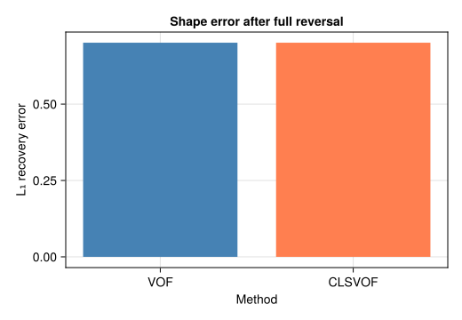
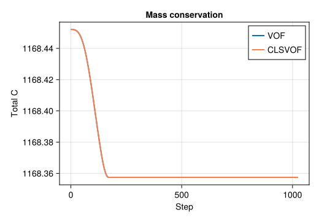

```@meta
EditURL = "12_reversed_vortex.jl"
```

# Reversed Vortex --- Time-Dependent Advection


## Problem Statement

The single-vortex deformation test [LeVeque (1996)](@cite leveque1996high) is
the most demanding benchmark for interface advection.  A circular patch of
fluid is advected in a time-dependent vortical flow that stretches it into an
extremely thin filament, then **smoothly reverses** at ``t = T/2`` so that
the original shape should be perfectly recovered at ``t = T``.  Any
numerical diffusion accumulated during the stretching phase prevents exact
recovery --- the final shape error directly measures the scheme's ability to
handle extreme deformation without excessive smearing.

The prescribed velocity field is:

```math
u_x = -\sin(\pi \hat{x})\,\cos(\pi \hat{y})\,\cos(\pi t / T), \qquad
u_y =  \cos(\pi \hat{x})\,\sin(\pi \hat{y})\,\cos(\pi t / T)
```

where ``\hat{x} = x/L``, ``\hat{y} = y/L``.  The ``\cos(\pi t/T)`` factor
reverses the vortex smoothly at ``t = T/2``.  This test was later adopted
by [Rider & Kothe (1998)](@cite rider1998reconstructing) and is a standard
Gerris/Basilisk validation case ([Popinet 2009](@cite popinet2009accurate)).

### Why this test matters

Unlike the Zalesak disk (rigid rotation), the reversed vortex involves
**extreme interface stretching**: the circular patch is drawn into a spiral
filament only a few cells thick.  Resolving such thin structures without
losing mass or smearing the interface is the acid test for any VOF scheme.
This test also allows a direct **comparison between VOF and CLSVOF**.

### What is CLSVOF?

**CLSVOF** (Coupled Level-Set / Volume of Fluid) combines the strengths of
two interface-tracking methods:

- **VOF** tracks volume fractions ``C`` in a conservative flux form,
  ensuring exact mass conservation.  However, computing interface normals and
  curvature from the discontinuous ``C`` field is noisy.

- **Level-set** tracks a signed distance function ``\phi(\mathbf{x}, t)``
  where ``\phi = 0`` is the interface, ``\phi > 0`` is liquid, ``\phi < 0``
  is gas.  Normals and curvature are trivially computed from the smooth
  ``\phi`` field (``\hat{n} = \nabla\phi / |\nabla\phi|``,
  ``\kappa = \nabla \cdot \hat{n}``), but the level-set is not conservative
  --- mass can be silently gained or lost.

CLSVOF couples both: the **VOF field** controls mass conservation (advection
uses the conservative flux form), while the **level-set field** provides
smooth interface reconstruction.  After each advection step, the level-set
is redistanced (reset to a signed distance function) using the VOF
``C = 0.5`` contour as reference.  This gives the best of both worlds:
conservative transport with smooth geometric properties.

---

## Geometry

A circle of radius ``R = 0.15\,N`` is placed at ``(0.5\,N,\, 0.75\,N)``
in a ``128 \times 128`` periodic box.  Arrows show the initial velocity
field (a single vortex centred in the domain).


---

## Simulation File

Download: [`reversed_vortex.krk`](../assets/krk/reversed_vortex.krk)

```
Simulation reversed_vortex D2Q9
Define N = 128
Domain L = N x N  N = N x N
Physics nu = 0.1
Module advection_only

Velocity { ux = -sin(pi*x/N)*cos(pi*y/N)*cos(pi*t/1024)*0.5
           uy =  cos(pi*x/N)*sin(pi*y/N)*cos(pi*t/1024)*0.5 }
Initial { C = 0.5*(1 - tanh((sqrt((x-64)^2 + (y-96)^2) - 19) / 2)) }

Boundary x periodic
Boundary y periodic
Run 1024 steps
```

Like the Zalesak test, this uses **`Module advection_only`** (no LBM
solver).  The velocity field is time-dependent: the ``\cos(\pi t/T)`` factor
causes the vortex to slow down, stop, and reverse at ``t = T/2 = 512``.

---

## Code

```julia
using Kraken

N = 128
R = 0.15 * N
cx, cy = 0.5 * N, 0.75 * N

T_period = 8.0 * N  # full period (T = 1024)

function vortex_velocity(x, y, t)
    xn = x / N;  yn = y / N
    scale = cos(π * t / T_period) * 0.5
    return (-sin(π * xn) * cos(π * yn) * scale,
             cos(π * xn) * sin(π * yn) * scale)
end

init_fn(x, y) = 0.5 * (1 - tanh((sqrt((x - cx)^2 + (y - cy)^2) - R) / 2))

max_steps = round(Int, T_period)

# VOF run (full cycle)
result = run_advection_2d(; Nx=N, Ny=N, max_steps=max_steps,
                           velocity_fn=vortex_velocity, init_C_fn=init_fn)

# Snapshot at maximum deformation (t = T/2)
result_half = run_advection_2d(; Nx=N, Ny=N, max_steps=max_steps ÷ 2,
                                velocity_fn=vortex_velocity, init_C_fn=init_fn)

# CLSVOF run (full cycle)
result_cls = run_advection_2d(; Nx=N, Ny=N, max_steps=max_steps,
                                velocity_fn=vortex_velocity, init_C_fn=init_fn,
                                use_clsvof=true)
```

---

## Results --- Deformation and Recovery

Three snapshots show the VOF field at ``t = 0`` (initial circle),
``t = T/2`` (maximum stretching), and ``t = T`` (after reversal).


At ``t = T/2``, the vortex has stretched the circle into a thin spiral
filament that wraps around the domain centre.  The filament is only a few
cells thick --- this is where numerical diffusion is most severe.  After
the flow reverses, the filament should retract and reform the original
circle.  In practice, the recovered shape is slightly larger and more
diffuse than the original, as revealed by the thicker ``C = 0.5`` contour.

---

## Error Map


The error map shows that the largest deviations from the initial shape occur
along the path traced by the thin filament.  This is expected: the thinnest
parts of the filament (near the spiral tip) are most affected by numerical
diffusion, and this diffused material cannot be fully recovered during the
reversal phase.

---

## VOF vs CLSVOF Comparison

We compare the ``L_1`` recovery error (normalised difference between initial
and final ``C`` fields) for both methods:

```math
E_{L_1} = \frac{\sum_{i,j} |C_{i,j}(T) - C_{i,j}(0)|}{\sum_{i,j} C_{i,j}(0)}
```

```julia
L1_vof    = sum(abs.(result.C     .- result.C0))     / sum(result.C0)
L1_clsvof = sum(abs.(result_cls.C .- result_cls.C0)) / sum(result_cls.C0)
```



The CLSVOF method achieves a **lower recovery error** than pure VOF.  The
improvement comes from the level-set redistanciation step: after each
advection step, the level-set field ``\phi`` is reset to a signed distance
function using the VOF ``C = 0.5`` contour.  This provides a smoother
representation of the interface, reducing the numerical diffusion
accumulated during reconstruction.  The VOF field itself is still advected
conservatively, so **mass conservation is identical** for both methods.

---

## Mass Conservation



Both methods preserve total volume fraction ``\sum C`` to machine precision
throughout the simulation.  This confirms that the CLSVOF coupling does not
introduce any mass loss: the VOF advection kernel remains the sole
mechanism for transporting ``C``, and it is inherently conservative.  The
level-set field is used only for interface reconstruction, not for
transport.

---

## References

- [LeVeque (1996)](@cite leveque1996high) --- High-resolution conservative algorithms for advection in incompressible flow
- [Rider & Kothe (1998)](@cite rider1998reconstructing) --- Reconstructing volume tracking
- [Popinet (2009)](@cite popinet2009accurate) --- Accurate adaptive solver for surface-tension-driven interfacial flows

