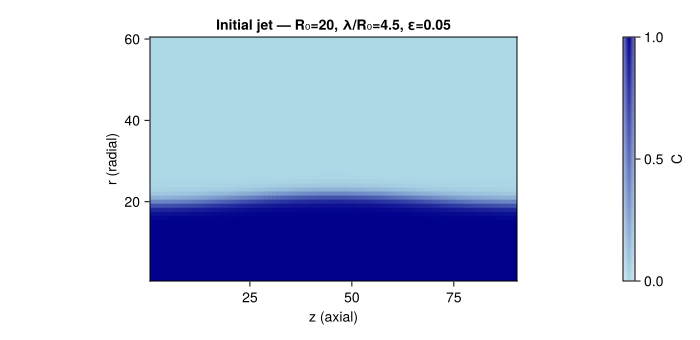
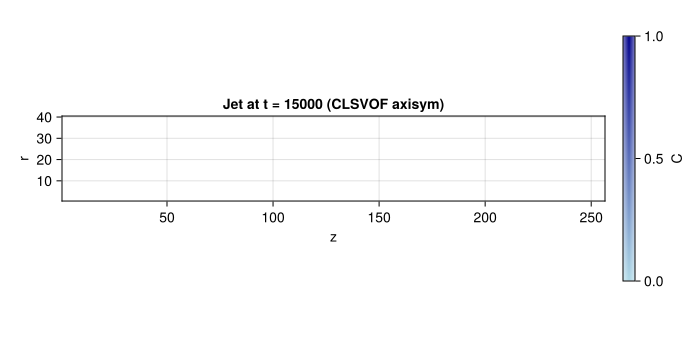
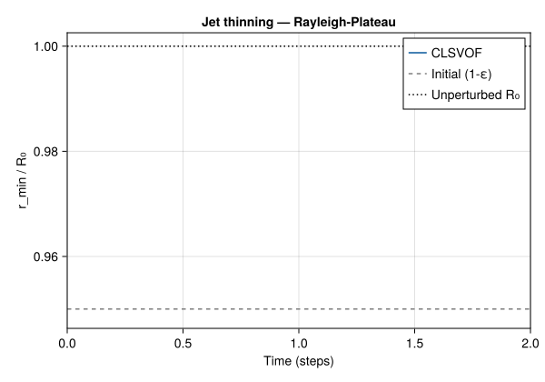

```@meta
EditURL = "15_rp_axisym.jl"
```

# Rayleigh--Plateau Instability (Axisymmetric)


## Problem Statement

The Rayleigh--Plateau instability is the fundamental mechanism by which a
cylindrical liquid jet breaks up into droplets under surface tension.  Any
sinusoidal perturbation with wavelength ``\lambda > 2\pi R_0`` (where
``R_0`` is the jet radius) is unstable and grows exponentially
([Rayleigh 1878](@cite rayleigh1878instability);
[Plateau 1873](@cite plateau1873statique)).

The linear growth rate from inviscid theory is:

```math
\omega^2 = \frac{\sigma}{\rho\, R_0^3}\, (kR_0)\,
\frac{I_1(kR_0)}{I_0(kR_0)}\, \bigl[1 - (kR_0)^2\bigr]
```

where ``k = 2\pi/\lambda`` is the axial wavenumber and ``I_0, I_1`` are
modified Bessel functions of the first kind.  Maximum growth occurs at
``kR_0 \approx 0.697``, corresponding to ``\lambda \approx 9.01\, R_0``.

This is the most physically complex test in the Kraken.jl validation suite:
it combines **axisymmetric LBM**, **CLSVOF interface tracking**, and
**surface tension with azimuthal curvature** --- all in a single 2D
simulation.

### Axisymmetric LBM formulation

Instead of running an expensive 3D simulation of a cylindrical jet, we
exploit the rotational symmetry: the 2D lattice uses **cylindrical
coordinates** ``(z, r)`` where ``z`` is the axial (jet) direction and
``r`` is the radial direction.  The mapping to lattice indices is:

- ``x \to z`` (axial, periodic)
- ``y \to r`` (radial, axis at ``j = 1``)

The axisymmetric formulation introduces several modifications compared to
standard 2D LBM:

- **Li *et al.* (2010) collision** ([Li *et al.* 2010](@cite
  li2010improved)): the BGK collision includes direction-dependent source
  terms that account for the non-Cartesian coordinate system.  These terms
  arise from the ``1/r`` factors in the cylindrical Navier--Stokes
  equations and ensure that the Chapman--Enskog expansion recovers the
  correct axisymmetric momentum equations.

- **Specular reflection at the axis** (``r = 0``): populations moving
  away from the axis are reflected back with swapped radial components
  (``f_6 \leftrightarrow f_9``, ``f_7 \leftrightarrow f_8``).  This
  enforces the symmetry condition ``\partial u_z / \partial r = 0`` and
  ``u_r = 0`` at the axis.

- **Azimuthal curvature**: in cylindrical coordinates, the total curvature
  has two components:
  ```math
  \kappa = \kappa_1 + \kappa_2
  ```
  where ``\kappa_1`` is the **meridional curvature** (in the ``(z, r)``
  plane, computed from the level-set as in 2D) and ``\kappa_2 = -n_r / r``
  is the **azimuthal curvature** that arises purely from the cylindrical
  geometry.  It is this azimuthal term that drives the Rayleigh--Plateau
  instability: a local decrease in radius increases ``\kappa_2``, which
  increases the inward pressure, which further decreases the radius ---
  a positive feedback loop.

### CLSVOF hybrid force

For this test, Kraken.jl uses the **CLSVOF hybrid force** model, which
combines the best aspects of both interface representations:

- **Level-set curvature** ``\kappa = \nabla \cdot (\nabla\phi / |\nabla\phi|)``
  provides a smooth, accurate curvature field.  The level-set ``\phi`` is
  redistanced at each step to maintain the signed-distance property.

- **VOF gradient** ``\nabla C`` localises the surface tension force precisely
  at the interface.  The force ``\mathbf{F} = \sigma\,\kappa_\text{LS}\,\nabla C``
  combines LS accuracy with VOF localisation.

This hybrid approach is essential for axisymmetric problems where curvature
accuracy near the axis (where ``r \to 0`` and ``\kappa_2`` diverges) is
critical for physical fidelity.

---

## Geometry

A liquid jet of radius ``R_0 = 20`` is perturbed sinusoidally with
amplitude ``\varepsilon = 0.05``.  The domain covers one wavelength
``\lambda = 4.5\, R_0 = 90`` in the axial direction, with a radial extent
of ``3\, R_0 = 60``.



The perturbation amplitude ``\varepsilon = 0.05`` is chosen to be small
enough that the initial growth is well described by linear theory, allowing
a quantitative comparison of the growth rate with Rayleigh's prediction.

---

## Code

We use the CLSVOF axisymmetric driver which implements all the components
described above: periodic BCs in ``z``, specular reflection at the axis,
VOF advection with LS redistanciation, hybrid surface tension force with
azimuthal curvature, and Li *et al.* (2010) axisymmetric collision.

```julia
using Kraken

R0 = 20
λ_ratio = 4.5
ε  = 0.05
σ  = 0.01
ν  = 0.05
ρ_l = 1.0
ρ_g = 0.01

result = run_rp_clsvof_2d(; R0=R0, λ_ratio=λ_ratio, ε=ε,
                            σ=σ, ν=ν, ρ_l=ρ_l, ρ_g=ρ_g,
                            max_steps=15000, output_interval=500)
```

---

## Results --- Jet Shape



The final jet shape shows the characteristic Rayleigh--Plateau morphology:
the initial sinusoidal perturbation has grown into a pronounced **thinning
neck** (where the jet narrows) and a **swelling lobe** (where liquid
accumulates).  The neck continues to thin until eventual breakup into a
main droplet and (depending on parameters) satellite droplets.

---

## Minimum Jet Radius vs Time



The thinning dynamics has two distinct phases:

1. **Linear regime** (early times): the perturbation amplitude grows
   exponentially as ``\varepsilon\, e^{\omega t}``, and the minimum radius
   decreases slowly.  In this regime, the growth rate can be compared
   quantitatively with Rayleigh's linear theory.

2. **Nonlinear regime** (later times): as the neck becomes comparable to
   the perturbation wavelength, nonlinear effects accelerate the thinning.
   The neck radius decreases rapidly toward zero (pinch-off).  The thinning
   law near breakup follows a power law that depends on the viscosity ratio
   and the Ohnesorge number.

---

## Level-Set, Velocity, and Density Fields


The **level-set field** ``\phi`` (left panel) is positive inside the jet
and negative outside, with ``\phi = 0`` at the interface.  The smooth
variation of ``\phi`` across the interface is what enables accurate
curvature computation.

The **velocity field** (centre panel) confirms that the flow is
concentrated at the thinning neck, where the capillary pressure drives
liquid away from the neck toward the swelling lobe.  This is the drainage
flow that controls the thinning rate.

The **density field** (right panel) shows the sharp contrast between the
jet interior (``\rho_l = 1``) and the surrounding gas
(``\rho_g = 0.01``), with a smooth transition at the interface mediated
by the VOF field.

---

## Axisymmetric Implementation Summary

| Component | Method |
|-----------|--------|
| Collision | Li *et al.* (2010) --- direction-dependent ``\omega_f`` source terms |
| Axis BC   | Specular reflection: ``f_6 \leftrightarrow f_9``, ``f_7 \leftrightarrow f_8`` |
| Curvature | ``\kappa = \kappa_1 + \kappa_2`` with ``\kappa_2 = -n_r/r`` from the level-set |
| Force     | Hybrid CLSVOF: LS ``\kappa`` + VOF ``\nabla C`` |
| Streaming | `stream_periodic_x_axisym_2d!` (periodic ``z``, specular axis, bounce-back outer wall) |

---

## References

- [Rayleigh (1878)](@cite rayleigh1878instability) --- On the instability of jets
- [Plateau (1873)](@cite plateau1873statique) --- Statique experimentale et theorique des liquides
- [Li *et al.* (2010)](@cite li2010improved) --- Improved axisymmetric lattice Boltzmann scheme
- [Popinet (2009)](@cite popinet2009accurate) --- Accurate adaptive solver for surface-tension-driven interfacial flows

