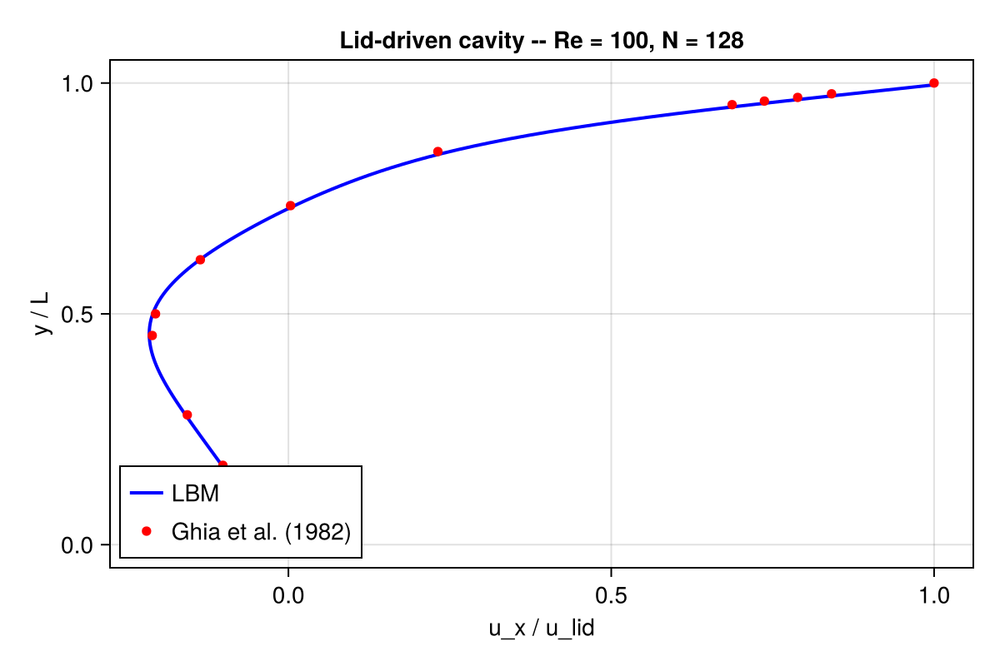

# Getting started

This page starts from the public Kraken workflow: run a checked-in `.krk`
case, inspect the parsed setup, then use the Julia API only where direct
control is useful.

## 1. Install Kraken.jl

From a Julia REPL (Julia 1.10 or later):

```julia
using Pkg
Pkg.add(url="https://github.com/lauguimel/Kraken.jl")
```

Or, if you have cloned the repository and want a development checkout:

```julia
using Pkg
Pkg.activate("/path/to/Kraken.jl")
Pkg.instantiate()
```

See [Installation](installation.md) for GPU setup (Metal on Apple
Silicon, CUDA on NVIDIA).

## 2. Your first simulation

Kraken.jl uses a small DSL called `.krk` to describe cases. The
repository ships with a ready-to-run lid-driven cavity at
`examples/cavity.krk`. Load it, inspect the parsed setup, then run it:

```julia
using Kraken

# Parse the .krk file into a SimulationSetup
setup = load_kraken("examples/cavity.krk")

# Inspect what we are about to run
println("Case: ", setup.name)
println("Lattice: ", setup.lattice,
        "  grid: ", setup.domain.Nx, "×", setup.domain.Ny,
        "  steps: ", setup.max_steps)

# Run on CPU (default). On Apple Silicon / NVIDIA, pass a GPU backend.
result = run_simulation(setup)

# A quick diagnostic: peak speed in the cavity
using Statistics
umag = sqrt.(result.ux .^ 2 .+ result.uy .^ 2)
println("max |u| = ", maximum(umag), "   mean |u| = ", mean(umag))
```

If this prints a non-zero maximum speed without errors, your install is
working.

For quick smoke tests, override the step count from the file path:

```julia
run_simulation("examples/cavity.krk"; max_steps=100)
```

`max_steps` is a file-path convenience keyword. If you already have a parsed
`SimulationSetup`, edit the file/kwargs first or call `run_simulation(setup)`
without that keyword.

To run on a GPU instead, pass the backend explicitly:

```julia
using Metal                 # or: using CUDA
run_simulation(setup; backend=MetalBackend())   # CUDABackend() for NVIDIA
```

## 3. Visualize the result

You have two options.

### Option A — ParaView via VTK

The `.krk` file has an `Output` block that writes VTK snapshots to
`results/`. After the run finishes, open the latest `.vti` / `.vtr` file
in [ParaView](https://www.paraview.org). Good first fields to look at
are velocity magnitude and pressure.



The figure above compares Kraken.jl's centerline velocity profiles
against the reference data of Ghia et al. (1982).

## 4. What just happened?

Under the hood, Kraken.jl ran a Lattice Boltzmann simulation. At every
time step the solver does three things, in order:

1. **Collision** — at each lattice node, the distribution functions
   relax toward a local equilibrium. The simplest flavor is BGK, and
   that is what the cavity example uses. See
   [BGK collision](theory/03_bgk_collision.md).
2. **Streaming** — post-collision populations are shifted to their
   neighbor nodes along the lattice directions. See
   [Streaming](theory/04_streaming.md).
3. **Boundary conditions** — at walls and inlets, populations are
   reconstructed to enforce no-slip, prescribed velocity, or outflow.
   The cavity uses Zou–He on the moving lid and bounce-back on the
   three static walls. See
   [Boundary conditions](theory/05_boundary_conditions.md).

The macroscopic velocity and density you printed above are moments of
the distribution functions, computed each step from the local
populations.

## 5. Where to go next

- New to LBM? Read the [Concepts index](concepts_index.md) — it maps
  every theory page to the examples that use it.
- Want a single-phase validation benchmark?
  [Lid-driven cavity 2D](examples/04_cavity_2d.md),
  [Taylor–Green vortex](examples/03_taylor_green_2d.md), or
  [Flow past a cylinder](examples/06_cylinder_2d.md).
- Interested in thermal / buoyant flows?
  [Heat conduction](examples/07_heat_conduction.md),
  [Rayleigh–Bénard convection](examples/08_rayleigh_benard.md).
- Want to write your own case? Every example in the tutorial corpus is
  built from a `.krk` file, and the DSL is documented inline in the
  example pages.
- Need the exact supported feature list? Read the
  [capabilities matrix](capabilities.md). It marks parser-only and
  development-branch features explicitly.
