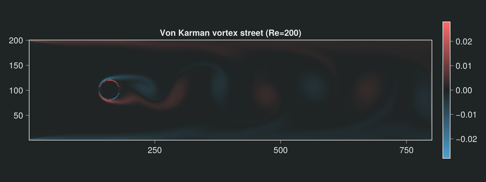
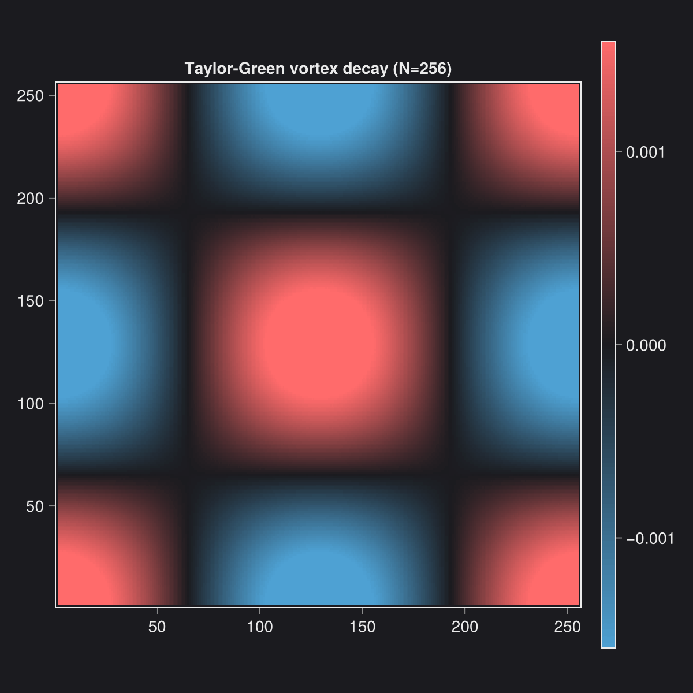
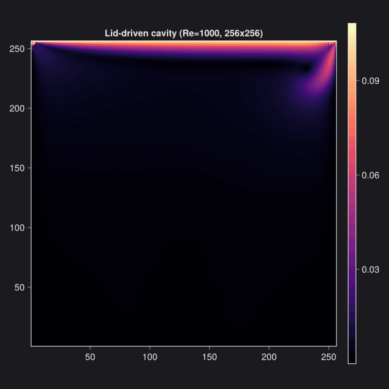
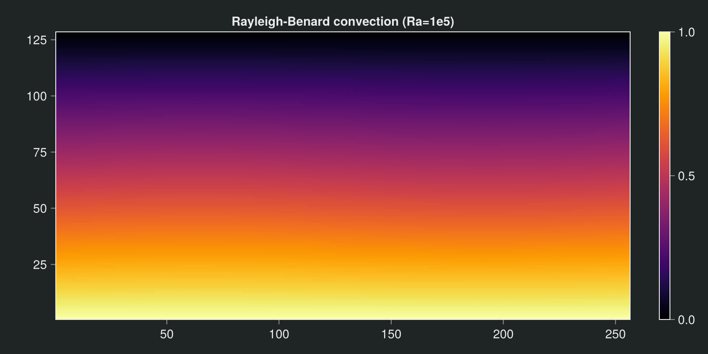

# Kraken.jl

```@raw html
<div align="center">
  
</div>
```

**A GPU-native Lattice Boltzmann framework in Julia — write your solver once, run it on NVIDIA, Apple Silicon, AMD, or CPU.**

Kraken.jl is a composable, high-performance Lattice Boltzmann (LBM) solver for
incompressible and thermal flows. Kernels are written once against
[KernelAbstractions.jl](https://github.com/JuliaGPU/KernelAbstractions.jl) and
dispatched automatically to whatever hardware you have — no vendor-specific code
in the physics layer.

```@raw html
<div align="center">
  
  
  <br/>
  <em>Left: von Kármán vortex street past a cylinder (Re = 200). Right: Taylor–Green vortex decay.</em>
</div>
```

## Why Kraken

- **One solver, every backend.** The same kernel runs on CUDA, Metal (Apple
  Silicon), AMD ROCm, and multi-threaded CPU — selected at runtime, with no
  vendor-specific code in the physics layer.
- **Fast where it counts.** A single H100 sustains **7675 MLUPS** for D2Q9 BGK,
  and up to **24 000 MLUPS** with the fused Float32 kernels — see the
  [performance benchmarks](benchmarks/performance.md).
- **Composable physics.** BGK and MRT collision, Guo body forcing, thermal
  double-distribution coupling, and axisymmetric flows share one kinetic core.
- **Validated against the literature.** Lid-driven cavity (Ghia et al. 1982),
  natural convection (de Vahl Davis 1983), and 3D sphere drag (Clift et al.
  1978) are cross-checked in the [benchmarks](benchmarks/accuracy.md), several
  against an independent OpenFOAM run — the cavity centreline matches Ghia to
  **better than 0.5 %** at Re = 100 and 400.
- **Configuration without code.** Describe a full run in a single declarative
  [`.krk` file](krk/overview.md) and launch it from the command line — no Julia
  required to drive a simulation.
- **Built for inspection.** Fields stream to VTK (`.vti` / `.pvd`) for ParaView,
  and stay in memory for direct postprocessing.

## Quick start

```julia
using Kraken

# Lid-driven cavity at Re = 100 on a 128×128 grid
N = 128
ν = 0.1 * N / 100  # ν = u_lid · N / Re
config = LBMConfig(D2Q9(); Nx=N, Ny=N, ν=ν, u_lid=0.1, max_steps=30000)
result = run_cavity_2d(config)
```

The same simulation can be written declaratively in a `.krk` file and launched
from a shell:

```
# cavity.krk — lid-driven cavity at Re = 100
Simulation cavity D2Q9
Domain     L = 1.0 x 1.0   N = 128 x 128
Physics    nu = 0.128
Boundary   north velocity(ux = 0.1, uy = 0)
Boundary   south wall
Boundary   east  wall
Boundary   west  wall
Run        30000 steps
```

```bash
krk cavity.krk
```

## Where to go next

- **[Installation](@ref)** — set up Kraken.jl and its GPU backends.
- **[Getting started](getting_started.md)** — from zero to a running simulation.
- **[Concepts](concepts_index.md)** — the ideas behind the solver.
- **Theory** — ten progressive chapters, from kinetic theory to lattice Boltzmann.
- **Tutorials & examples** — validated runs with plots and convergence studies.
- **[Benchmarks](benchmarks/accuracy.md)** — accuracy and performance measurements.
- **[`.krk` DSL reference](krk/overview.md)** — the declarative configuration language.
- **[API reference](api/config.md)** — every public function, documented.

## Physics capabilities

| Capability | Lattice | Driver |
|:-----------|:--------|:-------|
| Lid-driven cavity | D2Q9, D3Q19 | `run_cavity_2d`, `run_cavity_3d` |
| Channel flow (Poiseuille) | D2Q9 | `run_poiseuille_2d` |
| Couette flow | D2Q9 | `run_couette_2d` |
| Taylor–Green vortex | D2Q9 | `run_taylor_green_2d` |
| Cylinder drag | D2Q9 | `run_cylinder_2d` |
| Thermal convection | D2Q9 | `run_rayleigh_benard_2d` |
| Axisymmetric pipe flow | D2Q9 | `run_hagen_poiseuille_2d` |

## Showcase gallery

```@raw html
<div align="center">
  
  
  <br/>
  <em>Left: lid-driven cavity at Re = 1000 (primary vortex + corner eddies).
  Right: Rayleigh–Bénard convection cells at Ra = 1e5.</em>
</div>
```

All four animations on this page are produced by the validated drivers shown in
the table above; reproduce them from the [examples](examples/04_cavity_2d.md)
and [benchmarks](benchmarks/accuracy.md).
