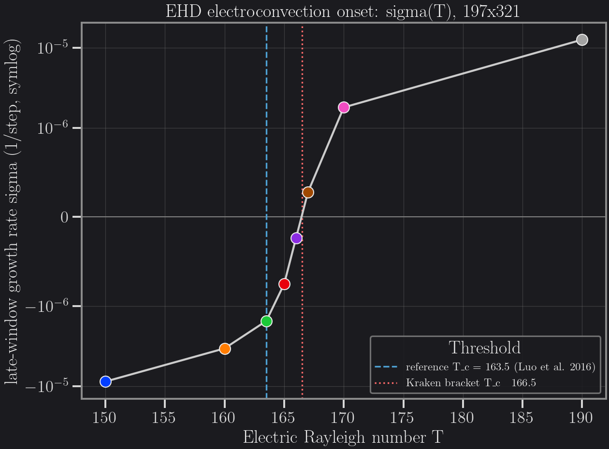

# Electroconvection (EHD, Unipolar Charge Injection)

Coulomb-driven flow of a dielectric liquid between two flat plates, triggered
by unipolar charge injection from the bottom electrode, validated against the
Luo, Wu, Yi & Tan (2016) linear-instability reference.

## The physics

A weakly-conducting dielectric liquid sits between two horizontal plates. The
bottom plate injects a steady flux of unipolar charge into the liquid; the top
plate collects it. In the absence of flow the injected charge sets up a
hydrostatic charge-density and electric-field profile between the plates. Above
a critical injection strength the Coulomb body force `F = qE` on the charged
liquid overcomes viscous damping and drives convection rolls — electroconvection
— even though there is no thermal buoyancy in the problem.

Three fields are coupled:

- **Flow** — incompressible Navier–Stokes, forced by the Coulomb body force
  density `F = qE`.
- **Charge transport** — the charge density is advected by the flow *and* by
  its own drift velocity in the local electric field (`u + K E`, `K` the ion
  mobility), plus weak diffusion.
- **Electric potential** — a Poisson equation `∇²φ = −q/ε` sourced by the local
  charge density, closing the loop through `E = −∇φ`.

Kraken solves all three with D2Q9 lattice-Boltzmann populations: one for the
flow, one carrying the charge density (drift-diffusion), and one carrying the
electric potential (pseudo-time Poisson relaxation), or — in the validated
configuration used here — a direct GPU solve for the potential in place of the
third population.

### Nondimensional groups

Following Luo, Wu, Yi & Tan (2016), the problem is governed by four
dimensionless numbers:

- **T** (electric Rayleigh number) — the ratio of the Coulomb driving force to
  viscous + charge-diffusive damping. Plays the role Ra plays in thermal
  convection: T exceeds a critical value `T_c` for convection rolls to grow.
- **C** — the injection strength, i.e. how much charge density the bottom
  electrode injects relative to the background field.
- **M** — the ratio of hydrodynamic mobility (how easily the fluid moves) to
  ionic mobility (how easily charge drifts under the field). Sets the
  relaxation time of the flow through the lattice mapping.
- **alpha** — the charge diffusion coefficient relative to ion drift; small
  `alpha` means the charge is carried almost purely by drift and advection.

The onset problem is: for fixed `C`, `M`, `alpha`, find the `T_c` at which the
linear growth rate of a small charge-density perturbation changes sign.

**Reference.** Luo, K., Wu, J., Yi, H.-L. & Tan, H.-P. (2016), *Lattice
Boltzmann simulation of electro-convection in a dielectric liquid layer with
unipolar charge injection*, Physical Review E **93**, 023309.

## Validation, stated honestly

Three separate checks were run, at increasing physical complexity. Two are
solid; the third (linear onset) lands within 2% of the reference but the
residual is not yet closed by a mesh-convergence study, and this page says so
plainly rather than presenting a clean match.

### 1. Hydrostatic base state (no flow)

With the flow held at rest, the charge-density and electric-field profiles
between the plates were compared to the closed-form hydrostatic solution
(`C = 10`, `alpha = 1e-4`, `Ny = 96`, driver `run_ehd_hydrostatic_2d`):

| Quantity | Relative L2 error |
|----------|-------------------|
| Charge density `q(y)` | **0.64 %** |
| Electric field `E(y)` | **0.76 %** |

Both are comfortably inside the acceptance gate for this base state and confirm
the Poisson/charge-collision kernels reproduce the closed-form profile.

### 2. Linear instability threshold `T_c`

The coupled solver was run at `197 x 321`, MRT collision, regularized charge
collision, direct GPU Poisson solve, `xy` force projection, for 600 000 cycles
per `T`, seeded with a small sinusoidal charge perturbation. The **late-window
growth rate** — the least-squares slope of `log(max|u|)` over the trailing 40%
of the run — was measured at eight values of `T`:

| T | late-window growth rate `sigma` (1/step) | trend |
|---:|---:|:--|
| 150   | −8.79e-6 | decaying |
| 160   | −3.39e-6 | decaying |
| 163.5 | −1.54e-6 | decaying |
| 165   | −7.53e-7 | decaying |
| 166   | −2.35e-7 | decaying |
| 167   | +2.79e-7 | growing |
| 170   | +1.80e-6 | growing |
| 190   | +1.26e-5 | growing (finite amplitude) |

`sigma` changes sign between `T = 166` and `T = 167`, giving a bracketed
threshold **`T_c ~ 166.5`** against the reference value **`T_c = 163.5`**
(Luo, Wu, Yi & Tan 2016) — a **+1.8 % deviation**.

This residual is consistent with finite spatial resolution at `197 x 321`: the
thermal-convection benchmark on this same lattice method shows the analogous
critical-parameter error shrinking monotonically with mesh refinement, and no
resolution sweep has yet been run for this onset problem. **A mesh-convergence
study for `T_c` is pending** — the +1.8 % number should be read as "consistent
with a resolution-limited BGK/MRT-class solver," not as a converged result.

### 3. Finite-amplitude convection

At `T = 190`, well above threshold, the perturbation grows into finite-amplitude
convection rolls (`sigma = +1.26e-5`, nearly an order of magnitude above the
near-threshold growth rates) — the qualitative nonlinear regime the linear
analysis predicts.

### What is NOT yet validated

- **Subcritical hysteresis** — whether the transition shows the subcritical
  (hysteretic) branch reported for some unipolar-injection regimes in the
  literature. Not probed here.
- **Field-by-field comparison against the reference implementation** — the
  validation above compares scalar diagnostics (`T_c`, error norms) against
  the published reference; it does not compare the full 2D charge/potential/
  velocity fields against a reference implementation of the Luo et al. method.
- **Mesh convergence of `T_c`** — see above; only one resolution (`197 x 321`)
  has been run.

## Figure

Late-window growth rate `sigma` vs `T`, symlog scale, with the reference
threshold (`T_c = 163.5`, dashed) and the Kraken sign-change bracket
(`T_c ~ 166.5`, dotted) marked. `sigma` is the trailing-40%-window
least-squares slope of `log(max|u|)`, **not** the cumulative
`log(|u|/|u|_0)/t` diagnostic also present in the raw sweep CSVs (that column
is positive even for decaying runs and must not be read as a growth rate).



## Performance

At `197 x 321` on a single H100, with the direct GPU Poisson solve (cuDSS):

| Poisson solve | ms / step |
|---|---:|
| Direct (cuDSS, factorize-once) | **1.39 ms** |
| Faithful pseudo-time DDF (`phi_scheme=:lbm`) | 16.5 ms |

The direct solve is roughly **12x** faster per step at this resolution, which
is why the `T_c` sweep above used it: a 600 000-cycle run per `T` takes about
**14 minutes** on the direct path.

## How to run it

The Julia driver, called directly with the validated configuration (MRT
collision, regularized charge, direct Poisson, `xy` force projection):

```julia
using Kraken

result = run_electroconvection_2d(;
    Nx=197, Ny=321,
    C=10.0, M=10.0, T=166.0, Ma_E=1e-2, alpha=1e-4,
    ns_scheme=:mrt,
    charge_scheme=:regularized,
    phi_scheme=:direct,
    force_projection=:xy,
    max_cycles=600_000,
    backend=CUDA.CUDABackend(),
    FT=Float64,
)
```

Sweep over `T` to reproduce the growth-rate table; `result.umax_history` and
`result.cycle_history` give the amplitude trace to fit the late-window slope
from.

**`.krk` file interface.** Two fixtures under `benchmarks/krk/ehd/` run the
same physics through the `.krk` runner path. The GPU-scale, published-resolution
benchmark used for the figure above:

```
Preset electroconvection_2d
Domain L = 1.0 x 1.0  N = 197 x 321
Run 50000 steps
```

(`benchmarks/krk/ehd/electroconvection_luo_pre93.krk` — the preset supplies the
validated MRT/direct-potential EHD scheme; `Domain`/`Run` override its modest
defaults. Not intended for CI at this size.)

A small CPU fixture exercises the hydrostatic base state instead, for
CI-scale analytical validation rather than production onset benchmarking:

```
Simulation ehd_hydrostatic D2Q9
Domain L = 1.0 x 1.0  N = 8 x 96
Physics C = 10.0 M = 10.0 alpha = 1e-4 Ma_E = 1e-2 charge_scheme = srt
Module ehd
Run 100000 steps
```

(`benchmarks/krk/ehd/hydrostatic_fast.krk`.) Run either with the standard
`.krk` runner entry point (`run_simulation("benchmarks/krk/ehd/<file>.krk")`).

## Reproduction data

Retained sweep results (amplitude histories + one-line digests) live under
`benchmarks/results/ehd/` — see `benchmarks/results/ehd/README.md` for the
per-run configuration and file inventory. The figure above is generated by
`benchmarks/results/ehd/plot_tc_sweep.py`.

## References

Luo, K., Wu, J., Yi, H.-L. & Tan, H.-P. (2016), *Lattice Boltzmann simulation
of electro-convection in a dielectric liquid layer with unipolar charge
injection*, Physical Review E **93**, 023309.
