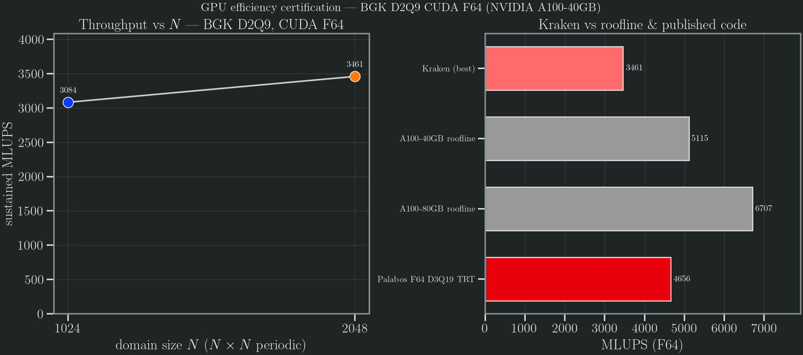

# GPU efficiency certification — BGK D2Q9 CUDA F64

Single-GPU throughput certification of the Newtonian BGK D2Q9 solver in
**CUDA Float64**, run through the Taylor–Green vortex driver
(`run_taylor_green_2d`). The metric is sustained **MLUPS** (Mega Lattice
Updates Per Second),

```
MLUPS = N² · steps / wallclock_s / 1e6
```

measured over 1000 steps after a discarded warm-up on an `N × N` periodic
domain. The certification grades that throughput against the
**memory-bandwidth roofline** of the GPU it ran on, and against a published
single-GPU F64 LBM code.

## Roofline definition

LBM is memory-bandwidth bound. A D2Q9 BGK step in Float64 moves the 9
populations in and 9 out (plus amortised density/aux access), i.e.
`2 × 19 × sizeof(Float64) = 304 bytes/update`. The hard upper bound on
throughput is therefore the vendor peak HBM bandwidth divided by that traffic:

```
MLUPS_ceiling = peak_BW / 304 / 1e6
```

No F64 D2Q9 kernel can exceed this ceiling. The certification gate is **≥ 0.5
of roofline** — Kraken within a factor of 2 of the memory-bandwidth limit.

## Run environment

The run was performed on the Aqua (QUT) cluster, node `gpu0n009`, an **NVIDIA
A100-40GB** (HBM2e, 1.555 TB/s peak bandwidth). The node resources confirm the
variant: `gpu_model = A100`, `gpu_id = A100`, `gpu_compute_capability = 8.0`,
`gpu_mem = 42949672 kb` (≈ 40 GB). CUDA, Float64. The 40 GB roofline is
therefore the applicable ceiling; the 80 GB figure is listed below only as a
stricter lower-bound reference.

## Measured throughput

| `N`  | Steps | Wallclock (s) | MLUPS    |
|-----:|------:|--------------:|---------:|
| 1024 | 1000  | 0.340         | 3083.83  |
| 2048 | 1000  | 1.212         | **3460.84** |

Best sustained throughput is **3461 MLUPS** at `N = 2048`.

## Roofline ratios



| Reference                          | MLUPS  | Kraken / ref | Type |
|------------------------------------|-------:|-------------:|------|
| A100-40GB roofline (1.555 TB/s)    | 5115   | **0.68**     | bandwidth ceiling |
| A100-80GB roofline (2.039 TB/s)    | 6707   | **0.52**     | bandwidth ceiling |
| Palabos, single-GPU F64 D3Q19 TRT  | 4656   | **0.74**     | published real code |
| H100 roofline (3.35 TB/s)          | 11020  | — (context)  | not the run GPU |

The H100 roofline is listed for context only; the run was on an A100, not an
H100. The Palabos figure is **~73 % of A100 FP64 peak** for D3Q19 TRT
(Latt et al., *Comput. Math. Appl.* 2021; PASC '22), the recommended real-code
F64 corroboration point.

**Verdict: PASS.** On the applicable **A100-40GB** roofline Kraken reaches
**0.68** of the memory-bandwidth limit (5115 MLUPS ceiling), and **0.74** of
the Palabos single-GPU F64 number — comfortably clearing the `≥ 0.5` gate and
placing it in the same neighbourhood as an established production LBM code.
Even against the stricter 80 GB ceiling (6707 MLUPS) the ratio is 0.52, so the
pass is robust to the bandwidth assumption.

## Honest caveats

- **GPU variant confirmed post-hoc via PBS node resources, not the run log.**
  The driver itself did not record the device; the A100-40GB identity was read
  from `pbsnodes gpu0n009` (`gpu_model = A100`, `gpu_mem ≈ 40 GB`). A
  recommended future tweak is to print `CUDA.versioninfo()` / `CUDA.device()`
  (device name, total memory, driver/runtime versions) into the run log so the
  exact GPU and roofline are locked by the run itself.
- **Single-GPU, bandwidth-bound figure.** This certifies sustained single-GPU
  throughput against the memory roofline. It is **not** a multi-GPU /
  weak-or-strong-scaling result; inter-GPU communication and domain
  decomposition are out of scope here.

## Reproduce

```bash
# Aqua (CUDA F64) — runs the certification sweep and writes the CSV:
julia --project=. bench/certification/cavity_bgk_cuda/run_certification.jl

# regenerate the figure:
conda run -n kraken-v0-3-figures python bench/certification/plot_certification.py
```

Data: `benchmarks/results/certification_a100.csv`. Reference derivation:
`bench/certification/E1_REFERENCE.md`. F32 codes such as FluidX3D
(A100 ≈ 10 228, H100 ≈ 17 602 MLUPS; Lehmann, arXiv:2112.08926) are **not**
comparable to this F64 gate — single precision moves half the bytes per update.
