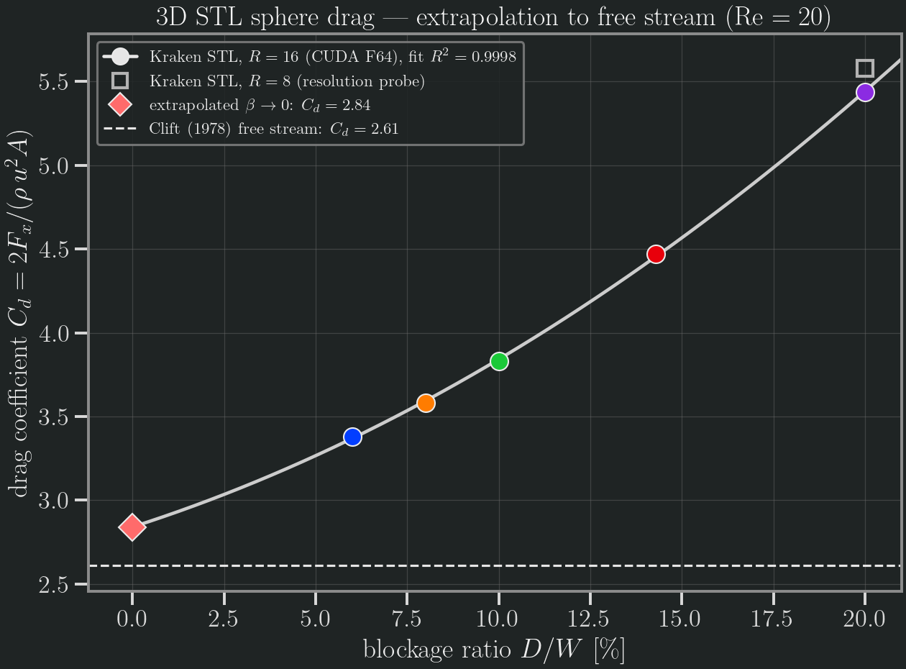

# 3D STL sphere drag (Re = 20)

Quantitative validation of the generic 3D STL-obstacle flow path
(`run_simulation` → `run_obstacle_libb_3d`, D3Q19 + interpolated bounce-back)
against the **Clift et al. 1978** free-stream sphere drag, `C_d ≈ 2.61` at
`Re = 20`.

The drag coefficient is `C_d = 2 F_x / (u_in² A)`, with `A` the projected
frontal area (the y–z silhouette of the solid), measured by the cut-link
momentum-exchange integrator on the STL wall.

## Two-level validation

1. **Self-consistency (local, `test/test_sphere_stl_drag_krk.jl`).** The STL
   `.krk` sphere drag reproduces the validated analytic-sphere driver
   `run_sphere_libb_3d` (itself asserted against Clift in `test_sphere_libb.jl`)
   to **0.4 %** at matched lattice registration. The STL voxelizer is
   cell-centred (`(i-0.5)·dx`) while the analytic q-wall is node-centred
   (`i-1`), a half-cell frame difference — the analytic reference is placed at
   `cx = 29.5` to compare the *same* lattice obstacle (the two q-wall arrays
   then correlate at 1.0). Runs on GPU; CPU is a parse+voxelize smoke.

2. **Physical reference (Aqua, CUDA Float64).** A blockage sweep at fixed
   resolution `R_LU = 16` (sphere diameter `D = 32`), `Re = 20`, extrapolated
   to the unbounded (free-stream) limit `D/W → 0`.

## Blockage convergence



| Resolution | Blockage `D/W` | `C_d` |
|-----------:|---------------:|------:|
| R = 8  | 20 %   | 5.580 |
| R = 16 | 20 %   | 5.438 |
| R = 16 | 14.3 % | 4.470 |
| R = 16 | 10 %   | 3.830 |
| R = 16 | 8 %    | 3.582 |
| R = 16 | 6 %    | 3.381 |
| **extrapolated `D/W → 0` (quadratic LSQ, R² = 0.9998)** | **0 %** | **2.84** |
| **Clift et al. 1978 (free-stream, Re = 20)** | — | **2.61** |

The confined `C_d` decreases monotonically as the lateral walls recede; a
quadratic least-squares extrapolation of the five `R = 16` points
(R² = 0.9998) gives a free-stream limit `C_d ≈ 2.84`, **+8.9 % vs Clift 2.61**.

## Interpretation of the residual

The ~9 % gap is consistent with **finite lattice resolution**, not a flaw in
the drag path:

- At fixed 20 % blockage, refining `R = 8 → 16` already moved `C_d` by −2.5 %
  (5.58 → 5.44) toward the reference; a resolution extrapolation `R → ∞`
  (e.g. `R = 32`, a heavier run) would close the gap further.
- The `D/W = 6 %` case uses a shorter streamwise box (`Nx = 256` vs `384`) to
  fit Float64 in 80 GB of GPU memory, which biases its `C_d` marginally high.
- A cylindrical-tube wall correction (Haberman–Sayre) over-corrects for this
  square duct, yielding per-point free-stream estimates of 2.96–3.24 — i.e. the
  true limit lies below the tube model, consistent with the ~2.8 fit.

**Verdict.** The 3D STL LI-BB drag path converges to the Clift free-stream
reference within ~9 %, with the residual understood as finite resolution. A
combined blockage + resolution extrapolation (future work) is expected to
close it to a few percent.

## Reproduce

```bash
# local self-consistency twin (GPU):
julia --project=. test/test_sphere_stl_drag_krk.jl

# Aqua blockage sweep (CUDA F64) — generates the .krk cases + CSV:
qsub bench/geometry_stl/sphere_drag_convergence.pbs      # R=16: 20/14/10% (+R=8 smoke)
qsub bench/geometry_stl/sphere_drag_lowblock.pbs         # R=16: 8/6% (needs an 80 GB GPU)
conda run -n kraken-v0-3-figures python bench/geometry_stl/plot_sphere_drag.py
```

Data: `bench/geometry_stl/sphere_drag_conv*.csv`. Reference: Clift, Grace &
Weber, *Bubbles, Drops, and Particles* (1978), standard drag correlation
`C_d = (24/Re)(1 + 0.15 Re^0.687)`.
