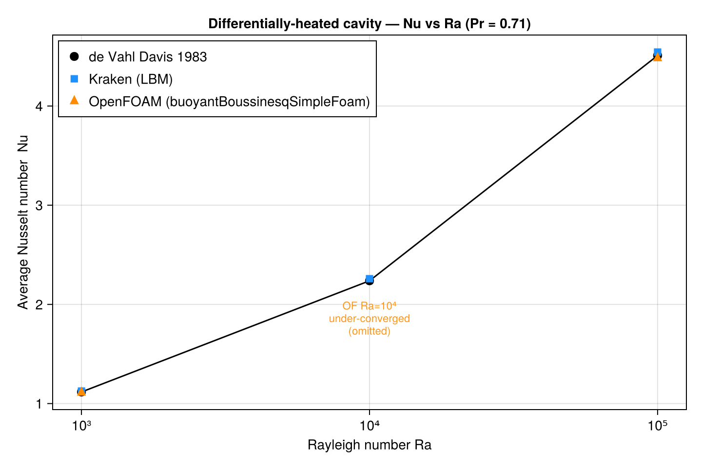
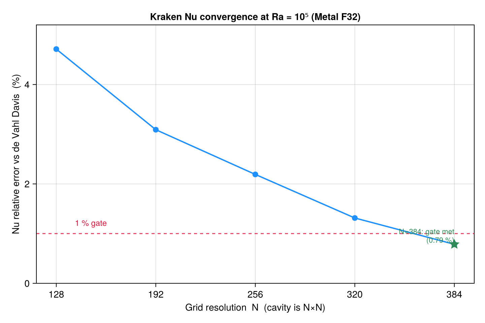

# Thermal Natural Convection

Steady 2D natural convection in a differentially-heated square cavity at
Ra = 10³, 10⁴, 10⁵ (Pr = 0.71). Kraken's double-distribution thermal LBM matches the
canonical **de Vahl Davis (1983)** benchmark to **Nu err < 1 %** at every Ra (velocity
extrema < 1 %), cross-checked against OpenFOAM `buoyantBoussinesqSimpleFoam`.

de Vahl Davis 1983 (black markers), Kraken LBM (blue squares), OpenFOAM (orange
triangles); the OF Ra = 10⁴ point is omitted as under-converged.



The Ra = 10⁵ convergence ladder shows the monotone descent of the Nu error with mesh
and the crossing of the 1 % gate at N ≈ 384.



## Result

| Ra   | Backend   | Mesh | Nu (Kraken) | Nu (dVD) | Nu err      |
|------|-----------|------|-------------|----------|-------------|
| 10³  | CPU F64   | 192² | 1.126       | 1.117    | **+0.79 %** |
| 10⁴  | Metal F32 | 320² | 2.259       | 2.238    | **+0.93 %** |
| 10⁵  | Metal F32 | 384² | 4.544       | 4.509    | **+0.79 %** |

Both mid-plane velocity extrema (`u_max*`, `v_max*`, normalised by `α/L`) are under
1 % at every Ra. OpenFOAM independently corroborates de Vahl Davis at Ra = 10³
(−0.56 %) and Ra = 10⁵ (−0.60 %) — two CFD codes (FVM SIMPLE and LBM) bracketing the
benchmark from opposite signs. Full data:
`bench/thermal_rheotool/kraken_natconv_results.csv`.

**Per-Ra precision recipe (a real finding).** The thermal boundary layer thins as
Ra^(1/4), so the resolution needed to clear the 1 % gate grows with Ra: at Ra = 10⁵
the Nu error descends monotonically and only crosses below 1 % at **N ≈ 384** (see the
convergence plot). At the opposite end, **Ra = 10³ must run in Float64**: its buoyancy
force `β g ∝ 1/N³ ≈ 10⁻⁹` LU sinks below the Float32 epsilon for `N ≥ 320` and the
convection cell collapses toward conduction. Where both precisions are valid
(Ra = 10⁴/10⁵ at N=128) **Metal-F32 and CPU-F64 agree on Nu to 0.07–0.09 %**.

## Methodology

**Kraken (thermal LBM, double-distribution D2Q9).** D2Q9 BGK flow + a second D2Q9
distribution advecting temperature, with Boussinesq buoyancy `F = ρ β g (T − T₀)`
coupled back into the flow. Hot left wall (`T = 1`), cold right wall (`T = 0`),
adiabatic top/bottom, all walls no-slip (halfway bounce-back). Driver
`run_natural_convection_2d`, iterated to a steady Nusselt residual.

**OpenFOAM cross-check (`buoyantBoussinesqSimpleFoam`, FVM).** v2512 (local Docker),
steady SIMPLE, laminar; Ra set by fixing `ν = 10⁻³`, `α = ν/Pr`, `β ΔT = 1`, varying
`g`. Nu from `snGrad(T)` on the hot patch. Meshes 128² (Ra = 10³), 192² (Ra = 10⁵).

**Reference.** de Vahl Davis, G. (1983), *Natural convection of air in a square cavity:
a bench mark numerical solution*, Int. J. Numer. Methods Fluids 3, 249–264 — Pr = 0.71,
Nu = 1.117 / 2.238 / 4.509 at Ra = 10³ / 10⁴ / 10⁵.

## 3D — cubic cavity

The same double-distribution thermal LBM extends to a **cubic** cavity (D3Q19 flow +
D3Q19 temperature, driver `run_natural_convection_3d`), referenced to Tric et al. (2000)
and cross-checked against Fusegi et al. (1991). As in 2D the boundary layer thins as
Ra^(1/4), so at 96³ the Nu error grows with Ra (**+1.45 % / +3.36 % / +6.29 %** at
Ra = 10³ / 10⁴ / 10⁵) but descends monotonically with mesh — at Ra = 10⁵,
**+13.8 % (N=48) → +9.9 % (64) → +6.3 % (96)**. Reaching < 2 % at Ra = 10⁵ needs
**N ≥ 128** (an HPC-class run); the residual at N = 96 is a resolution limit, not a
defect. **Float32 ≡ Float64 to 0.04 %** in 3D. Data:
`bench/thermal_rheotool/kraken_natconv_3d_results.csv`. References: Tric, E., Labrosse,
G. & Betrouni, M. (2000), Int. J. Heat Mass Transfer 43, 4043–4056; Fusegi, T., Hyun,
J.M., Kuwahara, K. & Farouk, B. (1991), Int. J. Heat Mass Transfer 34, 1543–1557.

## Caveats

- **OpenFOAM Ra = 10⁴ is not converged** in the iteration budget (Nu ≈ 1.55 at 6000
  iterations, still drifting; true steady state needs ~15–20 k). It is flagged
  `_UNCONVERGED` in the CSV and omitted from the plot — a slow-SIMPLE artifact of the
  reference, not a Kraken issue; Kraken's Ra = 10⁴ stands on its independent dVD
  validation (+0.93 %).
- **Low-Ra precision floor.** Ra = 10³ requires Float64 (the `β g ∝ 1/N³` body force
  underflows F32 for `N ≥ 320`). Use CPU F64 at low Ra; reserve Metal F32 for Ra ≥ 10⁴.
- **Rayleigh–Bénard is qualitative only.** The bottom-heated, periodic-side demo
  (`examples/rayleigh_benard.krk`) develops convection rolls above Ra_c ≈ 1708 but
  asserts no quantitative roll-cell reference.

## Reproduce

```julia
using Kraken
run_simulation("examples/natural_convection.krk")      # differentially-heated cavity
run_simulation("examples/rayleigh_benard.krk")          # qualitative Rayleigh–Bénard
run_simulation("examples/natural_convection_3d.krk")    # cubic 3D cavity
```

The presets set `ν`, `Pr`, `Ra`, the thermal module and the cavity walls; set the
backend and resolution per the precision recipe to reproduce a specific table entry
(CPU F64 at N=192 for Ra=10³; Metal F32 at N=320/384 for Ra=10⁴/10⁵). Plots are
regenerated with `bench/scratch/plot_thermal_natconv.jl` (CairoMakie, `--project=docs`).
