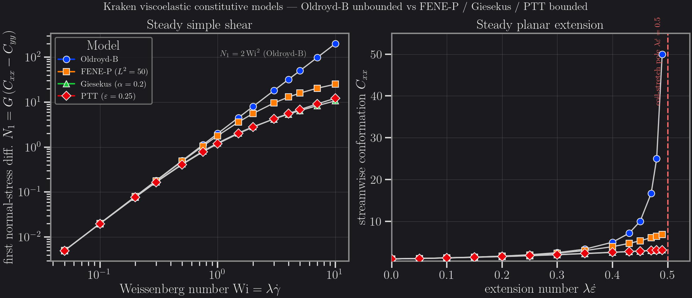

# Viscoelastic constitutive models — FVFD log-conformation (3D)

Kraken ships **four** 3D viscoelastic constitutive closures, all evolved in the
log-conformation variable `Ψ = log C` (Fattal & Kupferman 2004) by the same
finite-volume / finite-difference (**FVFD**) polymer transport that the
[Viscoelastic Poiseuille](ve3d-poiseuille-convergence.md) and
[Viscoelastic cylinder](viscoelastic-cylinder.md) benchmarks use. They differ
only in how the conformation relaxes — a single change in the constitutive
source term — so they share one validated transport, stress-reconstruction and
wall-BC machinery and are selected by passing a different model spec
(`LogConfOldroydB`, `LogConfFENEP`, `LogConfGiesekus`, `LogConfPTT`).

This page introduces the four models and compares them **analytically**: each is
driven single-cell through steady simple shear and steady planar extension by
the *real* Kraken constitutive solver (no closed-form shortcut), so the figure
below shows exactly what Kraken computes.

## The four models

All four advance `dC/dt = ∇uᵀ·C + C·∇u − R(C)/λ`, with the same upper-convected
stretch term and an Oldroyd-B stress reconstruction `τ_p = G·(C − I)` (FENE-P
adds the Peterlin factor). Only the relaxation `R(C)` changes:

| Model | Spec | Relaxation `R(C)` | Parameter | Equilibrium / OB limit |
|-------|------|-------------------|-----------|------------------------|
| **Oldroyd-B** | `LogConfOldroydB(G, λ)` | `C − I` | — | — |
| **FENE-P** | `LogConfFENEP(G, λ, L²)` | `f·C − I`, `f = (L²−3)/(L²−tr C)` | `L² > 3` | `f→1` as `L²→∞` |
| **Giesekus** | `LogConfGiesekus(G, λ, α)` | `(C−I) + α·(C−I)²` | `α ∈ [0, 0.5]` | `α = 0` |
| **PTT** | `LogConfPTT(G, λ, ε, variant)` | `Y(tr C)·(C − I)` | `ε ≥ 0` | `ε = 0` |

For PTT the scalar trace multiplier is `Y(tr C) = 1 + ε(tr C − 3)` (`:linear`,
Phan-Thien & Tanner 1977) or `Y(tr C) = exp(ε(tr C − 3))` (`:exponential`,
Phan-Thien 1978). For Giesekus the quadratic mobility acts per-eigenvalue,
`(c_i − 1)·(1 + α(c_i − 1))`, enhancing relaxation of stretched modes; for PTT
the *same* scalar `Y` multiplies every eigenvalue.

### Physical behaviour

| | constant viscosity | finite extensibility (`tr C < L²`) | shear-thinning |
|-|:-:|:-:|:-:|
| **Oldroyd-B** | ✓ | ✗ (unbounded) | ✗ |
| **FENE-P** | ✗ | ✓ | ✓ |
| **Giesekus** | ✗ | ✓ (bounded extension) | ✓ |
| **PTT** | ✗ | ✓ (bounded extension) | ✓ |

Oldroyd-B is the linear reference: a constant total viscosity, a first
normal-stress difference `N1 ∝ Wi²` that grows without bound, and a planar
extension that **diverges** at the coil-stretch number `λε̇ = 0.5`
(`C_xx = 1/(1−2λε̇)`). The other three are nonlinear: they shear-thin and bound
the stretch, so they remain finite in strong extension — the physically
essential behaviour for real polymer solutions.

## Analytical comparison



Left: steady **simple shear**, first normal-stress difference
`N1 = G(C_xx − C_yy)` vs `Wi = λγ̇` (log-log). All four collapse onto the
Oldroyd-B quadratic `N1 = 2 Wi²` at low `Wi` (the linear-viscoelastic limit),
then separate: Oldroyd-B stays on the `Wi²` line, while FENE-P, Giesekus and PTT
**shear-thin** and fall below it, each with a distinct slope set by its
nonlinearity. Right: steady **planar extension**, streamwise conformation
`C_xx` vs `λε̇ ∈ [0, 0.49]`. Oldroyd-B blows up toward the pole at `λε̇ = 0.5`;
the three bounded models saturate at distinct finite plateaus.

### Key numbers (from the real solver, `G = λ = 1`)

At `Wi = 5` in simple shear the models are clearly separated by their
shear-thinning, even though they agree to `< 1 %` at `Wi ≤ 0.1`:

| Model | `N1` (`Wi = 5`) | `η_p,app/η_p,0` (`Wi = 5`) | `C_xx` (`λε̇ = 0.49`) |
|-------|----------------:|---------------------------:|----------------------:|
| **Oldroyd-B** | 50.0 (`= 2 Wi²`) | 1.000 (no thinning) | **49.98** (→ pole at 0.5) |
| **FENE-P** (`L²=50`) | 15.88 | 0.466 | **6.88** |
| **Giesekus** (`α=0.2`) | 6.47 | 0.275 | **3.16** |
| **PTT** (`ε=0.25`) | 6.83 | 0.369 | **3.15** |

The contrast is the headline: Oldroyd-B's extensional `C_xx` runs away by an
order of magnitude as `λε̇ → 0.5`, while the bounded models settle at finite
plateaus — `≈ 6.9` (FENE-P, set by `L²`), `≈ 3.2` (Giesekus), `≈ 3.1` (PTT).
The two trace-based closures (Giesekus, PTT) plateau close together here; FENE-P
plateaus higher because `L² = 50` permits more stretch than the `α = 0.2` /
`ε = 0.25` nonlinearities. This is *exactly* the qualitative behaviour a
viscoelastic solver must reproduce to be useful beyond the linear regime.

## Validation status

Each constitutive closure is validated independently before it appears here:

- **Oldroyd-B / FENE-P / Giesekus / PTT** each match their closed-form steady
  simple-shear fixed point in a dedicated single-cell canary
  (`test/test_fvfd_{logconf,fenep,giesekus,ptt}_3d.jl`): Giesekus and PTT to a
  steady-equation residual `≤ 1e-6`, FENE-P and the Oldroyd-B limit to `≤ 1e-3`.
- **Oldroyd-B limit recovered bit-identically.** Setting `α = 0` (Giesekus),
  `ε = 0` (PTT, both variants) or `L² → ∞` (FENE-P) makes the relaxation
  factor exactly `1`, so the integrator visits the *same* floating-point
  trajectory as the dedicated Oldroyd-B kernel — verified byte-for-byte.
- **External cross-validation (RheoTool).** The Oldroyd-B planar-extension
  conformation matches RheoTool's `rheoTestFoam` to machine precision in the
  Hookean (`L² → ∞`) limit. For finite `L²`, Kraken's FENE-P and RheoTool's
  FENE-P differ by a documented `~11 %` in `C_xx` — a genuine **closure-variant**
  difference (Peterlin argument `tr C` vs `tr A`), *not* a bug: Kraken's own
  1000-step canary matches its own steady-state transcendental solution to
  `0.3 %`. See
  `benchmarks/results/rheotool_compare/viscoelastic_extensional_fenep_3d/`
  and the [Viscoelastic cylinder](viscoelastic-cylinder.md) page (Oldroyd-B,
  `< 1 %` on `C_d`).

## Reproduce

The four constitutive closures are exercised in CI by the single-cell canaries
above (CPU Float64):

```julia
# from the repo root
import Pkg
Pkg.test("Kraken"; test_args=["test_fvfd_giesekus_3d.jl"])
Pkg.test("Kraken"; test_args=["test_fvfd_ptt_3d.jl"])
Pkg.test("Kraken"; test_args=["test_fvfd_fenep_3d.jl"])
```

The analytical comparison data and the figure generator are tracked under
`benchmarks/results/repro/ve-constitutive-models/`. The data is **fully
CI-reproducible** (single-cell, CPU Float64, ~1 min) — regenerate the CSV with
the real Kraken solver:

```bash
# from the repo root — drives all 4 models, both flows, writes the CSV
julia --project=. benchmarks/results/repro/ve-constitutive-models/make_csv.jl
```

then regenerate the figure (env `kraken-v0-3-figures`):

```bash
conda run -n kraken-v0-3-figures python \
  benchmarks/results/repro/ve-constitutive-models/plot.py
```

The shipped viscoelastic `.krk` presets (sphere, extensional, cylinder) live in
`benchmarks/krk/viscoelastic/`.

## References

- R. Fattal, R. Kupferman (2004), *Constitutive laws for the matrix-logarithm of
  the conformation tensor*, J. Non-Newtonian Fluid Mech. **123**, 281–285 — the
  log-conformation representation shared by all four models.
- H. Giesekus (1982), *A simple constitutive equation for polymer fluids based on
  the concept of deformation-dependent tensorial mobility*, J. Non-Newtonian
  Fluid Mech. **11**, 69–109.
- N. Phan-Thien, R.I. Tanner (1977), *A new constitutive equation derived from
  network theory*, J. Non-Newtonian Fluid Mech. **2**, 353–365.
- F. Pimenta, M.A. Alves (2017), *Stabilization of an open-source finite-volume
  solver for viscoelastic fluid flows*, J. Non-Newtonian Fluid Mech. **239**,
  85–104 — the RheoTool reference.

::: tip Coming next
This page covers the *constitutive* response in homogeneous flows. Follow-up
sections will add the **in-flow** trace `tr C` along a Poiseuille / extensional
channel and a **cross-slot** stagnation-point comparison of the four models.
:::
