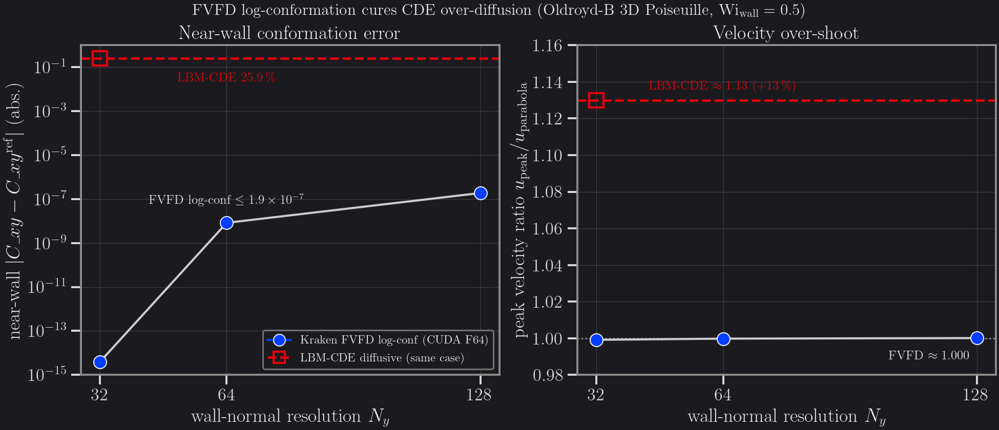

# Viscoelastic Poiseuille — FVFD log-conformation (3D)

A planar Poiseuille flow of an Oldroyd-B fluid is the simplest case with a *curved*
conformation profile: the shear rate `γ̇(y)` varies linearly across the channel, so the
shear conformation `C_xy = λ·γ̇(y)` is a steep, sharply-curved function near each wall.
That curvature is exactly what an over-diffusive polymer-transport scheme smears — which
makes this case the cleanest demonstration of the **#2B cure**: Kraken's **FVFD
log-conformation** polymer transport reproduces the near-wall conformation **machine-exactly**,
where the diffusive **LBM convection–diffusion (LBM-CDE)** path on the *same case* is
**25.9 % off near-wall**.



Left: near-wall shear-conformation error vs wall-normal resolution `N_y` (log scale).
The FVFD log-conformation path (filled blue) stays at machine precision across the sweep;
the LBM-CDE diffusive path (dashed red) sits at a flat 25.9 % — its error is a *modelling*
term, not a discretisation one, so it does not converge away under refinement. Right: the
peak velocity ratio `u_peak / u_parabola` — FVFD recovers the analytic parabola to
≈ 1.000, while the LBM-CDE solver over-shoots by +13 % (`u_ratio ≈ 1.13`).

## Result

The FVFD near-wall shear conformation is **machine-exact (≤ 1.9 × 10⁻⁷, ≤ 2 × 10⁻⁵ %)**
at every resolution, with the velocity profile matching the analytic parabola to within
0.01 % (GPU H100, CUDA Float64, `Wi_wall = 0.5`, `β = 0.5`):

| `N_y` | near-wall `\|C_xy − C_xy^ref\|` | `u_peak / u_parabola` | NaN-free |
|-------|--------------------------------|-----------------------|----------|
| 32    | 3.9 × 10⁻¹⁵                     | 0.99914               | ✓        |
| 64    | 8.3 × 10⁻⁹                      | 0.99979               | ✓        |
| 128   | 1.9 × 10⁻⁷                      | 1.00009               | ✓        |

For contrast, the diffusive **LBM-CDE** path on the **identical** `N_y = 32` case returns a
near-wall `C_xy` error of **25.9 %** and a peak velocity ratio of **≈ 1.13** (from the
payoff canary `test/test_fvfd_poiseuille_payoff_3d.jl`). The FVFD/LBM near-wall error ratio
is **~10⁻¹⁴**: not a marginal improvement but a categorical one — the two schemes solve
*different* equations near the wall.

The reference is **anti-tautological**: the expected `C_xy = λ·γ̇(y)` is built from the
*measured* velocity shear `γ̇(y)`, not from the conformation field itself, so a flat or
diffused `C_xy` cannot pass by self-consistency.

## Mechanism — why LBM-CDE over-diffuses

The LBM convection–diffusion solver for the conformation tensor carries an intrinsic
numerical diffusivity

```math
\kappa = c_s^2\,(\tau^{+} - \tfrac{1}{2}) = \tfrac{1}{6}
```

(at `τ⁺ = 1`), which adds a spurious term `κ·∂²C/∂y²` to the conformation transport.
Where `C(y)` is curved — strongest at the wall, where `∂²C_xy/∂y²` is largest — this term
smears the profile, flattening the near-wall conformation and feeding a too-large polymer
stress back into the momentum equation (hence the +13 % velocity over-shoot). The
**FVFD finite-volume log-conformation** path has **no such diffusive term**: it advects the
matrix-logarithm `Ψ = log C` (Fattal–Kupferman 2004) with a flux-limited MUSCL–superbee
scheme and reconstructs `C = exp Ψ`, preserving positive-definiteness and the sharp
near-wall curvature exactly.

## Methodology

**Kraken (FVFD log-conformation, 3D).** Planar Poiseuille driven by a constant body force
`Fx`, periodic in `x`/`z`, no-slip walls in `y`. The polymer conformation is advected as
`log C` by a dedicated finite-volume solver (MUSCL–superbee, adaptive sub-stepping) and
the extra stress `τ_p = (ν_p/λ)(C − I)` couples back to the momentum solver. Driver
`run_viscoelastic_fvfd_poiseuille_3d`.

- **Fluid**: Oldroyd-B, solvent fraction `β = ν_s/ν_total = 0.5`, `ν_total = 0.1`.
- **Forcing**: `Fx = 1.5 × 10⁻⁵`; wall Weissenberg `Wi_wall = λ·γ̇_wall = 0.5` held fixed
  across resolutions (`λ` recomputed per `N_y`).
- **Mesh**: `N_x × N_y × N_z = 6 × {32,64,128} × 6`, 40 000 steps to steady state.
- **Run**: GPU H100, CUDA Float64.

**LBM-CDE reference.** The same physics solved with the diffusive lattice-Boltzmann
conformation transport (`run_conformation_poiseuille_libb_3d`, `τ⁺ = 1`) — the path whose
`κ·∂²C/∂y²` term the FVFD scheme is designed to remove.

## Caveats

- **This is a *consistency* benchmark, not a literature drag match.** It validates that the
  FVFD polymer transport is exact for the analytic Poiseuille conformation and quantifies
  the LBM-CDE modelling error — it is not an external-code comparison. The external
  Oldroyd-B reference lives on the [Viscoelastic cylinder](viscoelastic-cylinder.md) page
  (RheoTool, < 1 % on `C_d`).
- **The LBM-CDE 25.9 % is from the `N_y = 32` canary.** The diffusive error is
  resolution-weak (it is a physical-model term, not a truncation term), so the flat
  reference band is the honest representation; it is drawn at a single resolution rather
  than swept.

## Reproduce

The FVFD-3D Poiseuille driver is exercised in CI by the payoff canary, which asserts the
FVFD-vs-LBM near-wall cure directly (coarse `N_y = 32`, CPU Float64):

```julia
# from the repo root
import Pkg; Pkg.test("Kraken"; test_args=["test_fvfd_poiseuille_payoff_3d.jl"])
```

The shipped Oldroyd-B `.krk` presets (sphere, extensional, cylinder) live in
`benchmarks/krk/viscoelastic/`.

The GPU mesh-converged table above (`N_y = 32/64/128`, CUDA Float64) was produced on
**Aqua (H100)** by `bench/scratch/ve_3d_poiseuille_sweep/sweep_run.jl` (env
`KRAKEN_VE3D_BACKEND=cuda`) — it is **not** CI-reproducible and requires a GPU run. Data:
`bench/scratch/ve3d_poiseuille_sweep.csv`. Regenerate the figure with:

```bash
conda run -n kraken-v0-3-figures python \
  bench/scratch/plot_ve3d_poiseuille_sweep.py
```

## References

- R. Fattal, R. Kupferman (2004), *Constitutive laws for the matrix-logarithm of the
  conformation tensor*, J. Non-Newtonian Fluid Mech. **123**, 281–285 — the
  log-conformation representation that keeps `C` positive-definite and the near-wall
  curvature sharp.
