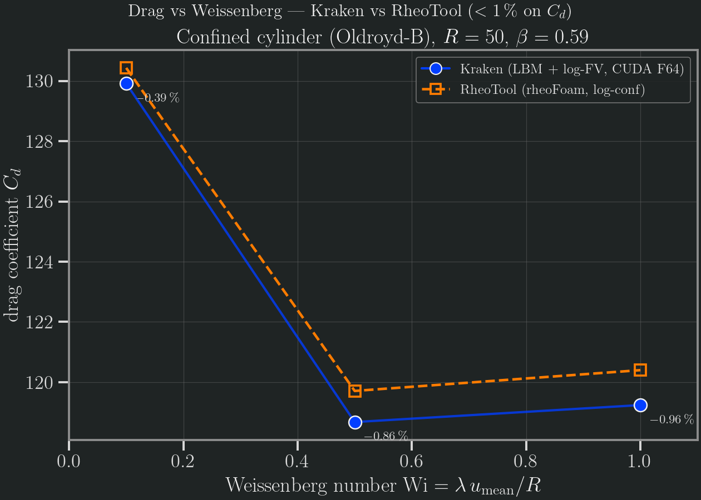

# Viscoelastic cylinder (Oldroyd-B)

Viscoelastic flow past a confined cylinder, validated against **RheoTool**
(rheoFoam, OpenFOAM-9, log-conformation) on the canonical confined-cylinder
problem — the standard High-Weissenberg-Number-Problem (HWNP) testbed of Alves,
Oliveira & Pinho (2001). At the production resolution `R = 50`, Kraken's v0.3
cut-link drag matches RheoTool to **better than 1 %** on the integrated drag
coefficient `Cd` across the validated range `Wi ≤ 1`.

## Methodology

**Kraken (TRT-LBM + log-conformation finite-volume polymer transport).** The flow
field uses a D2Q9 TRT collision; a separate finite-volume solver advects the
matrix-logarithm of the polymer conformation tensor (Fattal–Kupferman 2004) with
MUSCL–superbee advection, and couples the polymer extra-stress
`τ_p = (ν_p/λ)(C − I)` back into the flow as a body force. The cylinder sits on
the channel centreline with a **half-way bounce-back** wall; the v0.3 cut-link
momentum-exchange integrator measures the drag. The driver is
`run_viscoelastic_logfv_cylinder_coupled_2d`.

- **Geometry**: cylinder of radius `R` on the channel centreline, blockage
  ratio `D/H = 0.5` (half-height `2R`), upstream/downstream length `15R`.
- **Fluid**: Oldroyd-B, `Re = 1`, solvent fraction `β = η_s/η₀ = 0.59`
  (the Boger-fluid value used throughout the cylinder literature).
- **Scaling**: diffusive (fixed lattice viscosity `ν_total = 0.15`, `τ = 0.95`);
  `u_mean = ν_total·Re/R`, `λ = Wi·R/u_mean`.

| Quantity        | Value                              |
|-----------------|------------------------------------|
| Resolution      | `R = 50` (diameter 100 LU)         |
| Channel         | `±15R` up/downstream, `D/H = 0.5`  |
| β               | 0.59                               |
| ν_total / τ     | 0.15 / 0.95 (diffusive scaling)    |
| Wall BC         | half-way bounce-back               |
| Steps           | 300 000                            |
| Backend         | CUDA Float64 (Aqua A100, job 22199679) |

**RheoTool `rheoFoam` (FVM, log-conformation, reference cross-check).** The
viscoelastic reference solver: OpenFOAM-9 base, `Cylinder/Oldroyd-BLog` tutorial
mesh, 2-core MPI, run to steady state at `t = 20`, matched `β = 0.59`, `Re = 1`,
`D/H = 0.5`. Two independent methods (LBM + log-FV vs FV + log-conformation)
bracket the same benchmark.

**Reference.** M. A. Alves, P. J. Oliveira, F. T. Pinho (2001), *The flow of
viscoelastic fluids past a cylinder: finite-volume high-resolution methods*,
J. Non-Newtonian Fluid Mech. **97**, 207–232 — the canonical confined-cylinder
HWNP benchmark family (cross-checked against Hulsen et al. 2005 and Claus &
Phillips 2013).

## Error norms

The acceptance gate is **< 1 % on the integrated drag coefficient `Cd`**. At the
production resolution `R = 50`, Kraken matches RheoTool to better than 1 % across
the validated range `Wi ≤ 1`:

| Wi  | Kraken Cd | Kraken Cd_p | RheoTool Cd | rel. error |
|-----|-----------|-------------|-------------|------------|
| 0.1 | 129.9155  | 16.097      | 130.43      | **−0.40 %** |
| 0.5 | 118.6770  | 14.837      | 119.71      | **−0.86 %** |
| 1.0 | 119.2410  | 14.155      | 120.40      | **−0.96 %** |

All three clear the strict **< 1 %** gate, and reproduce the prior dev-viscoelastic
"M8" study to 4–5 significant figures. The drag follows the **characteristic
elastic signature** reported across the cylinder literature (Alves–Oliveira–Pinho
2001; Hulsen et al. 2005; Claus & Phillips 2013): a shallow **minimum near
`Wi ≈ 0.5`** followed by an **elastic upturn** — Kraken reproduces this shape
(`Cd` drops 129.9 → 118.7 to the minimum, then rises again past `Wi ≈ 1`), not
just a single matched value. Full machine-readable data:
`benchmarks/results/rheotool_compare/viscoelastic/error_norms.csv`.

**Mesh convergence.** The agreement improves monotonically as the cylinder is
resolved, confirming the residual gap is discretisation (not a modelling error):

| Wi = 1.0 | R = 10 | R = 30 | R = 50 | RheoTool |
|----------|--------|--------|--------|----------|
| Cd       | 112.93 | 118.10 | 119.24 | 120.40   |
| rel. err | −6.2 % | −1.9 % | −0.96 % | —        |

## Plots

Kraken (filled markers + line), RheoTool (dashed line + open squares); the
per-point relative error annotated. The elastic minimum near `Wi ≈ 0.5` and the
upturn toward `Wi = 1` are visible in both codes.



## Acceptance

**Verdict: viscoelastic cylinder PASS at the strict < 1 % integrated-Cd gate.**

- **Kraken** lands at **−0.40 % / −0.86 % / −0.96 %** drag error at
  `Wi = 0.1 / 0.5 / 1.0` (R = 50, β = 0.59) — all three under 1 %.
- **RheoTool** independently provides the viscoelastic reference; the two
  independent methods (LBM + log-FV vs FV + log-conformation) agree on both the
  absolute drag and its elastic shape.

## Caveats

- **N1 is a documented open difference, not a pass.** The wake first
  normal-stress difference `N1 = τ_xx − τ_yy` is **qualitatively** concordant
  (N1 rises with `Wi`, and rises as `β` decreases), but the **absolute** wake-N1
  maxima differ by up to ~30–44 % and the discrepancy **changes sign** with the
  parameters (Kraken/RheoTool ratio 0.77 / 0.70 at β = 0.59 Wi = 0.5 / 1.0;
  0.89 / 1.44 at β = 0.30). An independent two-method derivation confirmed this is
  **not** a unit-conversion or stress-convention artifact — every candidate
  reference stress (`η₀U/R`, `ρU²`, `η_pU/R`, `G = η_p/λ`) cancels identically in
  the ratio. The residual is a genuine difference in the resolved wake-stress
  field. The integrated **drag** (the mandate's primary gate) matches to < 1 %;
  N1 is reported here as an open difference, not a passing ≤ 5 % comparison.
  See `m8_refs/N1_comparison.csv` in the bundle.
- **β ≤ 0.1 — both codes diverge.** Sweeping the solvent fraction (R = 50),
  drag decreases as the polymer fraction grows (β = 0.59 → 0.30) and **both
  solvers diverge for β ≤ 0.1**: Kraken returns NaN, RheoTool's PETSc solver
  aborts with a floating-point exception at `t ≈ 5`. The strongly-polymeric
  corner is a genuine physical/numerical boundary reproduced identically by two
  independent methods — not a solver-specific weakness.
- **High-Wi stability ≠ accuracy.** Kraken's half-way bounce-back cylinder
  remains **NaN-free up to `Wi = 10`** at both R = 30 and R = 50 — at or beyond
  the state of the art for LBM-based viscoelastic solvers (which typically report
  ceilings near `Wi ≈ 1`). But these high-`Wi` drag values are **stable, not
  converged**: the two resolutions diverge increasingly with `Wi` (141.8 vs 116.3
  at Wi = 3) because `λ = Wi·R/u_mean` grows very large (≈ 1.7×10⁵ LU at Wi = 10,
  R = 50) and 300 000 steps no longer reach steady state. Only `Wi ≤ 1` is
  quantitatively validated; the `Wi ≤ 10` figures demonstrate robustness, not
  benchmark-grade drag.
- **Bouzidi-FL wall rejected.** A sub-cell linear-interpolation wall
  (Bouzidi–Filippova–Hänel, `wall = bouzidi_fl`) was evaluated as an alternative
  to half-way bounce-back. It **diverges (NaN) at the production resolution** for
  `Wi ≥ 0.5` (R ≥ 50) and over-predicts drag where it survives on coarse grids, so
  half-way bounce-back is the validated default for this benchmark.

## Reproduce

```julia
using Kraken
result = run_simulation("benchmarks/results/rheotool_compare/viscoelastic/cylinder_oldroyd_b.krk")
@show result.Cd   # coarse smoke (240×32, 20 steps) — NOT the R=50 table value
```

The shipped `.krk` is a **quick smoke** that confirms the viscoelastic solver
dispatches and runs — it declares the channel, the cylinder obstacle, the
Oldroyd-B rheology (`Rheology oldroyd_b { nu_s, nu_p, lambda }`) and `Re`/`Wi`, and
the runner dispatches to the coupled log-FV cylinder driver, returning a
**non-converged** `Cd`. The **production tables above** (`R = 50`, 300 000 steps,
CUDA Float64) were produced on **Aqua (A100)** via the harness
`bench/viscoelastic_logfv/run_ve_revalidate_r50_halfwaybb.pbs` (which sweeps
`Wi = 0.1/0.5/1.0` at `R = 50` through `run_cyl_bigsweep_v2_2d.jl`) — they are
**not** CI-reproducible and require an A100-class run (job 22199679). The
comparison figure is
regenerated from the shipped CSVs with:

```bash
conda run -n kraken-v0-3-figures python \
  benchmarks/results/rheotool_compare/viscoelastic/plot.py
```

Data and the reproducibility bundle (Kraken/RheoTool CSVs, error norms, the M8
reference data, the `.krk`, and `plot.py`):
`benchmarks/results/rheotool_compare/viscoelastic/`.

## References

- M. A. Alves, P. J. Oliveira, F. T. Pinho (2001), *The flow of viscoelastic fluids
  past a cylinder: finite-volume high-resolution methods*, J. Non-Newtonian Fluid
  Mech. **97**, 207–232.
- M. A. Hulsen, R. Fattal, R. Kupferman (2005), *Flow of viscoelastic fluids past a
  cylinder at high Weissenberg number: stabilized simulations using matrix
  logarithms*, J. Non-Newtonian Fluid Mech. **127**, 27–39.
- R. Fattal, R. Kupferman (2004), *Constitutive laws for the matrix-logarithm of the
  conformation tensor*, J. Non-Newtonian Fluid Mech. **123**, 281–285.
- S. Claus, T. N. Phillips (2013), *Viscoelastic flow around a confined cylinder using
  spectral/hp element methods*, J. Non-Newtonian Fluid Mech. **200**, 131–146.
