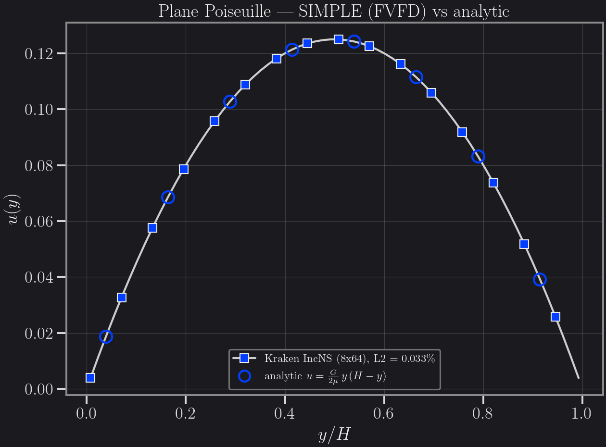
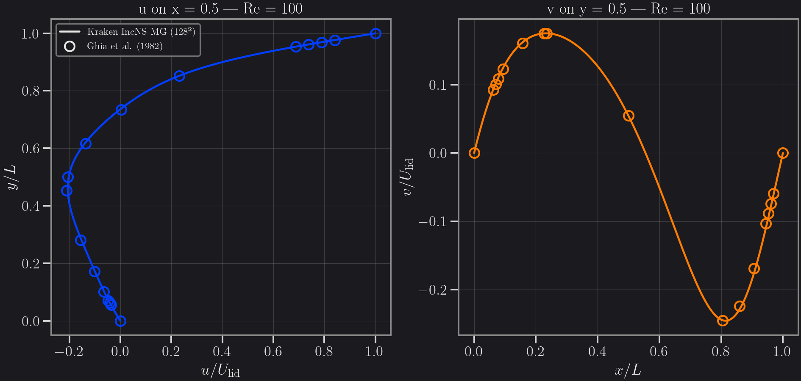
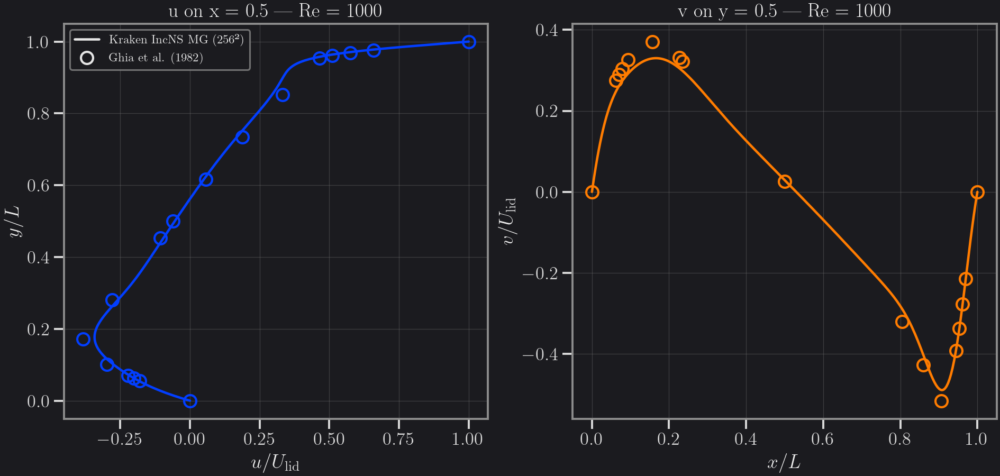
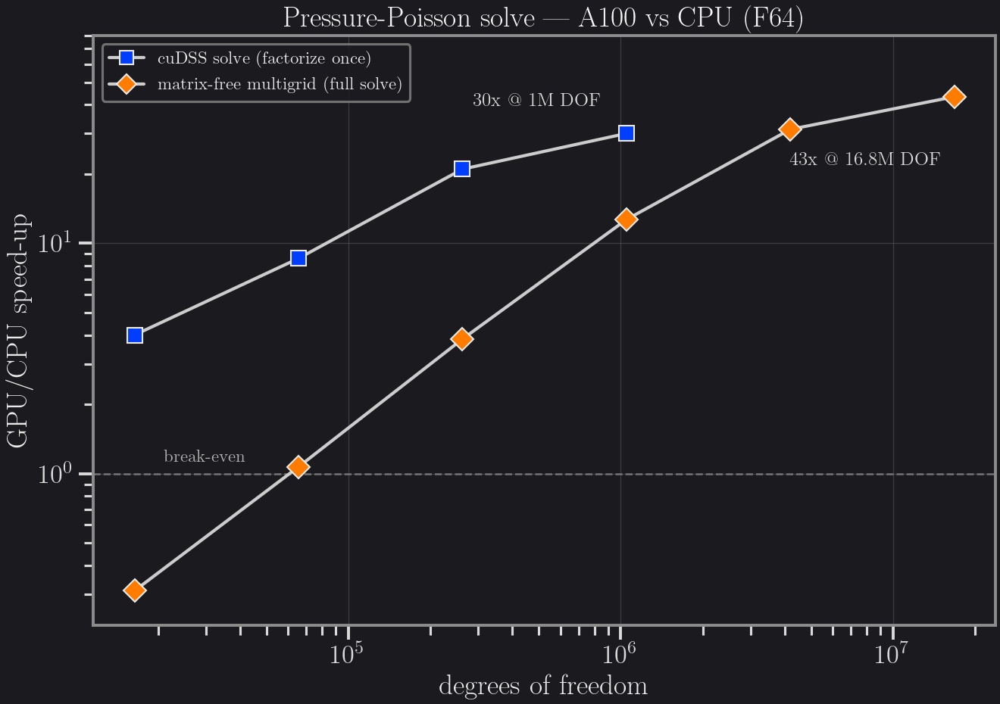
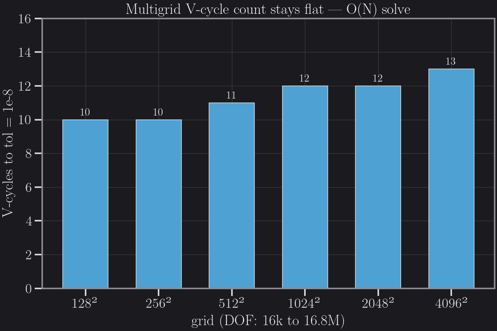
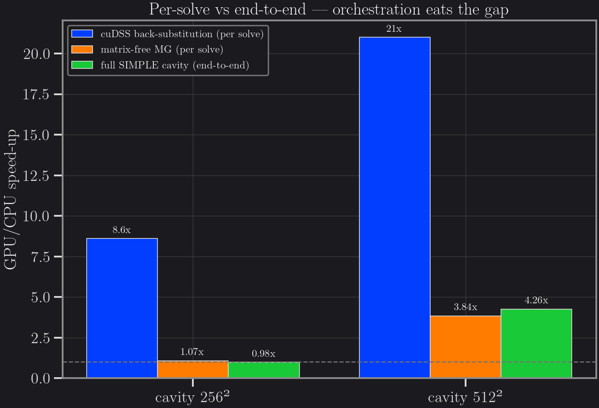

# Incompressible steady Navier–Stokes (FVFD/SIMPLE)

A steady, laminar, Newtonian, **incompressible** Navier–Stokes solver built on
Kraken's FVFD (finite-volume/finite-difference) operators, with **SIMPLE**
pressure–velocity coupling on a collocated grid (Rhie–Chow face interpolation,
checkerboard-free pressure). The discretization is **cut-cell-ready**: the
pressure-Poisson seam is the same one validated on a tilted embedded wall in the
cut-cell GPU benchmark. The solver is **backend-parametric**: every field is
allocated through an array type `atype` and every elementwise operation is a
KernelAbstractions `@kernel`, so the *identical source* runs on the CPU and on
CUDA (Float64), with bit-identical results (GPU↔CPU parity `‖Δ‖∞ ≈ 1e-16`).

## When to use it (and when to use LBM instead)

The choice is about the **flow regime**, not about raw GPU throughput.

An incompressible steady problem is **elliptic**: the sound speed is infinite,
so a pressure perturbation is felt everywhere in the domain instantly. The
steady solver honours that physics — each pressure-Poisson solve couples the
whole domain globally — and therefore relaxes to the steady state in roughly
**10³–10⁴ outer iterations**. An unsteady explicit method such as LBM propagates
information at most one cell per time step and must *wait out* the physical
transient, typically **10⁶–10⁷ time steps** to reach the same steady state.
That three-to-four-order-of-magnitude gap in iteration count — *not*
per-kernel GPU throughput, where LBM's single fused local kernel is unbeatable —
is this solver's real advantage for steady cases.

Conversely, for **genuinely unsteady / transient flows** the time steps are not
overhead but the answer itself, and LBM remains the right tool in Kraken.

| Problem | Use |
|---|---|
| Steady laminar incompressible (cavity, channel, slow flow around obstacles) | this solver |
| Transient / time-resolved dynamics (vortex shedding, waves, startup flows) | LBM |

## How to run

The solver is currently a **standalone API**: it is *not* yet registered as a
Kraken `AbstractMethod` and has *no* `.krk` seam — you `include` the solver file
directly and call the entry point (the includes pull in the FVFD operators and
the linear/multigrid solvers they need; use the root project environment).

**Plane Poiseuille** (body-force-driven periodic channel, direct
factorize-once linear solves):

```julia
# julia --project=.
using KernelAbstractions
include("src/methods/inc_ns/simple.jl")

res = solve_incns_simple(; nx=8, ny=64, H=1.0, mu=1.0, G=1.0,
                         relax=(u=0.7, p=0.3), tol=1e-10, maxiter=300)
res.converged          # true (a few outer iterations)
res.u, res.v, res.p    # converged cell-centred fields
```

**Lid-driven cavity** (matrix-free multigrid for both the momentum predictor
and the pressure correction), CPU:

```julia
# julia --project=.
using KernelAbstractions
include("src/methods/inc_ns/cavity_mg.jl")

res = solve_incns_cavity_mg(; nx=128, ny=128, U_lid=1.0, Re=100.0,
                            relax=(u=0.7, p=0.3), tol=1e-7, vel_tol=1e-6,
                            maxiter=8000)
res.converged, res.iters    # (true, ~3.2e3 outer iterations)
```

The same call on an NVIDIA GPU — same source, two keyword changes:

```julia
using CUDA
res = solve_incns_cavity_mg(; nx=512, ny=512, U_lid=1.0, Re=1000.0,
                            relax=(u=0.5, p=0.2), tol=1e-7, vel_tol=1e-6,
                            maxiter=60000,
                            backend_ka=CUDABackend(), atype=CuArray{Float64})
```

## Validation

All profiles below are regenerated by `docs/generate_incns_figures.jl`
(CPU runs, CSV output) and plotted dark by `docs/plot_incns_validation.py`.

### Plane Poiseuille — analytic parabola

Body-force-driven periodic channel on an 8×64 grid. The converged x-averaged
profile matches the analytic parabola `u(y) = (G/2μ) y (H − y)` at
**0.033 % relative L2 error** (gate ≤ 1 %,
`test/analytical/incns_poiseuille.jl`), with zero cross-flow and second-order
spatial convergence.



### Lid-driven cavity — Ghia, Ghia & Shin (1982)

Centreline velocity profiles — `u(y)` on the vertical centreline `x = 0.5` and
`v(x)` on the horizontal centreline `y = 0.5` — against the canonical reference
data of Ghia, Ghia & Shin (1982), *J. Comput. Phys.* 48, 387–411.

**Re = 100, 128²** — maximum centreline deviation **0.689 %** of `U_lid`
(u-profile 0.572 %, v-profile 0.689 %; validation gate ≤ 5 %,
`test/analytical/incns_cavity_mg_ghia.jl`). Converged in ~3 150 outer
iterations, about 20 s on a laptop CPU.



**Re = 1000, 256²** (figure below; ~9 450 outer iterations, ~80 s laptop CPU) —
maximum centreline deviation **4.11 %** (u) / **4.16 %** (v) of `U_lid`. The
error is dominated by the first-order upwind advection at the steep-gradient
peaks and **improves with grid**: the A100 benchmark run of the same case at
**512² reaches 2.31 %** (`benchmarks/results/cavity_gpu_aqua_a100.md`).



## GPU benchmarks (A100)

All numbers below are measured results from Aqua A100-SXM4-40GB runs, Float64,
recorded in `benchmarks/results/poisson_gpu_aqua_a100.md`,
`benchmarks/results/poisson_mg_gpu_aqua_a100.md` and
`benchmarks/results/cavity_gpu_aqua_a100.md`; the figures are rendered by
`docs/plot_incns_gpu_benchmarks.py`. They tell one consistent — and honest —
story: **per-solve GPU speed-ups are large and grow with problem size, but the
segregated SIMPLE loop as written cannot yet feed them to the end-to-end
solve.**

### Per-solve speed-up grows with size

Two pressure-Poisson back-ends, same node, GPU vs CPU:

- **cuDSS (assembled sparse, factorize-once)** on the cut-cell Poisson:
  the per-iteration *solve* (back-substitution) reaches **30× at 1 M DOF**
  (4.0× → 8.6× → 21× → 30× from 16 k to 1 M), with GPU↔CPU parity ~1e-12.
  Factorization itself is ~3× *slower* on the GPU, but the Poisson matrix is
  geometry-only — factorized **once**, reused over every SIMPLE iteration.
  Amortized over a steady 1 M-DOF cavity (~3 200 outer iterations) that is
  ≈ 351 s CPU vs ≈ 15 s GPU, **~23× end-to-end on the linear-solve budget**.
- **Matrix-free multigrid** (red-black Gauss–Seidel V-cycles, the kernels the
  cavity solver uses): the full-solve speed-up **grows with N** — below
  break-even at 128², **12.7× at 1 M DOF, 43× at 16.8 M DOF and still rising**.
  Unlike cuDSS's sequential triangular solves, the stencil smoother saturates
  the A100 (99 % utilization during the GPU kernels).



The V-cycle count to a fixed tolerance stays **flat at 10–13 cycles from 16 k
to 16.8 M DOF** — the multigrid O(N) hallmark: total work scales linearly with
problem size.



The two back-ends win in different regimes: for moderate-size 2D steady
problems (factorization fits in memory) cuDSS's amortized back-substitution is
still the fastest per solve (4.7 ms vs a 59 ms full MG solve at 1 M DOF);
matrix-free MG wins at large N and in 3D (direct factorization explodes) and
for unsteady/changing matrices (no factorize-once amortization).

### End-to-end SIMPLE: the orchestration gap

The full backend-parametric SIMPLE cavity (Re = 1000) on the same A100:
**0.98× at 256²** (too small — overhead dominates) and **4.26× at 512²**
(14 min GPU vs 61 min CPU), with **bit-identical** GPU↔CPU fields
(`‖Δ‖∞ ≈ 1e-16`) and the same 2.31 % Ghia error on both.



Why does the end-to-end 4.26× sit so far below the per-solve numbers? Measured
GPU utilization during the run: **mean 4.5 %, peak 9 %** — the A100 is ~95 %
idle. This is the structural **few-global-vs-many-local trade-off**: the
iteration-count advantage over LBM comes from few, globally-coupled solves, but
a segregated SIMPLE loop fragments them into ~31 000 outer iterations, each a
chain of *small* kernels (advection, gradients, corrections), several inner MG
solves, **global reductions** for the residual and velocity-settle norms (each
forcing a host synchronization), and host-side orchestration. Kernel-launch
latency and host round-trips dominate; the device is starved. LBM saturates a
GPU because it is one fused, explicit, local kernel — a steady segregated
elliptic solver as written cannot be, and the ~20× left on the table (per the
4.5 % utilization) requires *solver-architecture* work, not just "run it on the
GPU":

- **kernel fusion** — collapse the many small per-iteration kernels;
- **batched / fewer global reductions** — the per-iteration norms force host
  syncs;
- **fewer outer iterations** — a coupled / Newton–Krylov (JFNK) scheme instead
  of segregated SIMPLE;
- **larger grids** (1024²+) where per-iteration compute amortizes launch
  overhead;
- **mixed precision** in the inner MG solves.

For calibration against industrial practice: a commercial finite-volume code
like Fluent reports of the order of **~30–100× per GPU vs a single CPU core**
on large grids — that is the attainable class for this solver *once the
efficiency levers above stack* (large grids + fusion + fewer syncs + mixed
precision). Multi-GPU scaling and all-physics robustness at that speed are
explicitly out of scope here.

### GPU-efficiency ablation

A cumulative per-change ablation (norm stride → fixed MG cycles → CUDA graph →
mixed precision) with per-step wall time and GPU utilization is being measured
on Aqua now.

<!-- ABLATION-RESULTS: pending Aqua job, filled by a follow-up mission -->

## Reproducing this page

| Artifact | Command |
|---|---|
| Validation CSV data | `julia --project=. -t auto docs/generate_incns_figures.jl` |
| Validation figures | `conda run -n kraken-v0-3-figures python docs/plot_incns_validation.py` |
| GPU benchmark figures | `conda run -n kraken-v0-3-figures python docs/plot_incns_gpu_benchmarks.py` |
| Validation tests | `test/analytical/incns_poiseuille.jl`, `test/analytical/incns_cavity_mg_ghia.jl` |
| A100 benchmark drivers | `benchmarks/krk/inc_ns/{poisson_gpu_bench,poisson_mg_gpu_bench,cavity_gpu_bench}.jl` |
